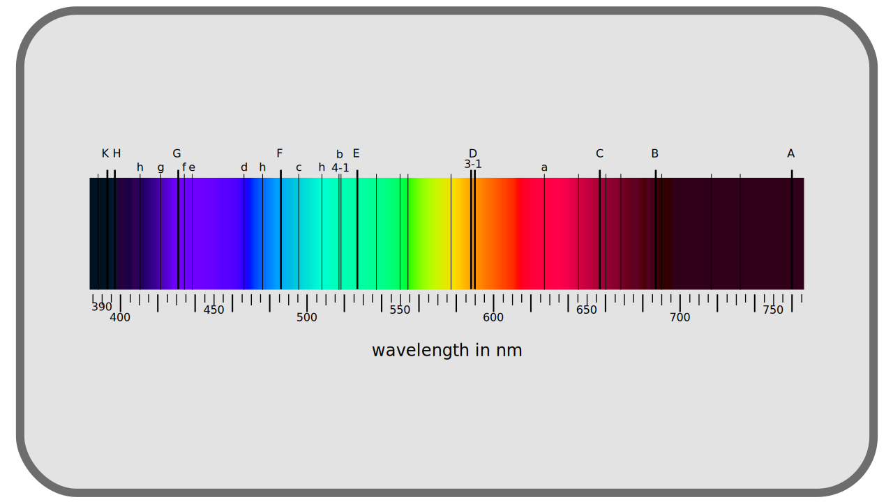

# I.A - What is color?

The word *color* may seem simple and univocal, but before entering the subject, it is important to explain what the word *color(s)* will cover in the following pages.

We will understand by *color* the whole range of light that the human eye can perceive, including in its nuances of intensity. The term thus covers as well the *hue* as the *saturation* and the *luminosity*, terms with which the people called to handle the colors are familiar. It is also implied that there are *a certain number* of defined colors, that this complete spectrum is divisible into quanta, into *bricks*. The size of the basic quantum, and incidentally the number of *color quanta*, the number of different colors, will be discussed later.

[TOC]

## A.1 - Physical color: visible light

What is called *color* is therefore the perception by the human being of *visible light*, visible light being in reality only a small part of the [electro-magnetic spectrum](https://fr.wikipedia.org/wiki/Spectre_%C3%A9lectromagn%C3%A9tique).

It is necessary to understand, considering this rainbow spectrum, that in nature, the sources of *monochromatic* light are rare, and one perceives especially a blend of these different frequencies; the *colors* of which one will thus discuss here include at the same time these monochromatic sources but also and especially *all the possible blends* between them, at different intensities. These blends thus represent an infinity of nuances, an infinity of different colors, which it would be impossible to describe all individually.

So naturally we try to give ourselves references in all these possible colors, from *black* to *white* through *gray* and in all the shades of the rainbow (i.e. monochromatic lights), red, orange, yellow, green, blue, violet... The problem is then to agree on these names and define precisely what is red and what is purple for example.

Historically, a solution came from the discovery of [*Fraunhofer lines*](https://en.wikipedia.org/wiki/Fraunhofer_lines) dark discontinuities in the spectrum of light emitted by the sun, discovered in the early nineteenth century. These lines, caused by the absorption of certain frequencies by the media crossed by the light (in the atmosphere in particular), are visible on precise wavelengths and were one of the first references to define precise colors.

To this problem of reference is added the fact that the definition of color is intrinsically linked to the perception that we have, and this perception obviously differs from one population to another, from one individual to another, and also from the environment in which we perceive the color.

## A.2 - Following light : from emission to reception

### A.2.a - Emission, transmission, reflection, reception

The color that we perceive is the result of a group of rays of light emitted ("created") by a given source (the sun, a screen, a light bulb ...), which has passed through one or more media with different properties that have absorbed, deviated or re-emitted part[^1], which has been reflected by one or more surfaces with different properties that have in turn absorbed, deviated or re-emitted part, before finally reaching a sensor: our eye, or a camera ...

**

### A.2.b - Breakdown of the received light

In the end, whatever the path of this group of rays of light, we only perceive the state in which it is at the arrival: it is the perceived color. Whatever the path and their origin, all colors are the same thing: groups of light rays.

The color is therefore "just" a mixture of a number of light rays that have reached a sensor or our eye. Each of these rays, or *photons*\* has a precise wavelength called *monochrome*\*, and if we see colors different from those of the electro-magnetic spectrum, they are the result of the mixture of all these rays.

It is the quantity of received photons forming this color which makes the intensity, the *luminance*\*, of the color, and the mixture of the various wavelengths which makes the *hue*\*.

----
Sources and references

- [Color on *Wikipedia*](https://en.wikipedia.org/wiki/Color)
- [Electro-magnetic spectrum on *Wikipedia*](https://en.wikipedia.org/wiki/Electromagnetic_spectrum)
- [Fraunhofer rays on *Wikipedia*.](https://en.wikipedia.org/wiki/Fraunhofer_lines)

[^1]:
    We speak in particular of *refraction* for the deviation of the rays