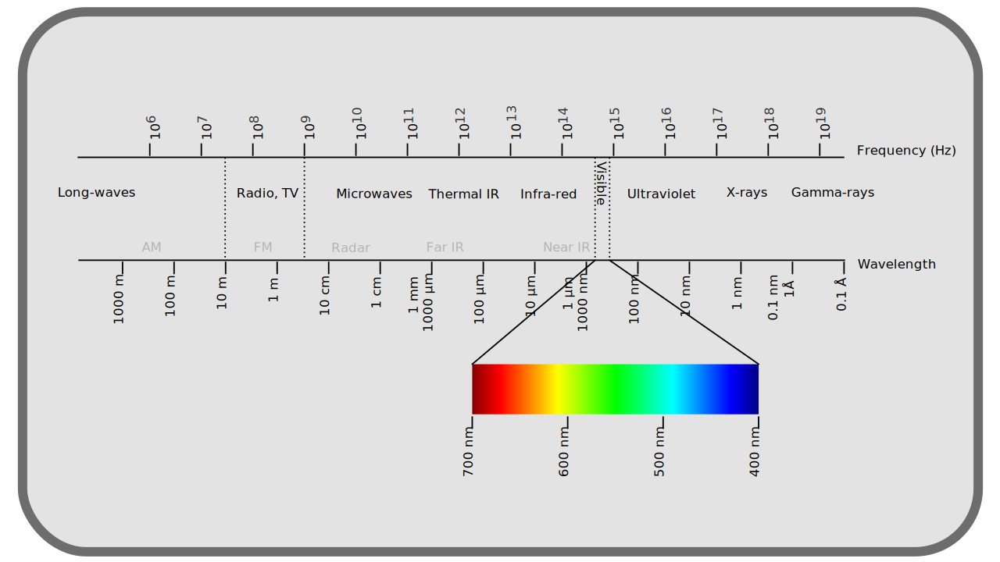
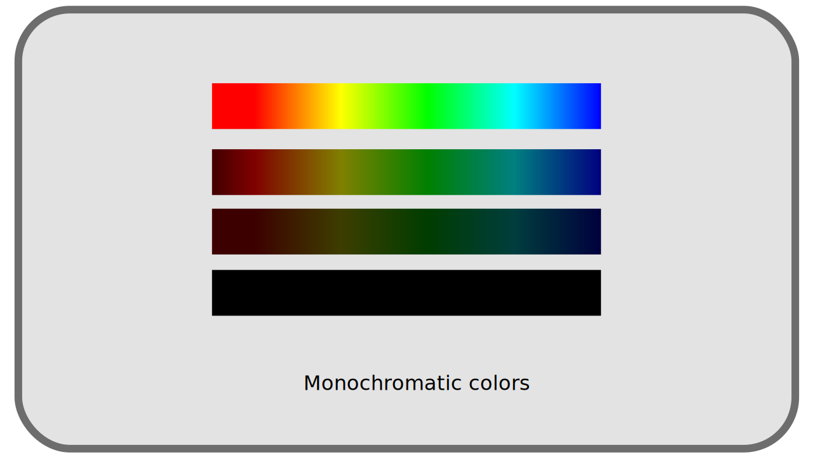
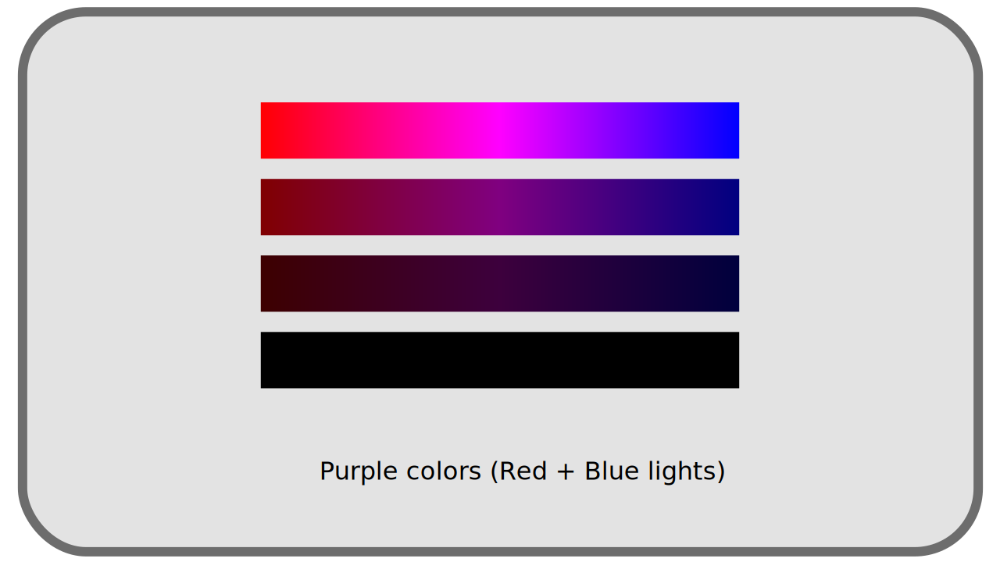
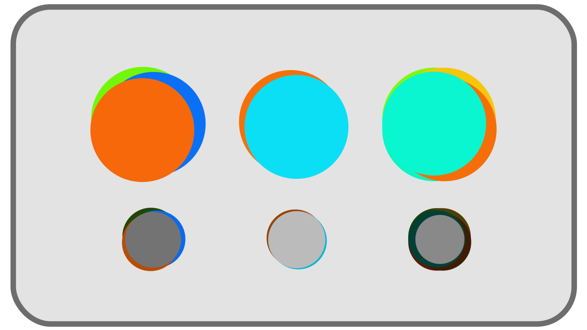
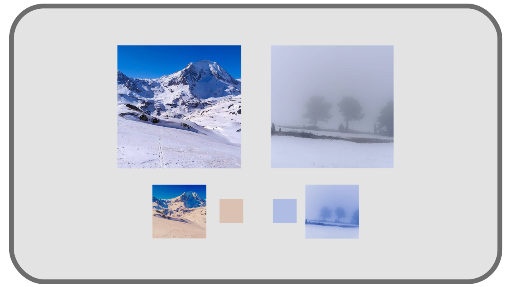

# I.B - Small inventory and classification of colors

The perceived colors are therefore mixtures of *monochromatic*\* light rays. Let's see how to classify all these colors and how they are decomposed.

[TOC]

!!! note
    We are still talking here about *light* and light rays, and thus about an *additive* system; it is not a question of the composition of surfaces and the way they absorb and reflect colors, and which would be the object of a *subtractive* synthesis of light.  
    *See *chapter [*D - Color Reproduction*](D-reproduction.md) for more details on the subject.

## B.1 - Black

The simplest color is therefore *black*\* : the total absence of light is perceived as black. When the intensity of the light decreases, the colors approach gradually the black. But when the intensity rises, the colors do not go towards white! The higher the intensity, the more the color appears "bright" and "saturated", but does not fade, does not whiten [^1].

## B.2 - Monochromatic lights

The simplest colors, and the rarest (they are those emitted by *Lasers* for example), are those composed of a single *monochromatic* light. They are in fact the *colors of the rainbow*, those which are included in the monochromatic spectrum.

**

They range from red to blue, orange, yellow, green, cyan... but do not include any shades of *purple*\*.

**

They can vary in intensity, in a scale from black (intensity 0) to the "brightest" color.

## B.3 - Purple

It should be noted that the purple/violet range[^2] are **not** part of the "natural" and *monochromatic* colors but are the result of the mixing of blue and red rays, which are the two extremes of the spectrum.

**

The purples added to the monochromatic colors form the set of the most *saturated[\*](ZZ-vocabulaire.md)* colors possible, which are thus all *monochromatic* colors **and** mixtures containing only blue and red.

**

## B.4 - White and grey

In nature, **all** the lights, or more precisely all the luminous rays, are *monochromatic[\*](ZZ-vocabulaire.md)*; it is the perception of their blending that the brain interprets in an infinity of other colors. We saw that the purples are part of these mixtures; all the other colors not *saturated[\*](ZZ-vocabulaire.md)*, the grays and the whites, are thus also mixed lights.

All the "desaturated" shades, whites, grays, are blends of these *monochromatic* colors, and there is for each color (and not only the grays, all the non-monochromatic colors) an infinity of different blends which can generate it.

**

Two colors perceived in an identical way but composed of *monochromatic* rays in different proportions are said ***metamers[\*](ZZ-vocabulaire.md)***.

### B.4.a - Complementary colors

A minimum of two "opposite" rays is needed to form white: two *monochromatic* rays that form grey/white when mixed are said to be *complementary[\*](ZZ-vocabulaire.md)*.

We can also include purples as complementary to greens. Indeed, a purple in turn mixed with green gives white[^3], and can therefore be considered as the *complementary* of green[^4], although it is actually already the combination of red and blue. We find there the three common primaries of digital color reproduction systems.

**

### B.4.b - Perception

The same white sheet of paper will be seen as white regardless of the time of day or the type of lighting, although in reality its color is quite different in each of these cases: the sheet of paper will in fact take on the color of the light that illuminates it, but the brain will operate a "shift" in perception that will make it appear white in all cases.

**  
*Under the sun, in the shade or in the clouds, whatever the time of day, in reality we perceive snow as* white *even if in reality the light it reflects is each time different[^5].*

Therefore, rays of light with perfectly different physical attributes can be seen in the same way by the observer. ***The perception of colors is eminently subjective.

----

[^1]:
     In the real world. But artistically, the technical limits of color reproduction systems impose to "cheat" by whitening the highlights to compensate the limit of luminosity of the available colors. Without this trick, "monochromatic" colors in an image could appear less luminous than gray or white of the same image; lights are therefore "pulled" towards white values to compensate.
[^2]:
    The term "ultraviolet" to describe the part of the electromagnetic spectrum beyond blue is misleading; the end of the spectrum is perceived as blue (dark) rather than violet. The true violet is the color that we perceive as a result of the combination of blue and red rays.
[^3]:
    We are of course speaking here of *light*, in other words an "additive" system where the intensities add up. This is obviously not true in painting and printing which are "subtractive" systems where the colors "asborbate" light intensity, subtracting rays of light. cf. chapter [*D - Reproduction of colors*](D-reproduction.md).
[^4]:
    If we wanted to be physically correct, the greens would simply have no complements at all, and only the intervals of rays near the two extremes of the spectrum (oranges-reds and cyan-blues) would be complementary to each other.
[^5]:
   What a camera has the greatest difficulty to reproduce. see chapter *[E - About white values : temperature](E-temperature.md)*.

