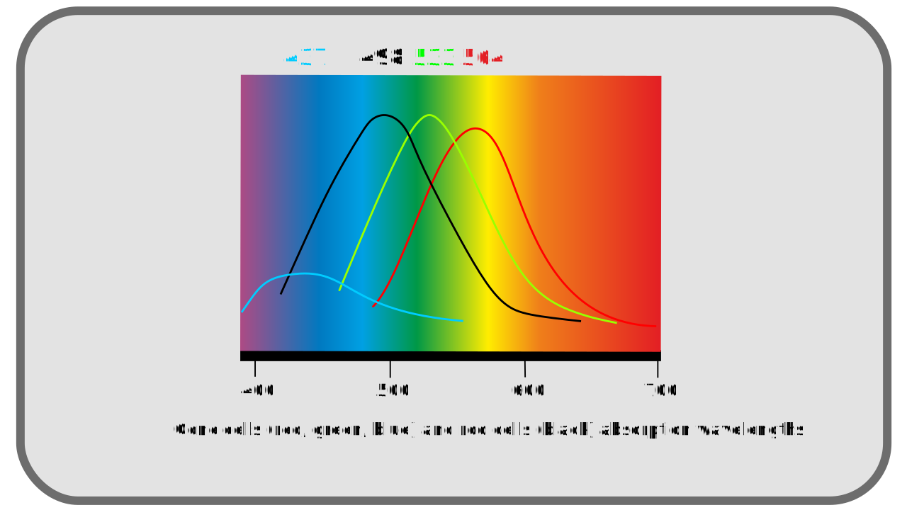
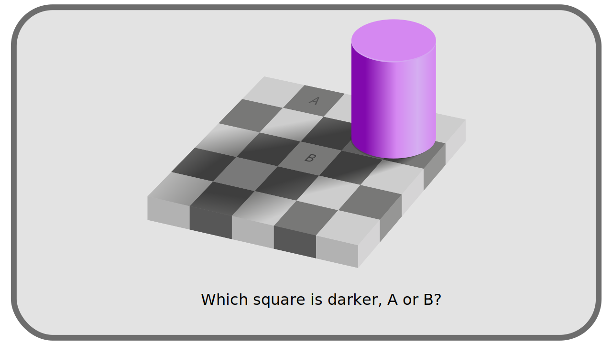
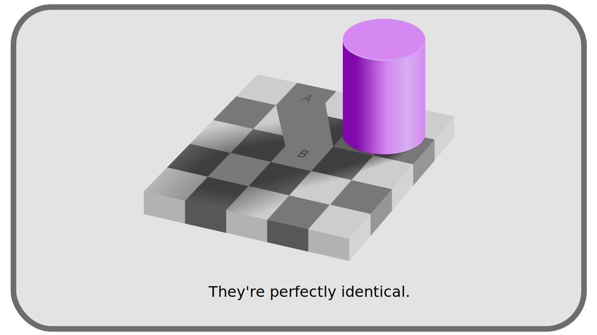

# I.C - Perception of light and colors by the human eye

To the problem of having an objective reference to define the colors is added the fact that the definition of the color is intrinsically related to the perception that one has, and this perception obviously differs from one population to another, from one individual to another, and also of the environment in which one perceives the color.

!!! hint
    In ancient history, [Democritus](https://en.wikipedia.org/wiki/Democritus) even suggested that colors are only imagination.

Comprehending this subjective interpretation of color is important for understanding how color management in digital image processing was designed and how it is evolving.

## C.1 - The Eye

As soon as light rays are received by the eye and the retina, the light is broken down and interpreted. Two types of photoreceptors make up the retina, cones and rods.

The rods are the useful and active cells in the half-light; they are saturated as soon as the light becomes too strong, around 500 photons per second.

The cones are the effective cells in the reception of the more intense lights; they activate only starting from an intensity of 10 photons per second. Divided into three different types, they are able to capture rays over a wider range of frequencies; this division into three types also allows the *hue* of the light to be interpreted: the nervous system can compare the intensities on the three different types of cones and deduce a hue.

The cones are mainly present in the center of the retina, while the rods are more on the periphery: we perceive colors better in the center of the image, but the eye is more sensitive to variations in contrast at the periphery, as well as in dim lights.

## C.2 - The nervous system

The information received by the cells of the retina are converted into nerve impulses and interpreted by the brain.

This process explains in particular the fact that **objectively different** mixtures of monochromatic sources can be perceived in exactly the same way and **subjectively identical**; thus, two *white* colors perceived in the same way and indistinguishable by the individual can in reality be formed of different blends of monochromatic lights[^1].

Conversely, colors that are **objectively the same** can be perceived in **completely different** ways depending on their environment. This is particularly the case for *white*; what we perceive as the color white varies greatly depending on the types of light sources and the general hue of the environment. This is the equivalent of *white balance* in photography, but it is true for all colors.

The nervous system is therefore responsible for an interpretation of the colors which is not directly related to the objective signal received by the eye, but which could be seen as a subjective "adjustment" in post-production: it adapts the image according to the environment, exactly as the photographer does by retouching the contrasts and the white balance (the tints), to "equalize" the image, and to increase the quantity of perceivable details in the reconstructed image.

All these different steps change the perception of a physical and objective signal: the same light ray will not be "seen" in the same way in two different places, and according to the quantity and the nature of the other rays which accompany it.

## C.3 - Consequences

The consequences of this subjective perception are important to understand the historical choices that were made on the techniques allowing the artificial reproduction and processing of images (analog and digital).

### C.3.a - On brightness and contrast

The presence of the rods on the retina and their performance in the weaker lights, to the detriment of the perception of the colors in these lights, makes that **the eye is globally more powerful to discern the details in the half-light** than in the strong lights, and that it is in general **more powerful to distinguish the contrasts of intensity than the variations of color** (the decomposition in precise wavelengths on the spectrum)

### C.3.b - On hues

The division into three types of cones, each performing on specific wavelengths, means that **three _primary_ colors**[^2] are sufficient to reproduce all the colors as the human being can perceive them, as long as these primaries correspond approximately to the range of performance of these three types of cones[^3].

The three "*primary*" colors closest to the ranges of perception of the cone cells are the combination **Red, Green, and Blue**, even if in reality the cones rather perceive yellow, green and blue.

!!! note
    Trichromy is not the only model that can represent the vision of color. We can also imagine a model where the vision distinguishes the oppositions white-black, blue-yellow and red-green for example[^4].

This way of perceiving the colors thus influences the choices of systems to reproduce them artificially, as we shall see later, in particular with the ***gamma***, the ***RGB*** or ***YUV*** system.

----
Sources & References

- [Color on *Wikipedia*](https://en.wikipedia.org/wiki/Color)
- [Psychophysics on *Wikipedia*.](https://en.wikipedia.org/wiki/Psychophysics)
- [Rod cells on *Wikipedia*](https://en.wikipedia.org/wiki/Rod_cell)
- [Cone cells on *Wikipedia*](https://en.wikipedia.org/wiki/Cone_cell))
- [Colour representation, *Kent State University*](http://www.cs.kent.edu/~farrell/cg00/lectures/color/colour.html)

;license:CC-BY-NC-SA;copyright:2021;updated:2021/03/23)

[^1]:
    There are several " grades " of white and apparently identical lights, depending on whether they are composed of a more or less varied range of rays of different wavelengths (thus of different tints).
[^2]:
    There is a vocabulary confusion, in particular in the audio-visual production, between *primary* color (which cannot be obtained by blending other colors), and *complementary* colors (whose blending gives black, gray or white). We use here the word *primary* in the sense of the spaces of numerical colors: whose mixing gives the white.
[^3]:
    [Isaac Newton](https://en.wikipedia.org/wiki/Isaac_Newton) had discovered that it is quite possible to reproduce a white light with only two monochromatic colors but a third primary is necessary to depart from the simple gradation between the first two.
[^4]:
    [Ewald Hering](https://en.wikipedia.org/wiki/Ewald_Hering) was vigorously opposed to trichromy. Based on the psychological study of perception, his model, which [Erwin Schrödinger](https://en.wikipedia.org/wiki/Erwin_Schr%C3%B6dinger) showed the mathematical equivalence with trichromacy, has since been confirmed by neuroscience studies. 