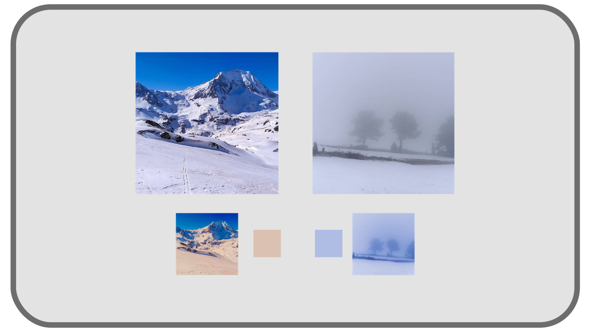

# I.E - About white values: temperature

White being perceived differently depending on the environment and the observer, we must, before talking about it, define exactly what is white. Once again, we need an invariant, physical referential, on which everyone can agree, a bit like how *Fraunhofer's rays* can be used as a reference to define precise *monochromatic lights[\*](ZZ-vocabulaire.md)*.

Radiation of *black bodies[\*](ZZ-vocabulaire.md)* is commonly used to define white.

[TOC]

## E.1 - Black body

A *black body* is an element which does not necessarily appear *black*, but which is black in the sense that it absorbs all the electromagnetic rays (and thus visible light) that it receives; in other words, **if** the black body were perfectly cold [^1], it would be pure black. But every body has some heat, and this heat causes it to emit radiation, some of it in the visible spectrum, which explains why what is called a *black body* is not *seen* as black.

The consequence is that the light, and therefore the color, of a black body is not influenced at all by the light it receives, but is only the result of its heat. Several elements can be considered as black bodies: the embers of a barbecue, fire, a glowing metal, the sun ... All these elements are not real black bodies in the physical sense (the radiation they emit is not perfectly independent of the radiation they receive) but are an approximation, very close in the case of the sun[^2].

*Black bodies* are interesting because the light they emit, and therefore their perceived color, does not depend on the environment in which they are; they therefore form good objective reference frames. Moreover, we know that their radiation spectrum depends directly on their energy, their heat. One can thus associate to a given heat a given spectrum, i.e. a light of a precise composition of *monochromatic rays[\*](ZZ-vocabulaire.md)*, resulting in a precise and measurable *white[\*](ZZ-vocabulaire.md)*.

**

!!! note
    Unlike the other incandescent elements in the examples above, the apparent color of the sun is not directly the result of its heat even though it is a black body; indeed, the absorption of rays by the atmosphere changes its color at our level.

## E.2 - Planckian locus

Rather than defining the spectrum of light from black bodies by describing the rays that make it up, we simplify by simply linking this color, this white, to the temperature of the black body that emitted it; and this measurement is given in *Kelvin* (and could just as easily be converted into degrees *Celsius* or *Fahreneit*). We can thus define a *white* light directly according to this theoretical temperature.

| Description | Kelvin | Degré Celsius | Degré Farenheit |
|---|---|---|---|
| Hot lava | `1000 K` | `726,85°C` | `1340,33°F` |
| Sun at noon | `5800 K` | `5526,85°C` | `9980,33°F` |
| Cloudy day | `7000K` | `6726,85°C` | `12140,33°F` |
| Lightning | `9000 K` | `8726,85°C` | `15 740,33°F` |

We note that the *temperature* of white reflects its hue and not the actual temperature of the body that emits this light; **this temperature is that of the black body that would have emitted radiation of the same color**, but **not** the temperature nor the energy of the element seen. We use these temperature values in Kelvin **by convention** to standardize the description of white.

All these temperatures can be represented in a *degree* going from yellow-orange to blue, in a whitish range (these are indeed colors resulting from a complex blend of *monochromatic rays[\*](ZZ-vocabulaire.md)* of the visible spectrum; only the proportions change [^3]).

We call this set of colors distributed in a line the *Planckian Locus*.

**

## E.3 - White balance

**  
*Under the sun, in the shade or in the clouds, no matter what time of day it is, in reality we perceive snow as *white *even though the light it reflects is actually different each time.

The brain is constantly making adjustments to compensate for the color of the light illuminating a scene, and always sees the whites... white. The problem arises when capturing colors via a camera or a camera to make the same adjustment.

Indeed, a sensor that would receive white at noon in the sun would actually "see" the "true" color, tending more towards yellow, while the same object on a cloudy day would be "seen" by the sensor as much more blue.

An operation of correction of these colors is then carried out to bring back the color of the object to a neutral "white": that of the device of reproduction. We call this *white balance*: "erasing" the influence of the light illuminating the scene at the time of the capture.

Thus, this "neutralized" image can be reproduced by the device under standard conditions.

- To display the image on a screen, the task is to bring the color of the white in the scene (`5800 K` under the sun or `7000 K` under the clouds for example) to that of the white of the screen (in general the one named *D65*, `6500 K`).
- When printing on paper, the white of the scene must be brought back to the white of the paper. Once the image is printed, it can be seen correctly under all possible lighting.

Without this work of "neutralization", the image is shifted compared to the reference white (the white of the screen or the white of the paper) and appears bluish or orange.

----
Sources & References

- [Black body on *Wikipedia*.](https://en.wikipedia.org/wiki/Black_body)
- [Planckian locus on *Wikipedia*](https://en.wikipedia.org/wiki/Planckian_locus)
- [Color temperature on *Wikipedia*.](https://en.wikipedia.org/wiki/Color_temperature)

[^1]:
    Only black holes, which absorb all light by gravitation, can be considered as almost perfect *black bodies* and** do not emit any radiation themselves; but it is now known that even black holes emit a very weak radiation, in a somewhat roundabout way, the *[Hawking radiation](https://fr.wikipedia.org/wiki/%C3%89vaporation_des_trous_noirs)*. On the other hand, we still don't really know if this radiation depends on the composition of the black hole (what is called *[the information paradox](https://fr.wikipedia.org/wiki/Paradoxe_de_l%27information)*, but it is a completely different subject than color...).
[^2]:
    Theoretically, even the sun reflects the rays it receives; but the proportion between the reflected rays and the emitted rays is so insignificant that we can consider the sun as a black body. And on our scale it is the same for fire, embers, sparks...
[^3]:
    The more energy the body has (the hotter it is), the higher the proportion of rays of high *frequency[\*](ZZ-vocabulaire.md)* (and low *wavelength[\*](ZZ-vocabulaire.md)*): indeed, the amount of energy carried by light rays depends directly on their frequency. The shorter wavelength rays are those of the blue side of the spectrum. Thus, the hotter the body, the more the proportion of blue rays increases in the emitted blend, the more the color moves away from the orange-red to the blue. But we must keep in mind that the light emitted remains a combination, and that we are talking about shades of white.  
    The discovery of this link between wavelength and energy, and the work on the color of black bodies by the physicist Max Planck at the end of the XIXth century are at the origin of modern *quantum physics*, with the discovery by Planck that energy is composed of discrete values and not continuous (this is the foundation prior to the theorization of the *photon* by Albert Einstein in 1905).

