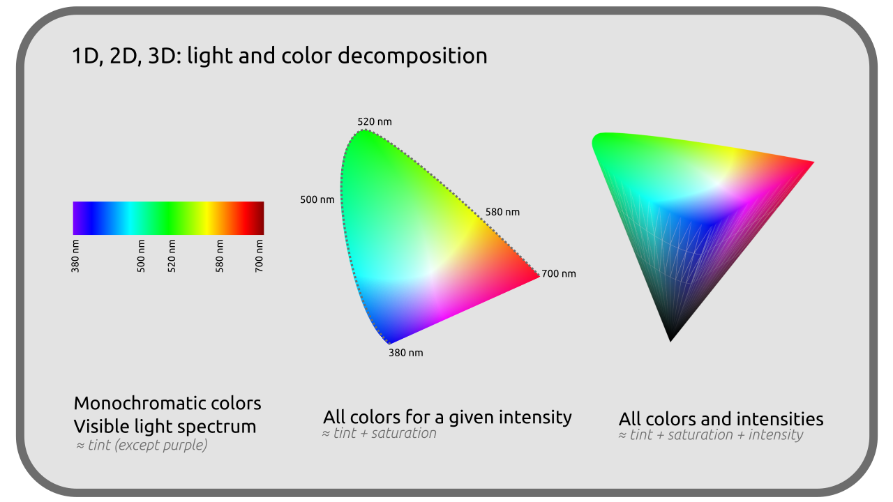
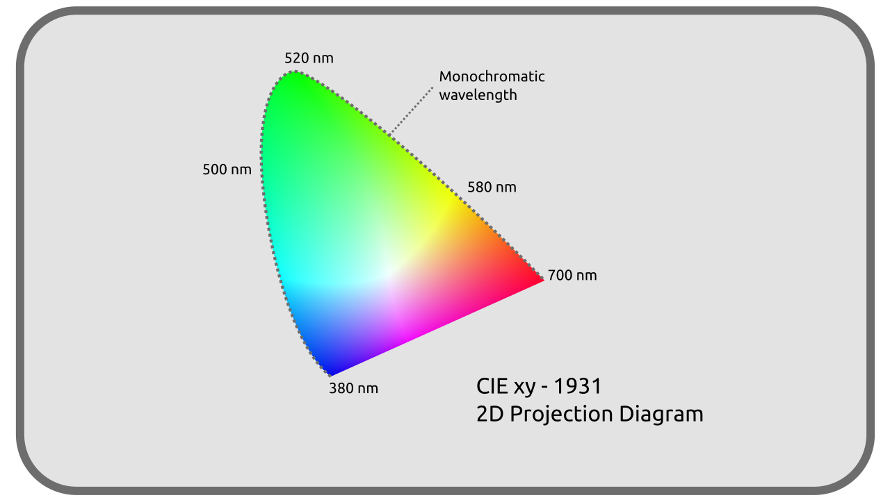
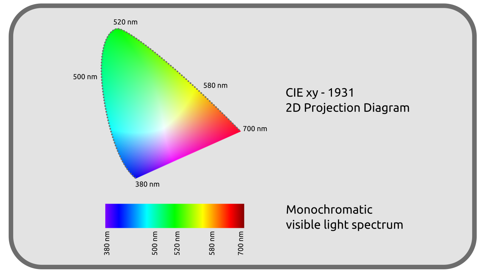

# I.F - Objective representation of colors

Given that the perception of colors is eminently subjective, any joint work requires the establishment of an objective reference shared by all (and therefore a certain standardization of techniques, which is not always obvious ...).

[TOC]

This work of rationalization was not born with the digital image; since 1913 the [International Commission on Illumination](https://en.wikipedia.org/wiki/International_Commission_on_Illumination) (*CIE*) has worked on the problem.

The modern color spaces [^1] used in image processing are proposed solutions to this rationalization, standardization of color representation, and are based on the work and early attempts of the CIE.

It is interesting to know that the CIE conducted its work empirically, defining an "average observer" from numerous experiments of color comparison by human observers, in order to characterize the colors and lights as perceived by the average person.

It is in 1931 that the CIE proposed a first representation and rationalization of the colors: the diagram *CIE-1931*, still very used today as an objective reference, in particular to compare the various colorimetric spaces in use.

## F.1 - Decomposing colors

It has been implied so far that a color as we perceive it is physically defined by three independent parameters: its *intensity*, its *dominant wavelength* and its *Extraction purity*.

- **Intensity** is quite intuitive to understand, and related to what is also called *luminosity*; it is the number of photons received each second by the cells of the retina.
- **Dominant wavelength** will primarily influence the *hue* of the color; it is the most intense monochromatic component in the mixture of all wavelengths forming that particular color.
- **Extraction purity** represents the proportion between the dominant wavelength and the amount of *white* that must be added to obtain the color in question. It is close to what is called *saturation*.

This breakdown is perfectly objective (related to the physical reality of light), it is a good foundation for making an objective representation of colors, which is what the CIE has done since 1931.

## F.2 - Color diagrams, CIE XYZ of 1931 and CIE xyZ

With these three parameters, we can represent the colors in three dimensions.

In order to establish this representation, the CIE chose three theoretical primary colors different from Red, Green and Blue more common, called X, Y and Z, able to include the entirety of the visible colors. This representation is thus the **CIE XYZ colorimetric space of 1931**, and is still used today as reference to represent and compare all the other colorimetric spaces.

The parameters defining this color space were carefully chosen in order to represent the entirety of the colors perceived by human vision.

!!! note
    The three-dimensional representation above is not exact, but does illustrate the general feel of the color space.

For better and easier use and visualization, it is mainly represented in a two-dimensional projection, not showing the intensity (brightness) of the color at all.

This projection actually is actually translated to another color space derived from the *CIE XYZ* where the color is represented on a plane by coordinates named *x* and *y* (in lower case) which makes it the ***CIE xyZ*** space.

On this diagram, we find the spectrum of visible light, on the upper turn, rounded, going from red to blue.

This outline contains all the possible monochromatic lights, while the inside of the diagram represents the "mixed" colors as we perceive them.

The lower straight line represents the blending of the two extremes of the visible spectrum, which we see as the *purple* colors, which are not part of the monochromatic lights and close the "color wheel" we know.

This diagram containing all the visible colors **is always used as reference** in which **one can register the other colorimetric spaces**, necessarily "smaller" because representing only a subpart of all these colors, as we will see thereafter.

## F.3 - Other CIE Spaces

Since the establishment of these first color spaces and until today, the CIE has continued this work, improving the *xyZ* space and creating other spaces more specific and for particular uses.

In 1976, two other spaces were published: the ***CIE L\*u\*v\**** (for light) and the ***CIE L\*a\*b\**** (for surface colors, better known as *CIE LAB*). These two spaces improve and compensate for a "defect" of the *xyZ*[^2]: the coordinates are no longer *linear* in order to better match the human vision. Indeed, in the *xyZ* space, two colors located "at the same distance" can in some areas appear more similar than in other areas. The *L\*a\*b\** and *L\*u\*v\** correct this "defect" at the price of a greater complexity of calculations.

But it is always the *XYZ* or *xyZ* of 1931 which is used as reference to work with and compare all the other colorimetric spaces.

----
Sources et références

- [Color on *Wikipedia*](https://en.wikipedia.org/wiki/Color)
- [International Commission on Illumination on *Wikipedia*.](https://en.wikipedia.org/wiki/International_Commission_on_Illumination)
- [CIE XYZ on *Wikipedia*](https://en.wikipedia.org/wiki/CIE_1931_color_space)
- [L\*a\*b\* CIE on *Wikipedia*](https://en.wikipedia.org/wiki/CIELAB_color_space)
- [L\*u\*v\* CIE on *Wikipedia*](https://en.wikipedia.org/wiki/CIELUV)
- [Colour representation, *Kent State University*](http://www.cs.kent.edu/~farrell/cg00/lectures/color/colour.html)

[^1]:
    The color spaces are the standardized ways of recording and representing the colors (analog as well as digital).  
    There are for example: *sRGB*, *BT.709*, *ACES*, *BT.2020*, *P3*, to name a few from a very large list.
[^2]:
    *L\*a\*b\** and *L\*u\*v\** are actually based on another space published in 1976, the *CIE U'V'W'* which is linear (and itself based on the *CIE UVW* of 1960). The chronology of publication of these successive spaces is as follows:  
    - 1931: *XYV*, and its representation *xyZ*, linear.  
    - 1960: *UVW*, and its representation *uvW*, linear.  
    - 1976 : *U'V'W'*, linear.  
    - 1976 : *L\*a\*b\** and *L\*u\*v\**, nonlinear.  