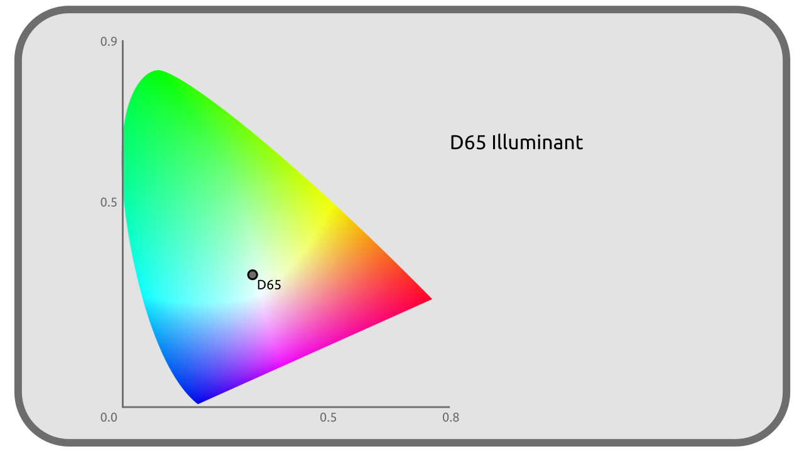
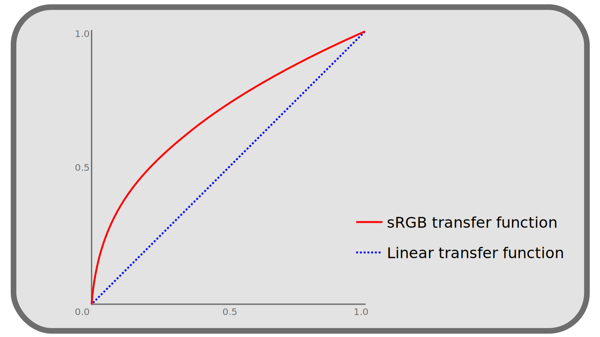

# I.H - What is a color space?

A color space defines **a subset of colors** (a volume in a 3D color diagram, or a surface on a 2D projection like the *CIE xy*) drawn from the visible spectrum (or even outside the visible spectrum)[^1].

!!! note
    The color space describes the colors as they should be reproduced, but does not define the technical means of recording them in the files. See chapter [K - Pixel Format](K-pix-format.md) on this subject.

[TOC]

**

## H.1 - What defines a color space

The whole of the colors being able to be represented by a colorimetric space depends on a principal parameter: **The primary colors** of the color space.

The way of representing these colors depends on two other parameters which supplement the definition of a colorimetric space: **The white point** and **the transfer curve**.

### H.1.a - Primaries and gamut

Most often with the number of 3, the primary colors are the paramount values of the colorimetric space; they can be represented by precise co-ordinates in the space *CIE XYZ* (which is a representation of all the visible colors on three axes). They are in the majority of the cases a shade of *Red*, *Green* and *Blue*, and are ideally close as possible to a real monochromatic color (the external edge of the diagram *CIE xy*).

**

Each space defines its primary colors by at least three coordinates in the space *CIE XYZ*.

For example, here are the coordinates of the Red, Green and Blue *sRGB (standard Red, Green, Blue)* space:

| | R | G | B |
| --- | --- | --- | --- |
| **X** | 0,64 | 0,30 | 0,15 |
| **Y** | 0,33 | 0,60 | 0,06 |
| **Z** | 0,03 | 0,1 | 0,79 |

This means that for two given spaces, the most intense "Red" value is not concretely reproduced by the same shade: some spaces will have a more or less intense or saturated primary red (or less close to monochromatic waves), more or less orange, for example.

The colorimetric space thus defines the way in which the most intense value of a primary color must be reproduced by the physical device which will display it (the screen, the projector, or the printer, etc).

In other words, each device of reproduction must be able to control precisely which light rays, at which wavelengths, which physical colors it is able to produce; according to the range of these wavelengths, the device is *compatible* with various colorimetric spaces if it is able to produce the wavelengths necessary to the reproduction of the primaries of space.

The coordinates of the primary define the limits of a subspace including all the colors which can be represented in the colorimetric space. This subspace is more or less large (it allows to represent more or less different colors); the size of this space is what is called the ***gamut***.

**

### H.1.b - White point

We have seen that in the human perception, what is regarded as *white* varies enormously according to the conditions, of the environment in which we perceive the colors.
It is t therefore necessary to define in the colorimetric space the color which will be regarded as *white*, corresponding concretely to that which must be obtained by the mixing in equal proportion of the various primary colors (white with the maximum intensity, gray with lower intensities).

This white point is also given by its coordinates in the space *CIE XYZ*.

**

For example, here are the coordinates of the white point in the *sRGB* space: 

| | White |
| --- | --- |
| **x** | 0,3127 |
| **y** | 0,3290 |

The [*CIE*](F-representation.md) has defined a number of remarkable white dots (also called *illuminant*), useful for particular purposes. They are represented by letters (from *A* to *F*), sometimes accompanied by a number in the case of series of white points.

A few examples :

- The illuminant *A* represents the color emitted by a tungsten filament of the old domestic bulbs; in other words the color of a *black body* of 2856 Kelvin (cf [Color temperature]()).

- The illuminant *B* represents direct sunlight.
- The *D* series of illuminants represent daylight in different conditions (e.g. *D65* represents light under a cloudy sky).

The illuminant *D65* is the one most commonly used as a white point in the various colorimetric spaces.

!!! note
    The white point is sometimes itself, by simplification, considered as a primary (in the sense that it is also simply a precise color, a coordinate in the *CIE XYZ*). In this case the *primaries* of the space are at least 4 and the space is only defined by two parameters.

The color space normally also associates with the white point its maximum intensity, its luminance, most often measured in *cd/m²*.

### H.1.c - The transfer curve

Colors in a color space are given by the intensity of each primary, represented by a value ranging from `0.0` to `1.0`.

The value `0.0` represents a zero intensity (the absence of light, a perfect black) and the value `1.0` represents the color given by the coordinate of the primary in the *CIE XYZ*.

The question arises as to how the intermediate values are transcribed into real colors (or coordinates in the *CIE XYZ*). This transcription is done by the **transfer curve**. It is a "simple" mathematical function which, for a given value in the colorimetric space, gives the corresponding coordinate in the *CIE XYZ*.

**

The space is said *linear* when this curve is a simple affine function, ie represented by a straight line, and whose correspondence between the values is just proportional.

Other spaces use a more complex transfer curve to better reflect human vision and/or the way early CRTs reproduced intensities[^2] (with a *gamma 2.4*); the "simplest" of these curves are the so-called *gamma* curves. This being said, most spaces do not use simple *gamma* curves but more complex ones.

See the section entitled *[L - Transfer curves, linear space and gamma](L-transfer.md)* for more details.

## H.2 - Other parameters

The color spaces can also impose or recommend other parameters, especially on the way of encoding/storing the colors, according to their intended uses.

### H.2.a - Pixel format

For storing pixels, spaces can recommend different formats. The two most common are:

- RGB, where the pixel contains three values: red, green and blue.
- YUV, where the pixel contains one value of *luminance* and two of *chrominance*.

See section *[K.1 - RGB and YUV](K-pix-format.md)* for more details.

### H.2.b - Depth

Spaces may specify a specific number of bits to be used for each pixel to encode each color. For example *sRGB* specifies a minimum of 8 bits, and *Rec. 2020* specifies 10 or 12 bits.

See section [K.3 - Depth (bpc)](K-pix-format.md) for more details.

## H.3 - Why different color spaces?

The color spaces are (very) numerous. There is in fact as many as different uses of the colors, without counting that the manufacturers of materials, and designers of software, sometimes add their own spaces to the already long list. The uses are relatively unstandardized.

Thus, certain spaces are related to precise materials of capture: a camera can record the data which it captures in a space which is specific to it, and corresponds to the capacities of its sensor, or to the use which will be made of the images (by proposing for example a broad range of colors which facilitates the post-production)

Other spaces are linked to reproduction equipment (screens, projectors, printers...) and represent the colors that the equipment is capable of reproducing.

Finally, more recently, spaces were created specifically for imagery work; they are then used temporarily and are different from the spaces used to capture, record or reproduce the images.

It is thus necessary to keep in mind that several colorimetric spaces come into play at the time of work on an image:

- The color space of the imported and used media.
- The color space of the display used for the display.
- The working color space, used to make the calculations on the image, by the computer.
- The color space used to record and store the output data (and later on the destination display of the media).

These spaces are classified into two categories:

- ***Display-referred*** or ***Output-referred***: Spaces used for display and reproduction.
- ***Scene-referred***: Spaces used for calculation.

**

Not all of these spaces are necessarily the same (and are rarely the same in reality), each having a specific use and corresponding to specific needs; a certain number of conversions then come into play to pass from one space to another. This is where the ability to convert information to and from a reference space (the *CIE XYZ*) allows one to work safely with multiple spaces, with each space defining its ***primary***, ***white point*** and ***transfer curve*** relative to the same reference space.

!!! warning
    It is a common mistake to think that you have to work in the space used for output (*output-referred*) when the *output-referred* spaces were intended for display, not calculation. The *scene-referred* spaces are intended for work.

----
Sources & References

- [Illuminant on *Wikipedia*](https://en.wikipedia.org/wiki/Standard_illuminant)

[^1]:
    It **doesn't** define a *number* of colors, of different shades (which depends on the sampling, on the way the values are stored digitally), but a limited *range* of colors in the set of real colors; in other words, it defines the size of the set of colors, but not the number of subdvisions of the set, which can be more or less fine in its concrete implementation. See the section [Pixel format](K-pix-format.md) for more details.
[^2]:
    The transfer curves during the analog era represented in fact the correspondence between the intensity of the electric signal, and the luminosity captured or reproduced by the camera or the screen; the modern *gamma[\*](ZZ-vocabulaire.md)* follows the same rules to link the luminous intensity to the digital value