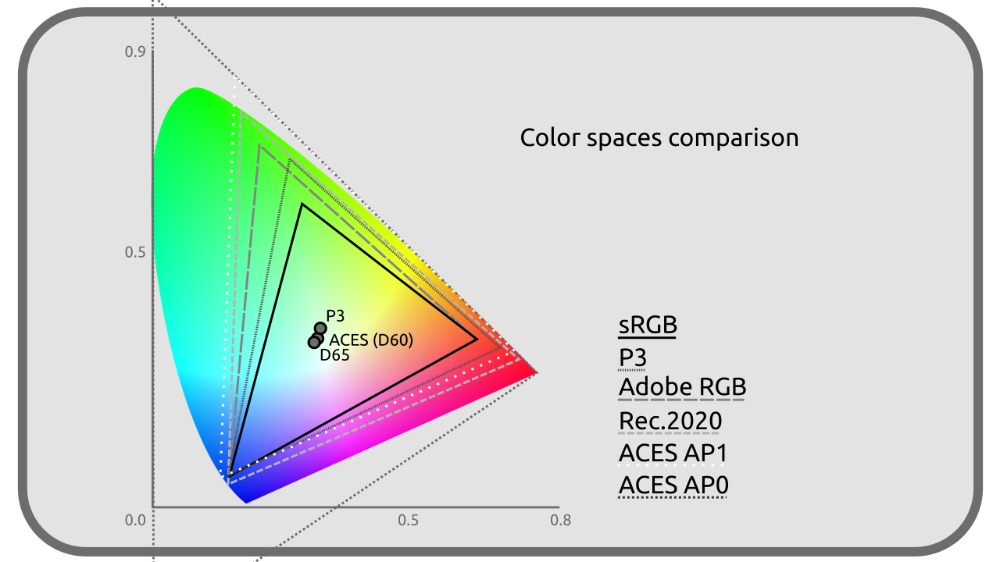
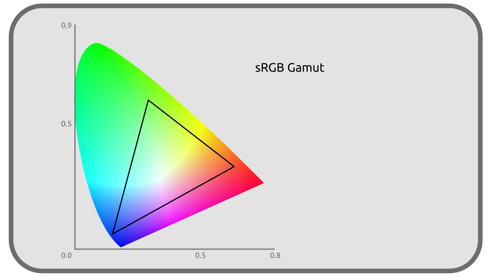

# I.I - Selective list of color spaces

It would not be possible to list here all the color spaces available, but here is a selection useful in audiovisual production in 2021.

[TOC]

## sRGB / CIE 61966-2-1 / IEC 61966-2-1

Display space, ***display-referred***.

The sRGB (for standard RGB) is one of the most common spaces in computing; indeed, it is that of most computer screens, and is also used by extension for most image formats in a standard way (*JPEG*, *PNG*, *TGA*...).

It dates from 1996.

### Primaries
These primaries are the same as those in *Rec. 709*.

| | R | G | B |
| --- | --- | --- | --- |
| **X** | 0,64 | 0,30 | 0,15 |
| **Y** | 0,33 | 0,60 | 0,06 |
| **Z** | 0,03 | 0,1 | 0,79 |

### White

| | White |
| --- | --- |
| **x** | 0,3127 |
| **y** | 0,3290 |
| **CIE** | *D65* |
| **lum.** | 80 cd/m² |

### Transfer curve

sRGB uses a transfer curve very close on average to a *Gamma 2.2*, with actually a linear transfer for linear luminances below *0.0031308* then a shifted *Gamma 2.4*.

## Linear RGB

Color space, ***scene-referred***.

Linear RGB is **a variation of *sRGB*, identical in all points except for the transfer curve which is** ***linear***. It is mainly used as a workspace (*scene referred*) when we need a better simulation of light (rendering engines, blending modes in compositing ...) and to simplify calculations. It is found in particular in *EXR* files.

!!! note
    Often software mistakenly talks about *linear SRGB*, or worse, *IEC 61966-2-1 linear*, but it is **not** *sRGB* since the transfer curve is different.

## Rec. 601 / ITU-R BT.601 / CCIR 601

Display space, ***display-referred***.

Rec. 601 is the complete standard for interlaced video for Standard Definition Television *SDTV*. It is no longer used but was used in the *PAL* and *NTSC* standards.

Its *PAL* version is very close to *sRGB*.

### Primaries

| | R | G | B |
| --- | --- | --- | --- |
| **X** (NTSC) | 0,63 | 0,31 | 0,155 |
| **Y** (NTSC) | 0,34 | 0,595 | 0,007 |
| **Z** (NTSC) | 0,03 | 0,095 | 0,775 |
| **X** (PAL) | 0,64 | 0,29 | 0,15 |
| **Y** (PAL) | 0,33 | 0,60 | 0,06 |
| **Z** (PAL) | 0,03 | 0,11 | 0,79 |

!!! note
    In *PAL*, the primaries of *Rec. 601* are very close to those of *sRGB*; only the *Gx* changes (0.29 instead of 0.3)

### White

| | White |
| --- | --- |
| **x** | 0,3127 |
| **y** | 0,3290 |
| **CIE** | *D65* |
| **lum.** | 100 cd/m² |

### Transfer curve

*Gamma 2.4*.

## Rec.709 / UIT-R BT 709

Display space, ***display-referred***.

Rec. 709 is the standard of the High Definition Television, *HDTV* and dates from 1990. It is generally found in the current video formats (*mp4*...)

It is very close to *sRGB*, only the transfer curve changes (and its white point must be a little more intense).

### Primaries

These primaries are the same as the *sRGB* ones.

| | R | G | B |
| --- | --- | --- | --- |
| **X** | 0,64 | 0,30 | 0,15 |
| **Y** | 0,33 | 0,60 | 0,06 |
| **Z** | 0,03 | 0,1 | 0,79 |

### White

| | White |
| --- | --- |
| **x** | 0,3127 |
| **y** | 0,3290 |
| **CIE** | *D65* |
| **lum.** | 100 cd/m² |

### Transfer curve

Close to a *Gamma 2.4* or *Gamma 2.35* according to the recommendations.

## Rec.2020 / UIT-R BT.2020

Display space, ***display-referred***.

Rec. 2020 is the standard for Ultra High Definition Television, *UHDTV* and dates from 2012.

### Primaries

| | R | G | B |
| --- | --- | --- | --- |
| **X** | 0,708 | 0,17 | 0,131 |
| **Y** | 0,292 | 0,797 | 0,046 |
| **Z** | 0,0 | 0,033 | 0,823 |

### White

| | White |
| --- | --- |
| **x** | 0,3127 |
| **y** | 0,3290 |
| **CIE** | *D65* |
| **lum.** | variable |

### Transfer curve

The same as Rec.709 close to a *Gamma 2,4*, but more precise.

## DCI-P3

Display space, ***display-referred***.

*DCI-P3* was created as a transition to *Rec. 2020* and for movie projection. It is used by some TVs and computer monitors, and even more recently some phones/tablets.

### Primaries

| | R | G | B |
| --- | --- | --- | --- |
| **X** | 0,68 | 0,265 | 0,15 |
| **Y** | 0,32 | 0,69 | 0,06 |
| **Z** | 0,00 | 0,045 | 0,79 |

### White

| | White |
| --- | --- |
| **x** | 0,3140 |
| **y** | 0,3510 |
| **CIE** | N/A |
| **lum.** | 48 cd/m² |

### Transfer curve

*Gamma 2,6*

## Display P3

Display space, ***display-referred***.

The *Display P3* is a variation of the *DCI-P3* adapted to be closer to (and better compatible with) the *sRGB* (and thus to make screens able to display both more easily). It keeps the primaries (and thus the wider gamut) of the *DCI-P3* but uses the White point and the Transfer curve of the *sRGB*.

### Primaries

| | R | G | B |
| --- | --- | --- | --- |
| **X** | 0,68 | 0,265 | 0,15 |
| **Y** | 0,32 | 0,69 | 0,06 |
| **Z** | 0,00 | 0,045 | 0,79 |

### White

| | White |
| --- | --- |
| **x** | 0,3127 |
| **y** | 0,3290 |
| **CIE** | *D65* |
| **lum.** | 80 cd/m² |

### Transfer curve

That of the sRGB close on average to a *Gamma 2.2*.

## ACES

*ACES* stands for *Academy Color Encoding System*, and represents a system comprising 5 color spaces designed by the Academy of the Oscars specifically for audiovisual production, released in 2014 for its first version.

These 5 spaces share the same White point, close to *D60*; they use two sets of Primaries named *AP0* or *AP1*. The *AP0* Primaries are *outside* the visible colors (and thus the *CIE XYZ*): they are the closest theoretical Primaries encompassing all visible colors. The *AP1* Primaries are closer to the usual *RGB* Primaries and to the screens and projectors, making them more practical in the production of images.

### Primaries (AP0)

| | R | G | B |
| --- | --- | --- | --- |
| **X** | 0,7347 | 0,0 | 0,001 |
| **Y** | 0,2653 | 1,0 | -0,77 |

### Primaries (AP1)

| | R | G | B |
| --- | --- | --- | --- |
| **X** | 0,713 | 0,165 | 0,128 |
| **Y** | 0,293 | 1,830 | 0,044 |

### White

| | White |
| --- | --- |
| **x** | 0,32168 |
| **y** | 0,33767 |
| **CIE** | proche de *D60* |
| **lum.** | infinie |

### ACES2065-1

**Storage space**.

*ACES2065-1* is the main space of the *ACES* system. It is designed to store any color information in a non-destructive way and is usable in the long term with future new spaces. It thus encompasses all visible colors and is *larger* than the *CIE XYZ*. Its use is mainly theoretical.

It is intended to be used in *openEXR* images or *MXF* videos.

It is linear.

### ACEScg

Workspace, ***scene-referred***.

*ACEScg* is similar to *ACES2065-1* but uses the *AP1* Primaries. It is intended primarily for 3D renderers and compositing.

Its standard image storage format is *openEXR*.

### ACEScc

Workspace, ***scene-referred***.

*ACEScc* is similar to *ACEScg* (with *AP1* Primaries) but uses a non-linear Transfer curve, more convenient for color correction and calibration.

## Adobe RGB

Display space, ***display-referred*** and working space.

*Adobe RGB* was designed in 1998 for graphic designers working on screen but whose work is intended for printing. It is close to *sRGB*, but the green primary has been shifted to include more colors that can be reproduced in *CMYK* printing. Its Transfer curve is also slightly different.

### Primaries

| | R | G | B |
| --- | --- | --- | --- |
| **X** | 0,64 | 0,21 | 0,15 |
| **Y** | 0,33 | 0,71 | 0,06 |

### White

| | White |
| --- | --- |
| **x** | 0,3127 |
| **y** | 0,3290 |
| **CIE** | *D65* |
| **lum.** | 160 cd/m² |

### Transfer curve

*Gamma 563/256* soit *2,199 218 75*.

----
Sources et références

- [*sRGB* on *Wikipedia*](https://en.wikipedia.org/wiki/SRGB)
- [Specifications *sRGB* on *color.org*](http://www.color.org/chardata/rgb/srgb.xalter)
- [Specifications *BT.601* on *color.org*](http://www.color.org/chardata/rgb/BT601.xalter)
- [*Rec. 709* on *Wikipedia*](https://en.wikipedia.org/wiki/Rec._709)
- [Specifications *BT.709* on *color.org*](http://www.color.org/chardata/rgb/BT709.xalter)
- [*Rec. 2020* on *Wikipedia*](https://en.wikipedia.org/wiki/Rec._2020)
- [Specifications *BT.2020* on *color.org*](http://www.color.org/chardata/rgb/BT2020.xalter)
- [*DCI-P3* on *Wikipedia*](https://en.wikipedia.org/wiki/DCI-P3)
- [Specifications *DCI-P3* on *color.org*](http://www.color.org/chardata/rgb/DCIP3.xalter)
- [*ACES* on *Wikipedia*](https://en.wikipedia.org/wiki/Academy_Color_Encoding_System)
- [acescolorspace.com/](https://acescolorspace.com/)

