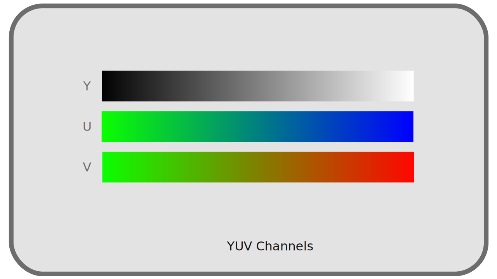

# I.K - Pixel format

Color spaces define how colors should be reproduced, and what specific colors should be generated, but they do not define how those colors are recorded by the computer. It is the pixel format used that will define what types of values are recorded, and how. This format is completely independent of the color spaces, but will influence the quality of the image and the amount of shading that can be stored.

[TOC]

Each pixel is composed of different values of colors, they are the *channels[\*](ZZ-vocabulaire.md)*, which are in general (but not necessarily) either red, green and blue (it is the *RGB*), or a *luminance[\*](ZZ-vocabulaire.md)* and two *chrominances[\*](ZZ-vocabulaire.md)* (it is the *YUV*)

In the case of *YUV*, there is sometimes *chrominance subsampling*, which reduces the amount of data to be stored with a minimal (and almost indiscernible) loss of quality.

Finally, for each *channel*, you can choose the range and precision of the recorded values.
f
## K.1 - RGB or YUV

Any visible color can be represented by only two *complementary[\*](ZZ-vocabulaire.md)* colors and *primary[\*](ZZ-vocabulaire.md)* colors. As soon as three *primaries* are defined and fixed, by varying their proportions, one can obtain a wider range (a *gamut[\*](ZZ-vocabulaire.md)*) of visible colors, a useful (and sufficient) surface of visible colors. Thus, the majority of the devices of reproduction of the colors (screens, projectors...) use three primary colors.

These colors are mostly reds, greens, and blues; they may vary depending on the device and the *color space[*](ZZ-vocabulaire.md)* they use but are always within this range.

In any case, all the color coding systems use a group of different values corresponding to precise primaries or properties; we speak of *channels[\*](ZZ-vocabulaire.md)*, generally three in number.

### K.1.a - RGB

**

A numerical division of the information of colors is generally used based on the same *primary[\*](ZZ-vocabulaire.md)* Red, Green and Blue as the devices of reproduction. Red, Green and Blue are the three channels *R*, *G*, *B* of this system.

**

There are several reasons for the use of these *primaries* and this system of color representation:

- The choice of red, green and blue is close to what the receptor cells perceive best naturally
- Red and blue are the extremes of the visible spectrum, and green is halfway between the two: it is the choice that easily allows to have the widest *gamut* in the set of visible colors.
-These colors are naturally the most used by the display devices although in theory it would be possible to choose others.

But historically, and for reasons of performance and storage, another system is very widespread: *YUV*.

### K.1.b - YUV

**

In the first uses of an electrical signal (analog, not digital at first) to represent videos, the signal was a "simple" one-dimensional signal: videos were represented only in a range from black to white through grays, in *black and white*. In other words, one stored and reproduced only the information of luminous intensity, of *luminance[\*](ZZ-vocabulaire.md)*.

Then came the color televisions, but it was necessary to keep the compatibility of the signal with the oldest black and white televisions; the information of colors, of *chrominance* was therefore added to the luminance signal [^1] , without touching the original signal; the old black and white televisions simply ignored this additional information.

The system used is not a *RGB* system but of three channels *YUV*[^2], where *Y* represents the *luminance*, and *UV* represent two information of *chrominance* (containing respectively the ratio blue/green and red/green).

**

What is interesting about this system is not only historical: as we have seen previously, the human eye distinguishes better the contrasts of *luminance[*](ZZ-vocabulaire.md)* than of *chrominance*. Separating this information makes it possible to treat them differently, and in particular to reserve a quantity of information, a resolution, higher in the luminance than the chrominance, and thus to reduce the quantity of information to be stored and transmitted without notable loss of visible quality.

### K.1.c - Comparison

We have two main systems of color coding, **independent of color spaces** used [^3].

Here are the main differences:

- History: the use of *RGB* spread with the digital age, *YUV* dates from the analog
- Consequently *YUV* is more widespread in video formats, *RGB* in image formats.
- YUV* allows a more efficient data compression, with a certain loss in chrominance, while *RGB* must store as much information in its three channels.
- The conversion from *YUV* to *RGB*, and vice versa, is done easily and *almost* without loss of information.

### K.1.d - Others

There are other less common combinations of channels and pixel formats, for specific uses or *containers[\*](ZZ-vocabulaire.md)*.

For example, some image formats use a *palette* of colors instead of several mixed primaries, and thus have only one channel per pixel, whose value corresponds to a predefined color[^4].

Other formats store only grayscale, and thus just one *channel* of brightness. There are also more exotic formats with two layers...

## K.2 - YUV 4:4:4, 4:2:2, 4:2:0... Chrominance subsampling

*YUV* has the advantage, compared to *RGB*, to be able to function in practice in a way closer to the human perception which is more powerful in *luminosity[\*](ZZ-vocabulaire.md)*. Indeed, by separating the *luminance[\*](ZZ-vocabulaire.md)* from the *chrominance[\*](ZZ-vocabulaire.md)*, it is possible to decrease the quantity of data recorded in *chrominance* to support the *luminance*, without losing the perceived visual quality and thus to compress the video data effectively.

To operate this reduction of quality in *chrominance*, we simply decrease the resolution, the number of pixels; it is what we call chroma sub-sampling.

Chroma subsampling is therefore *a lossy compression method* that is completely independent of the *standard[\*](ZZ-vocabulaire.md)* (*codec[\*](ZZ-vocabulaire.md)*) encoding of the video.

The acronyms *4:4:4*, *4:2:2*, *4:2:0*[^5]... describe how the subsampling is done and indicate the amount of data lost. This description is made from a 4 by 2 pixel grid.

The first value of the trio represents the resolution (sampling) of the *luminance[\*](ZZ-vocabulaire.md)*.  
The second value represents the subsampling of the *chrominance[\*](ZZ-vocabulaire.md)* on the first line (all odd lines), while the third represents this subsampling on the second line (all even lines).

A fourth value is sometimes added to the acronym and represents in this case a subsampling in the *alpha\** channel of the video [^6].

We can easily calculate the amount of data saved by adding the three values and dividing by 12 (or 16 if there is a separate value for alpha).  
For example:

- in *4:4:4*, there is no loss (factor of `1.0`)
- in *4:2:2*, one third is gained (factor of `0.66`)
- in *4:2:0*, we gain half (factor of `0.5`)

!!! tip
    In the case of black and white video, chrominance is completely useless, so you can choose the mode that has the least chrominance.

### K.2.a - 4:4:4

The *4:4:4* subsampling in *YUV* is **the only equivalent to *RGB*** in terms of quality (and quantity of data). There is in fact no subsampling in this mode and all pixels contain *chrominance[\*](ZZ-vocabulaire.md)* and *luminance[\*](ZZ-vocabulaire.md)* information.

It is not used in broadcasting but **only in production** (or for archiving). Indeed, the bitrate would be too high, but this data is essential for post-production, especially when using green or blue background (*chroma-key*): since masking is done on the chrominance information, it is absolutely essential to have the full resolution.

!!! warning
    Unfortunately, only high-end professional cameras and recorders can record in *4:4:4*, many cameras record in *4:2:2*, only in *4:2:0* for the entry level.

### K.2.b - 4:2:2

In *4:2:2*, the resolution of the *chrominance[*](ZZ-vocabulaire.md)* is half that of the luminance (so the amount of data is reduced by one third). The loss is imperceptible, which makes it a very efficient way of compressing video. This mode is used in production (as long as there is no overlay, green/blue background), in high-end formats and in high quality broadcasting (especially in television).

The horizontal resolution of the chrominance is reduced by half while the vertical resolution is kept.

### K.2.c - 4:2:0

In *4:2:0*, the *chrominance[\*](ZZ-vocabulaire.md)* resolution is reduced by half on every other line, and completely removed on the other line. The amount of data is thus reduced by half overall, but the difference is still very difficult to perceive, which makes it a very good broadcast format[^7].

This mode is the main one in consumer computer files and on the internet. Many software players, and most *hardware* players (blu-rays players, smart TVs, etc) only support *4:2:0*.

It is to be proscribed in production in case of colorimetric correction or overlay; the *chrominance* information is very insufficient (a "staircase" effect can easily appear, due to the lack of resolution in chrominance).

Both the horizontal and vertical resolution of the chrominance are reduced by half.

## K.3 - Color depth (bpc)

Regardless of the chosen color space, and whether for exported files or the working space, the color depth parameter describes the accuracy of the values recorded for each *channel[*](ZZ-vocabulaire.md)* of pixels.

Contrary to a widespread idea, the depth of color does not really influence the quantity of visible colors, but rather the precision of the calculations, and thus the number of "sub-shades" usable within the chosen colorimetric space. In other words, the depth does not change the *gamut[*](ZZ-vocabulaire.md)*. We will speak here rather about quantity of *shades* rather than quantity of *colors* to avoid this confusion.

By defining the precision of the values, and the amount of data recorded, the color depth directly influences the size of the files.

This is usually measured in *bits[*](ZZ-vocabulaire.md)* (meaning *per pixel*) or in `bpc` (*bits* per channel). The more *bits* (`0` or `1`) you use to store the pixel (or each of the channels), the more space the file will take up but the higher the accuracy (and therefore the quality).

Depending on the system, the standards vary, especially because of the *YUV* chrominance subsampling.

### K.3.a - In RGB

In *RGB* each *channel[\*](ZZ-vocabulaire.md)* contains as much information (there is no subsampling), and if in theory one could imagine an arbitrary number of *bits[\*](ZZ-vocabulaire.md)* to store the *channels* (and it is the case in certain file formats), one generally uses multiples of 8 (and thus integer bytes[^8])

#### K.3.a.a 8 bpc / 24 bits / 24 bpp / 32 bits with alpha

Most images use 8 *bits* per *channel*. With 8 bits, we can code 28, that is 256, different values (from 0 to 255). With three layers, we therefore have a total of 83, that is, a little over 16 million, different values for a pixel.

This quantity of nuances is necessary and sufficient so that the human eye does not distinguish "levels" in the images with a *gamut[*](ZZ-vocabulaire.md)* like that of the *sRGB*, and is thus the most widespread in the digital images *RGB* intended for the computer screens.

But this quantity is not sufficient when working on the image, as a workspace. Indeed, when modifying the images, the computer performs calculations on the values of the different layers, and these calculations on only 256 integer values lead to a strong loss of precision, visible very quickly[^9].

This depth is also not sufficient for TV or film work that uses a higher depth (associated with a wider *gamut* in spaces other than *sRGB*).

To be able to work without degrading the image, we therefore increase the color depth of the workspace.

#### K.3.a.b 16 bpc / 48 bits / 48 bpp / 64 bits with alpha

By adding a byte for each layer, we greatly increase the number of available shades. In effect, we increase the number of values available for each layer to 216, or 65536. This makes a total of 655363, or several *trillion*, shades per pixel.

As a general rule, these 16 *bits* per *layer* provide the necessary precision for fine work on the image, but may still be insufficient in specific cases:

- When using a *linear* workspace for an export intended for high-end TV and HDR or cinema (*cf.* chapter [L - Transfer curves](L-transfer.md)): the transition from *linear[\*](ZZ-vocabulaire.md)* to non-linear output space (the application of a *gamma[\*](ZZ-vocabulaire.md)*) "compresses" the dark values and "stretches" the lights. As a result of this calculation, *16 bpc* linear corresponds in quality to just *12 bpc* of the highest standards for television[^10] and cinema[^11].
- In case of complex and heavy work, even on a non-linear space, for television or cinema, it's possible to reach the limit of precision necessary for very fine color gradations.

We can therefore further increase the depth of color in these cases.

#### K.3.a.c 32 bpc / 96 bits / 96 bpp / 128 bits with alpha

!!! warning
    Do not confuse *32 bpc* (per channel) with *32 bits* or *32 bpp* (per pixel) which is actually only *8 bpc* (with an alpha layer)!

We add a third byte per channel, which further increases exponentially the number of available shades, with 232, 4 billion, possible values per *channel[\*](ZZ-vocabulaire.md)*, that is to say a number that we will consider infinite shades per pixel.

This mode is the one which allows a work virtually without any loss on the image, whatever the colorimetric space used, whether it is linear or not, but becomes very heavy in term of memory.

While it can be useful as a working mode, it is in fact rarely used for storing files (even intermediate ones) where *16 bits* per *layer* are often enough [^12].

### K.3.b - In YUV

In *YUV*, which is never used as a working system but only for storage and diffusion, the depth used is different from *RGB* systems.

It's usually noted in the number of bits used for the luminance layer per pixel; indeed the number of *bits[\*](ZZ-vocabulaire.md)* per *channel[\*](ZZ-vocabulaire.md)* doesn't really make sense with the different *sub-samples of chrominance[\*](ZZ-vocabulaire.md)* possible, as well as a number of *bits* per pixel

By taking into account the *subsampling of chrominance*, we can calculate the average number of bits used per byte (and therefore the approximate size of an image without compression by multiplying by the number of pixels), even if in reality, the number of bits used by chrominance is the one indicated for pixels containing chrominance, and zero for the rest.

The various modes thus differ only in term of quality, and as a general rule, the more we increase the resolution of the image and the *gamut[*](ZZ-vocabulaire.md)* of the color space, the more we increase the depth to ensure that the gradations remain fine and without effect of staircase ("*banding*" )

#### K.3.b.a 8 bits

This is the most common depth in computing; most computer monitors can't display more than this.

- In *4:4:4*, this means that each pixel is represented by *24 bits*.
- In *4:2:2*, this means that a pixel is represented *on average* by *16 bits*, with actually half of the pixels (every other column) containing *24 bits* (*8 bits* per channel), and the other half containing *8 bits* (*8 bits* of luminance and none of chrominance).
- In *4:2:0*, this means that a pixel is represented *on average* by *12 bits*, with actually every fourth pixel (every second row and every second column) containing *24 bits* (*8 bits* per channel), and the last quarter containing *8 bits* (*8 bits* of luminance and none of chrominance).

This is the standard depth for *HD* video in *Rec.709*.

#### K.3.b.b 10 bits

This is the basic depth of high-end and *UHD* videos in *Rec.2020*.

- In *4:4:4*, this means that each pixel is represented by *30 bits*.
- In *4:2:2*, this means that a pixel is represented *on average* by *20 bits*, with actually half of the pixels (every other column) containing *30 bits* (*10 bits* per layer), and the other half containing *10 bits* (*10 bits* of luminance and none of chrominance).
- In *4:2:0*, this means that a pixel is represented *on average* by *15 bits*, with every fourth pixel (every second row and every second column) actually containing *30 bits* (*10 bits* per layer), and the last quarter, *10 bits* (*10 bits* of luminance and none of chrominance).

#### K.3.b.c 12 bits

This is the "*HDR*" depth of high-end video and *UHD* in *Rec.2020*.

- In *4:4:4*, this means that each pixel is represented by *36 bits*.
- In *4:2:2*, this means that a pixel is represented *on average* by *24 bits*, with actually half of the pixels (every other column) containing *36 bits* (*12 bits* per layer), and the other half containing *12 bits* (*12 bits* of luminance and none of chrominance).
- In *4:2:0*, this means that a pixel is represented *on average* by *18 bits*, with every fourth pixel (every second row and every second column) actually containing *18 bits* (*12 bits* per layer), and the last quarter, *12 bits* (*12 bits* of luminance and none of chrominance).

### K.3.c - Others

There are other depths, from *1 bit per pixel* (monochrome images), depending on specific uses. For example, an image using a palette of 256 colors as found in the *GIF* format or some *PNG* for example use *8 bits per pixel* (and therefore per channel too, since there is only one channel in this case)

## K.4 - Full range / Limited / TV / PC ?

When encoding video (and decoding it), an important parameter is the *color range*. This parameter has its historical origin at the time of the passage from analog TV to digital RGB screens. It gives a range of possible levels on each of the *channels[\*](ZZ-vocabulaire.md)* of color (red, green, blue).

### K.4.a - Full range / PC

Digital computer monitors use the *full* range of red, green and blue levels for color reproduction. With the 8 *bits[\*](ZZ-vocabulaire.md)* per *channel[\*](ZZ-vocabulaire.md)* most common, this means that each channel stores values between 0 and 255.

0 represents black, and 255 represents white.

### K.4.b - Limited range / TV

Televisions are expected to use the range known as *limited* of the levels; this range is originally adapted specifically to represent more correctly the contrasts of the films and corresponds with 8 *bits[\*](ZZ-vocabulaire.md)* by *channel[\*](ZZ-vocabulaire.md)* to values between 16 and 235.

This means that in television, the value 16 represents black, and the value 235 represents white. All values below 16 are ignored (more black than black) as well as all values above 235 (more white than white) [^13].

### K.4.c - Practical conclusion

It is therefore necessary to know both your material when reproducing a video, and what to do when encoding it.

#### K.4.c.a - Encoding

In the vast majority of cases, video standards recommend encoding in *limited range / TV*: videos are intended to be seen in television conditions (including on the Internet). This is the case for example for *mp4* in *h.264* or *h.265*, for *mkv*, and for all *broadcast* formats.

On the other hand, image formats (*PNG*, *Jpeg*, *openEXR*, etc.), as well as *intermediate* video formats (those used during production and not broadcasting, such as *Prores*), being intended for a computer environment, use rather the *full range / PC*.

It is important to respect these standards to be sure that the files are correctly interpreted by the viewers' equipment, and always inquire about the formats recommended by the broadcasters.

#### K.4.c.b - Playback and display

When playing videos, it is also necessary that the whole system is correctly configured; a common (not to say recurrent) problem on computers is that videos are left in *limited range* while the screen is *full range*.

During playback, the video source must be converted to match the screen or projector. Without conversion, a *limited range* video on a *full range* screen will be "dull": there will be no black or white, the range of the image going only from light to dark gray. Conversely, a *full range* video on a *limited range* TV will have a loss of information in both highlights and shadows, with large parts completely black or white (the image will be too contrasted).

**

So the hardware must be set up correctly. On a disc player or console, there must be a setting to specify whether the connected display is *full range* or *limited range* (as a general rule, a computer monitor or video projector is *full range*, a TV *limited range*).

On a computer, things can be a bit more complex: you have to start by checking the settings of the graphics card driver, usually in a section called "video", and specify *full range / PC* (unless it is a TV that is connected to the computer)[^14]. If after having set this parameter variations are still visible, you have to check that the software used to play the video does not make a bad conversion (for example *Quicktime* on *Windows* was known for this[^15]); most of these softwares should however let the graphics card do this conversion and not cause any problem (this is the case of *VLC*, of the video player of *Windows*, of *Totem* under *Linux*...).

**  
Example of parameters via the settings of a *Nvidia* graphics card (under *Linux*). Note especially here the *color range* parameter, to be set to *Full* if the screen is a computer screen, and *Limited* if it is a TV.

!!! warning
    On some hardware, an "Auto" option is available in addition to *full / limited range*. In this case the hardware *try* to detect the type of screen connected. Since this is a parameter that should only be changed when the screen is changed, it is strongly recommended to set it manually.

----
Sources & References

- [Sous-échantillonage de la chrominance sur *Wikipedia*](https://fr.wikipedia.org/wiki/Sous-%C3%A9chantillonnage_de_la_chrominance)
- [Color Depth sur *Wikipedia* (en anglais)](https://en.wikipedia.org/wiki/Color_depth)
- [RGB Full vs Limited sur *Reference Home Theater* (en anglais)](https://referencehometheater.com/2014/commentary/rgb-full-vs-limited/)

[^1]:
    In reality, we speak of either *luminance*(ZZ-vocabulaire.md)* or *luminosity*(ZZ-vocabulaire.md)* or *luma[\*](ZZ-vocabulaire.md)* :  
    - The *luminance* has a linear transfer curve.  
    - The *luma/luminosity/brightness*  has a gamma.  
    When we speak of *luminance* we note *YUV* while when we speak of *brightness* we should note *Y'UV*, but most of the time we omit the premium.  
    *See chapter *[L - Transfer curves, linear space and gamma](L-transfer.md)*.
[^2]:
    The general term *YUV* actually covers two families, each declined in *luminance* or *luminosity* (*Y* or *Y'*):  
    - In analog we speak of *YUV* and *Y'UV*, or sometimes *YPbPr* and *Y'PbPr*.  
    - In digital the exact term is *YCbCr* or *Y'CbCr*, and sometimes *YCC*.  
    But it is generally the term *YUV* that is used in all these different cases...
[^3]:
    In fact, *YUV* and *RGB* can be used interchangeably, but some standards and color spaces specify one or the other, or both. For example *sRGB* is specifically intended to be used on *RGB* encoding, while *Rec.709* specifies that it can be used in both *RGB* and *YUV*.
[^4]:
    This is the case for *GIF* which contains a maximum of 256 different colors in its palette. This principle can also be used for *PNG* and other formats. The aim here is to reduce the overall size of the file by storing less information (only the palette with the colors described in *RGB*, and only one *channel* per pixel; this way we can reduce the overall size by a factor of three).
[^5]:
    This list are the most common subsamples, but there are rarer ones (*4:2:1*, *4:1:1*), or more complex or downright exotic ones (*3:1.5:1.5*, *3:1:1*)...
[^6]:
    By default, the subsampling of the alpha channel is the same as that of the *luminance[\*](ZZ-vocabulaire.md)*.
[^7]:
    This mode exists in the *openEXR* format: it is the option noted "Luminance/Chroma".
[^8]:
    In current computing where the *byte[\*](ZZ-vocabulaire.md)* is also the *Byte[\*](ZZ-vocabulaire.md)*, the smallest unit of memory, one cannot use "half bytes" (or any other fraction). Using an integer number of *bytes* per pixel means that the number of pixels in the image can be completely arbitrary; if the number of *bytes* per pixel is not integer, several pixels will have to share bytes, and the number of pixels is constrained: the total number of *bytes* in the image must be integer. This is why the number of rows and columns in a *mp4* video must be even for example.
[^9]:
    It is easy to see why: let's imagine that we have to divide a value of `127` by two. The result will be rounded to `63` or `64`. If other calculations follow, the precision drops very quickly and so does the quality.
[^10]:
    In 2021, the standard for Ultra-High Definition (*4K*) *Rec.2020*, still little used in broadcasting but already standardized, which has a very wide gamut, recommends *12 bits* in luminance for its "HDR" mode.
[^11]:
    The *Digital Cinema Package* (*DCP*) (where the image is in fact encoded under the *JPEG 2000* lossless standard) in use in 2021 encodes the colors in a *XYZ* space with *12 bpc*.
[^12]:
    We won't go into the technical details of how these values are represented, either by a *float* number (between 0.0 and 1.0 and potentially negative too) or by an integer, but it is important to know that this distinction exists as much for the *16 bpc* as for the *32 bpc*. When in doubt, prefer floating point numbers.
[^13]:
    Some blu-rays and game consoles take advantage of this limit to add speculars (brightness) beyond the white and make them brighter. If the TV is compatible, it will display "super whites", otherwise it will simply ignore this information, without affecting the image.
[^14]:
    For a long time, NVidia graphics card drivers under *Windows* were configured to display videos in *limited range* by default...
[^15]:
    Although loved by animators for its ability to easily play videos frame by frame, *Quicktime* under *Windows* is to be avoided for its poor color management; its development has been abandoned by *Apple* anyway.  
    *[DJV](https://darbyjohnston.github.io/DJV/)*, available for *Windows*, *Mac OS*, *Linux*, as well as *BSD*, replaces it efficiently and integrates a professional color management.

