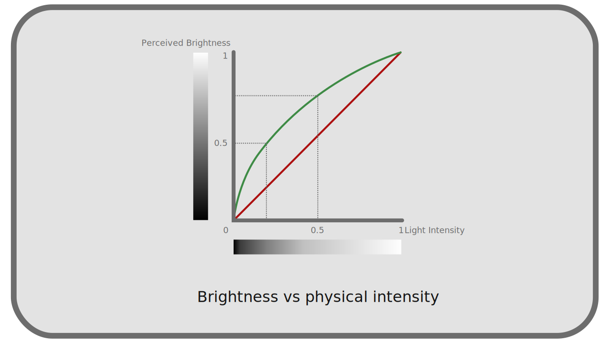

# I.L - Transfer curves, linear space and gamma

When the human eye perceives colors, it distinguishes better the contrasts in the weak intensities, the shades, than in the strong lights; in other words, the response to the intensity is not *linear* (proportional) [^1]: a light that we perceive at "half" the intensity of another light **is not** really and physically half as intense, but rather four times less intense. cf. chapter *[C - Perception of light and colors by the human eye](C-perception.md)*.

**

To optimize the amount of data and the quality of images in video, and later in digital images, instead of representing light in a physical way, we therefore used *non-linear* *transfer curves*, which we call a *gamma correction* [^2] in its simple form [^3], which simulates this non-linear perception of human vision and allows us to store the values *as they are perceived*.

The color spaces therefore each define their own transfer curve, and it is often possible to *linearize* the spaces used as workspaces in applications, to get closer to the physical light during the work (and simplify the calculations).

The interest of non-linear spaces is therefore twofold: as spaces for storage and for diffusion, they make it possible to limit the quantity of data without any visible loss of quality; as workspaces, they make it possible to work with intuitive values and color selectors, which work in the same way as our perception of colors.

**  
*The selection of dark colors is much more difficult in linear, while with a gamma the scale of brightness seems more regular and logical.

However, linear spaces also have their advantages: they simplify calculations (for developers), and by simulating real and physical light, allow 3D rendering engines to efficiently generate realistic images. In two dimensions too, linear spaces allow better calculations in the fusion of colors (the different types of transparency) and solve the problems of banding that appear in some color combinations, allowing more realistic, more logical blends.

**  
*Notice how the colors blend more naturally in linear, especially the blue in the red that pulls on the magenta, and especially how the blends do not darken or desaturate the colors.

!!! note 
    It is important to note that choosing a linear space to store (and work with) images imposes a higher [*color depth*](K-pix-format.md), in order to keep the quality when converting to non-linear display and broadcast spaces.

----
Sources & References

[^1]:
    We speak of "linear" because the graphical representation of the mathematical function corresponding to a given physical intensity its human perception would be a *affine* function, proportional, represented by a straight line.
[^2]:
    In reality, *gamma correction* was created to compensate for the fact that the light intensity of the first CRT screens was not linear either. But in digital, *gamma correction* is used to optimize data storage and bandwidth. The fact that this modern *gamma correction* is close to the one used with the old CRT screens is both a coincidence and the result of engineering that aimed to simplify the process.
[^3]:
    The *gamma* correction `γ` **is not** the *[Gamma function](https://en.wikipedia.org/wiki/Gamma_function)* `Γ` of mathematics, but a simple function using a power (often close to the square, the most common *gamma* varying around the value `2`).

