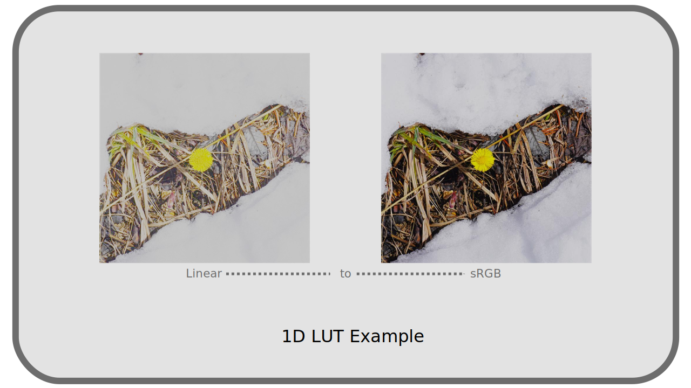
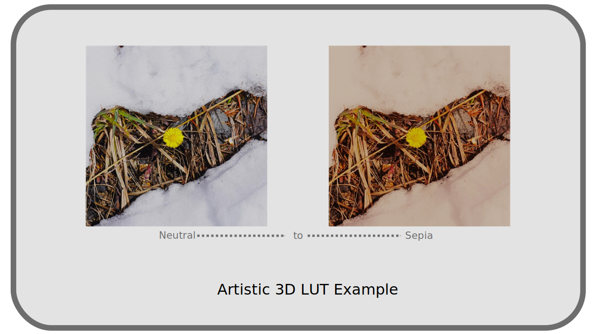

# I.M - LUTs

The acronym *LUT* comes from *Lookup Table*.

[TOC]

## M.1 - Description

As its name suggests, it is a simple array of values, allowing to match some input values with other output values. In computing, it is a convenient way to replace complex mathematical functions, the result of time-consuming calculations, with a simple search in the array, which can greatly improve performance: instead of having to recalculate, you already have the results in memory.

We keep the use in colors; it is a simple way to match a color in input to a different color in output: it is therefore a table that allows to retouch the colors or convert color spaces, describing them, color by color.

The main interest of a *LUT* is that any program can easily use them and thus convert from and to color spaces which are not provided for at the base by the program; instead of having to "know" the mathematical functions which define a color space (in particular the transfer curve), the program has only to read the results in the *mapping table* without having to carry out the calculation. It is a *utility* tool, for conversion.

They are also a way to "save" any colorimetric adjustment; even if an adjustment is made using multiple effects in an application (levels, curves, saturation...), it can be described and saved as a single *LUT* and then reapplied easily, and in *any* application capable of reading a *LUT*. In this case, it is an *artistic* and practical use.

Here is an example of a few lines of values from a *LUT*, which is really just a text file containing such an array of values:

| R | G | B |
|---|---|---|
|0|0|0|
|0|0|298|
|0|0|596|
|0|0|894|
|0|351|0|
|0|326|260|
|0|302|558|
|0|278|856|
|381|3784|0|
|282|3760|0|
|184|3736|117|
|85|3712|415|

A *LUT* does not describe *all* possible color matches, but a selection of colors; to obtain a color that is not in the table, it is necessary to perform *interpolation*. Normally, the application using the *LUT* proposes different interpolations which will change the way these colors are obtained (by rounding, linear interpolation, etc.).

The quantity of values contained in a *LUT* is thus very important for the quality of the output image: being only a table of limited values, there can be a loss during the conversion and the result can more or less differ from a true mathematical operation. However, the difference is not discernible in the case of *LUT* with many values, such as those used by *OCIO + ACES* for its conversions for example. *See *Chapter *[N - OCIO, ACES](N-ocio.md)*.

## M.2 - Use

There are many different file formats for *LUTs*, depending on applications, developers, etc. Here are some examples (formats supported by *[FFmpeg](http://ffmpeg.org)*):

| Extension | Name, publisher, application... |
|---|---|
|*3dl*|Discreet / After Effects / Autodesk|
|*cube*|Iridas / Resolve|
|*dat*|DaVinci|
|*m3d*|Pandora|
|*csp*|cineSpace|
|*spi1d*, *spi3d*|Sony Pictures Imageworks|

It can be useful to convert between different *LUT* formats; *[OCIO](N-ocio.md)* includes a command line conversion tool, for which the media encoder *[DuME](https://rainboxlab.org/tools/dume/)* provides a graphical interface.

There are two main types of *LUT*: ***LUT 1D*** and ***LUT 3D***.

- **1D LUT**

*1D LUT* work only on the *luminance* and do not modify the colors. Having only one dimension, they are lighter and simpler than the *3D LUT* and are useful for the conversions of *gamma[\*](ZZ-vocabulaire.md)*, for example between two colorimetric spaces which would have the same *primaries[\*](ZZ-vocabulaire.md)*. *See *chapter *[L - Transfer curves, linear space and gamma](L-transfer.md)*.

- **3D LUT**

The *3D LUT* work on the three channels red, green and blue. They therefore allow detailed retouching of both luminance and hues as well as saturation. They allow artistic effects as well as conversions from and to any color space.

Whatever the type of *LUT*, these conversion tables offer only a simple correspondence of value, **each _LUT_ is designed for a precise space and colors in entry** and **cannot be used indifferently on any image**!

For example, a *LUT* that converts to the *Rec.2020* color space is **certainly** intended to be applied to an image in another specific color space, e.g. *Rec.709*; in this example, it **cannot** be used on an *sRGB* image, unless it has first been converted to *Rec.709*.

This is also true for *LUTs* that are for artistic use, not utilitarian. It is necessary to know on which space and which type of image each *LUT* is supposed to be applied. Depending on the application, the choice of workspace is therefore important when using *LUT*, or at least you must be aware of it in order to make any conversions prior to using *LUT* (which means that they are not as simple as they seem).

----
Sources & References

- [Lookup table on *Wikipedia*](https://en.wikipedia.org/wiki/Lookup_table)
- [1D vs 3D LUTs by James Ritson on *Affinity Spotlight*](https://affinityspotlight.com/article/1d-vs-3d-luts/)[^1]

[^1]:
    Beware, his conclusion contains an error. In the otherwise very good article, James Ritson explains that a *1D LUT* can be used to convert an image from *Rec.2020* to *Rec.709*, which is wrong since the *primaries[\*](ZZ-vocabulaire.md)* of the two spaces are different, not just the *transfer curve[\*](ZZ-vocabulaire.md)*. You must then use a *3D LUT*. On the other hand the conversion from *Rec.709* to *sRGB* is well possible with a *LUT 1D* since only the *transfer curve* is different.

