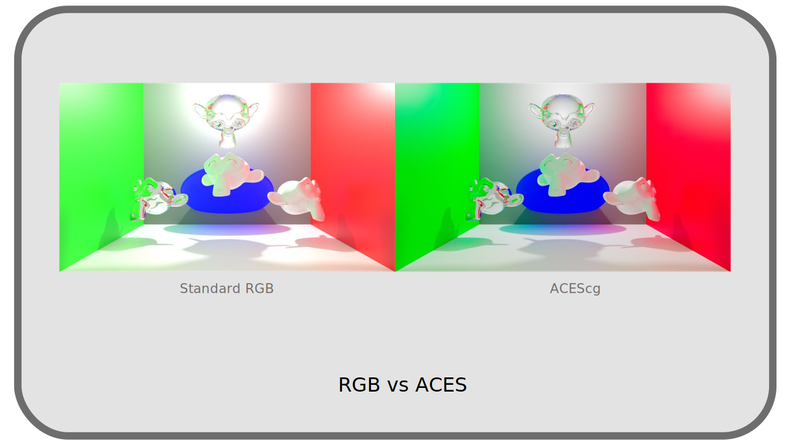
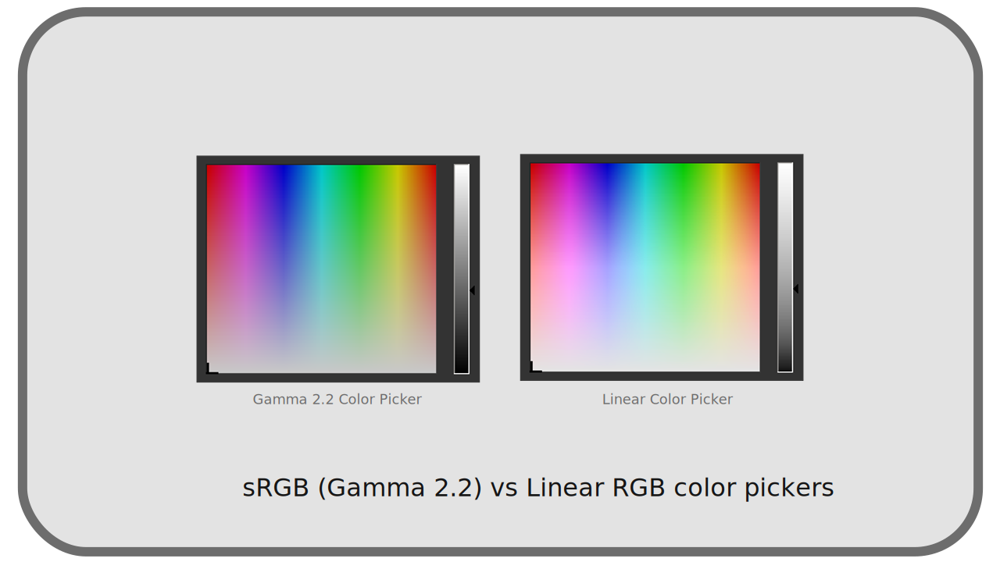

# I.N - OpenColorIO and ACES

[*OpenColorIO*](https://opencolorio.org/)[^1], often abbreviated as *OCIO*, is a free and open source library for developers (not users), facilitating color management. It aims to be used by all applications in digital image production, thus facilitating color management throughout the production pipeline: by becoming standard, it makes it possible to share the color configuration throughout the production pipeline and to have control over it at all stages, as easily as possible.

[TOC]

Applications using *OCIO* therefore all share the same color management configuration format, a file named `congig.ocio`.

It is thus possible to easily share the same color management throughout the production pipeline, defining workspaces, file spaces, color picker spaces, display spaces, final output spaces... *See Chapter *[II.A - Practical Implementation](pratique.md)*.

!!! note
    *OpenColorIO* also brings support for a large number of *LUTs[*](ZZ-vocabulaire.md)* formats, solving the problem of *LUTs* compatibility with applications.

Several [*OCIO* configurations are provided](https://opencolorio.readthedocs.io/en/latest/quick_start/downloads.html) as examples that can already be used in production as is, including the *ACES* configuration (see below) or the *Sony Pictures Imageworks* configuration for animation (*spi-anim*) and special effects (*spi-vfx*).

## N.1 - Compatible applications

Here is an alphabetical list (not exhaustive) of the main applications using *OpenColorIO*, established in early 2021[^2].

|Application|Use|Notes|
|----|----|----|
|Adobe After Effects|Compositing|Partial support [whith a plugin](https://fnordware.blogspot.com/2012/05/opencolorio-for-after-effects.html).|
|Autodesk Arnold|Render engine||
|Maxon Redshift|Render engine||
|Blender, Cycles, Eevee|3D, Render engine, compositing||
|DuME|Encoder|Partial support via LUTs|
|SideFX Houdini|3D||
|Krita|Drawing||
|The Foundry Mari|Textures||
|Autodesk Maya|3D||
|Mocha Pro|Tracking||
|Modo|3D||
|The Foundry Nuke|Compositing||
|Adobe Photoshop|Dessin|Partial support via ICC profiles|
|Substance Designer|Textures||
|Unreal Engine|Render engine||
|V-Ray|Render engine|

!!! hint
    Any application that can use *LUTs[*](ZZ-vocabulaire.md)* can be integrated into a production line using *OCIO*, by exporting the *LUTs* needed for production from *OpenColorIO*, either via the command line tool provided, or by using the *[DuME](https://rainboxlab.org/tools/dume/)* media encoder which can create these *LUTs*.

## N.2 - ACES

*ACES* stands for *Academy Color Encoding System*, and is intended to be a color management and exchange standard for digital imaging; it aims to simplify color management and maintain the highest fidelity in all production pipelines. It is free and open source, and uses *OpenColorIO* in its operation.

*ACES* actually consists of:

- 5 color spaces designed for different uses in the production chain.
- An *OpenColorIO* configuration, with the *LUTs* necessary for its use everywhere.
- A set of recommendations on color calculation and storage.

See chapter *[I - List of color spaces](I-liste-espaces.md)* for the technical details concerning the various color spaces of *ACES*.

The main recommendations on storage are:

- Use the *openEXR* file format.
- Save in wide color spaces, encompassing all others. The ideal space encompassing all visible colors is *ACES2065-1*.

### N.2.a - ACES color space

The different spaces offered by *ACES* correspond to different needs and specific uses. Here are the most important ones.

#### N.2.a.a - ACES2065-1

The space *ACES2065-1* is the space with the broadest *gamut[\*](ZZ-vocabulaire.md)*, including all the visible colors, and its curve of transfer is linear.

It is in fact the most complete of the spaces, its goal being to be able to store the colors without loss, and compatible with all the past and future spaces.

Like all linear spaces, it requires a depth of at least *16 bpc*, with a preference for *32 bpc* compatible with its goal of efficiently representing any visible color.

It is in fact little used, representing *too* much data, its interest being mainly theoretical.

#### N.2.a.b - ACEScg

The *ACEScg* (for *computer generated (images)*) space is derived from *ACES2065-1*, but uses different *primaries[\*](ZZ-vocabulaire.md)*, reducing its *gamut[\*](ZZ-vocabulaire.md)*, which is still very large, while being more convenient than *ACES2065-1*.

It is a linear space, designed and ideal for 3D rendering and compositing. With its very wide *gamut*, and the associated *OCIO* configuration allowing to efficiently generate images in smaller standard spaces, it allows a color synthesis more faithful to reality and human vision, especially in the highlights.

**  
*Comparison between rendering using RGB primaries and ACEScg[^3]*

The *ACES* recommendation is to use this space in animation and CGI production, both as a workspace in applications, and for storage in the *openEXR* file format. Thus, from rendering and image generation to final delivery, no data conversion is required (except for display of course).

#### N.2.a.c - ACEScc

The *ACEScc* (for *color correction*) space is similar to *ACEScg* except that its transfer curve is not linear.

This transfer curve makes it a poor space for rendering and image generation, but makes it much more practical for color grading.

**

It is therefore recommended for color correction and retouching work on filmed images, or at the end of animation production for final color correction.

----
Sources & References

- [*OpenColorIO* official website](https://opencolorio.org/)

[^1]:
    Being free and open source, many studios contribute to the development of *OpenColorIO*, managed by the *ASWF, Academy Software Foundation* in the USA.

[^2]:
    A complete list is available on the *[OpenColorIO](https://opencolorio.org/)* website.

[^3]:
    This comparison is made with*Blender*; *ACES* is not included in *Blender*, but it is easy to use with *OpenColorIO*. Although *ACES* does not come standard with *Blender*, the *Blender* renderings are still much better than this example: *Blender* uses a *LUT* named *Filmic* which greatly improves the conversion from *linear RGB* space to *sRGB* of the final image (disabled for this example), but still remaining less colorful than the result using the *ACES* configuration of *OCIO*.

