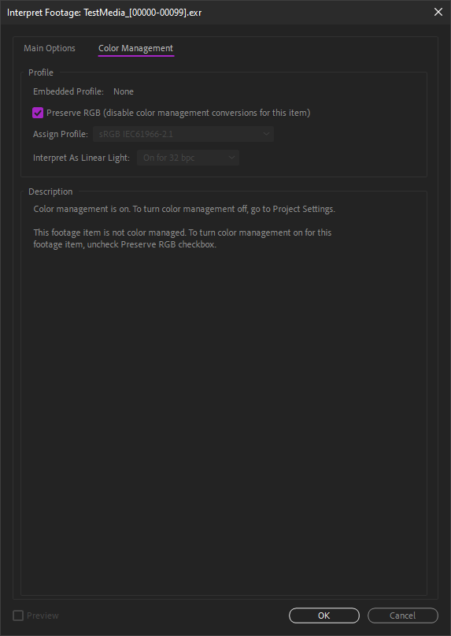
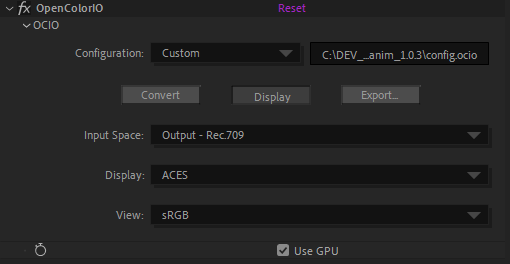

# II.G - Color management: Adobe After Effects

*After Effects* is one of the last software to not integrate *OpenColorIO[\*](ZZ-vocabulaire.md)* (*cf*. *[I.N - OpenColorIO and ACES](N-ocio.md)*) natively for color management. However, the color management in *After Effects* is quite simple to set up, and it handles a wide range of color spaces, including *ACEScg[\*](ZZ-vocabulaire.md)*, which may make it possible to do without *OCIO*.

However, it is possible to use *OCIO* anyway via a dedicated plug-in, and thus take advantage of a unique configuration on the whole production pipeline of which *After Effects* would be part.

Natively, *After Effects* can be complicated to integrate into a production pipeline:

- Footage interpretation, and color management in general, cannot be changed via a script.
- The default interpretation for each type of footage can be changed in a configuration text file, but it will have to be copied to all workstations.
- *After Effects* does not offer the *ACEScc* workspace for color correction.
- The output space is set by default to the workspace.

These shortcomings make it impractical when working in a team with a precise and automated workflow. These problems can be overcome by using the *OCIO* plug-in, which, being an effect, can be scripted.

For a freelancer or a small team, the management proposed by *After Effects* can however be sufficient.

[TOC]

## G.1 - Project Settings - Workspace

The workspace is set per project, in the project settings.

This is where we set the color depth to be used with the workspace; unless you are working on low performance hardware, there is no reason to choose anything other than *32 bpc*, especially if you enable color management. In any case, *16 bpc* is essential to obtain correct colors.

*After Effects* offers a long list of color spaces, and mixes both real workspaces and output/display and camera spaces **not to be used as workspace**. As with all software, it is advisable to choose a wide gamut space, such as *Adobe RGB* or *ACEScg*. Unfortunately, *After Effects* does not offer *ACEScc* for color correction natively, and you will have to use the *OCIO* plug-in or *LUT[\*](ZZ-vocabulaire.md)* to use it.

A check box allows you to linearize the workspaces which are not linear (like *Adobe RGB* for example) in order to better generate the colors.  
In the case of color correction work, common on *After Effects*, a non-linear space should be chosen and this box should be left unchecked.

## G.2 - Footage Interpretation - Input spaces

The input space is defined on each footage, in the *interpretation*, accessible via a right click on the footage.

It is necessary to check for each type of imported footage that *After Effects* selects the right space, or specify it manually via this dialog box. For example, when importing *EXR* files from a 3D renderer, *After Effects* considers them to be *RGB linear* by default; when working in *ACEScg*, you will have to select this space at this point **for each** imported *EXR* sequence.

You can change the default interpretation for each file type by modifying the configuration text file named *interpretation rules.txt*, itself located in the folder containing the *After Effects* settings[^1]. Once the file is modified, you have to restart *After Effects* for the changes to take effect.

!!! Warning
    If the color space of the imported files is different from the default one for the type of file in question, don't forget to select the right space at each import, or modify the default settings file.

## G.3 - View Options - Display Space and Simulations (Soft-proofing)

The transformation from the workspace to the display space is set in the *View* (*Display*) menu.

By simply checking the *Use display color managament* box, *After Effects* automatically converts the colors to the display space of the screen as specified by the operating system.

The *Simulate output* submenu allows you to test output color spaces without having to render: an output space is automatically applied to the image, which is then converted back to the display space. This option can be useful for testing the result of a specific output and checking that the various conversions do not degrade the image, and to be certain of the colors that will be generated when output in a specific space, even if most of the time this simulation can be left disabled.

You can then manually configure a simulation.

The first color space option allows conversion to the output space of the image.

The second option simulates a conversion or interpretation that a video player would make, and allows you to have a preview of what would happen in different scenarios. The *Preserve RGB* box is usually left checked, which disables any conversion on the image as it is output.

The third part, which cannot be modified, recalls the color space of the screen and the final transformation applied to the image for display.

## G.4 - Export Options - Output Spaces

Don't forget to apply the conversion to the output space when exporting.

These options are found in the output module settings of the render queue.

By default, *After Effects* sets the output to the workspace, which is not logical at all, as the workspace is rarely the output space! It is then necessary to specify the right space for each output... *See [II-B Some standards for files](standards.md)*.

!!! Warning
    *After Effects* applies by default the workspace to all files... You have to think about changing it systematically or create preconfigurations that are correctly set.

## G.5 - OCIO

### G.5.a - Introduction

Using *OCIO* on *After Effects* allows you to bypass many of the shortcomings and problems raised by native color management, but the use of the plug-in requires some precise organization.

The ideal is to create a script to automate these tasks in the production pipeline.

The first thing to do (after installing the plug-in) is to deactivate the color management of *After Effects* to be able to control everything via *OCIO*.

### G.5.b - Install the OCIO plug-in

[The updated plug-in is available here](https://fnordware.blogspot.com/2012/05/opencolorio-for-after-effects.html). Although the article dates from 2012, it is updated with each new version of *OCIO*.

After downloading the *.zip* archive, you just have to copy the *OpenColorIO.aex* file in the plug-ins folder of *After Effects*, then restart the application. *OpenColorIO* is an effect available in the *Utility* section of the effects.

### G.5.c - Disable color management in After Effects

Once the plug-in is installed, you have to take over the color management in *After Effects* to control it via the effect.

!!! Warning
    Contrary to what you might think, you must start by choosing a color space in the project settings, in order to then have access to the other color management options and be in a linear space...

In the project parameters, choose a default space. *sRGB* does the trick, but you must check the box to linearize it and use *32 bpc*.

When importing all the footage, you must check *Preserve RGB* in the interpretation so that *After Effects* does not perform any conversion. It is possible to modify the configuration text file named *interpretation rules.txt*, itself located in the folder containing the settings of *After Effects*[^1] in order to interpret all the footage by default in *Preserve RGB* mode.

**For each composition** you must disable the display transformation by unchecking *Use Display Color Management* in the *View* (*Display*) menu.

Finally, for all outputs, you must check the *Preserve RGB* box in the color parameters of the output module, so that *After Effects* does not perform any conversion.

All these operations ensure that it is indeed *OCIO* that will take care of all the color conversions.

### G.5.d - Management

Since *OCIO* for *After Effects* is an effect, its use requires some organization of the project to avoid mistakes.

When importingf footage, it will be much more practical to systematically place it in a precomposition, and to use this precomposition instead of the footage itself in the other compositions. It is in this precomposition that the interpretation of the footage and the conversion to the workspace will be set up.

### G.5.e - Input and workspace

In the precomposition of each footage, the *OpenColorIO* effect must be put on the layer of the footage.

After selecting the correct *OCIO* configuration, you can choose the space corresponding to the footage in the first field (in this example, *RGB linear*, for a *EXR* sequence for example).

In the second field, you choose the desired workspace for the project (*ACEScg* in this example). This second field will be common to all footage, while the first field depends on the format of the imported file.

### G.5.f - Output

The conversion for output is simply done via an effect layer with the *OpenColorIO* effect which converts the colors from the workspace to the output space.

Choose the workspace in the *input space* field and the output space corresponding to the desired file in *output space*.

### G.5.g - Display

To perform the display conversion, we use an adjustment layer at the top of the compositions in which we work. You can set this layer to *guide layer* mode to make sure that it is not active when rendering.

We add the *OpenColorIO* effect on this layer.

Two solutions are possible:

- Either we convert from the workspace to the display; this is the easiest course if we have several different outputs to do. In this case, the output layer is disabled while working, and you must remember to re-enable it to perform the rendering.

Check the *Display* box, select the workspace first (field *input space*), then the display space on the next field(s).

- Or we convert from the desired output space (see previous point), if we use only one. In this case the output layer is left active during the work.

Check the *Display* button, select the output space first (field *input space*), then the display space on the next field(s).

[^1]:
    This folder is easily found via the *Reveal Preferences* button in the *After Effects* general preferences panel