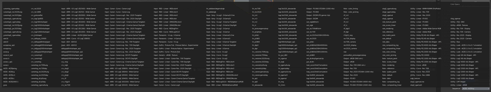
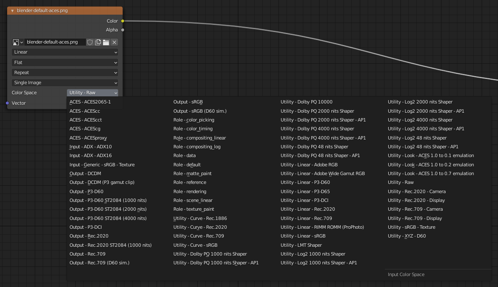

# II.K - Gestion des couleurs : BlenderColor management: Blender

*[Blender](http://blender.org)* use natively *OpenColorIO[\*](ZZ-vocabulaire.md)* (*cf*. *[I.N - OpenColorIO et ACES](N-ocio.md)*) for color management, and the parameters are very simple to set up.

An excellent default *OCIO* configuration comes with *Blender*, which includes spaces for importing image and video files, exporting in several formats, and a *Filmic* workspace that works very well for 3D rendering.

However, we can easily use a configuration with *ACES* if we want to take advantage of it or integrate Blender to a production pipeline in *ACES*, the *ACES* workspace being slightly different from *Filmic*.

[TOC]

## K.1 - Default configuration: *Filmic*

  
*a. Render without color management, with sRGB __standard__.* workspace

  
*b. Color managed render in the __Filmic__.* workspace.

With the default configuration and the *Filmic* space for rendering (*scene referred*), here are the few color settings in Blender.

### K.1.a - Rendering (scene referred) and display

These settings are located in the rendering settings, section *Color Management*.

!!! note
    - With ***OpenEXR*** output, only the raw (linear) data is saved.
    - For other formats***, the settings are applied during the conversion to the color space of the output format.

It is important to note that in a color managed workflow, and using the *OpenEXR[\*](ZZ-vocabulaire.md)* format as an intermediate format (and therefore for saving at the output of *Blender*), all these options only influence the **display** of the rendering in *Blender* but not the data saved in the *OpenEXR* file ! So you have to re-apply the same settings in the following applications of the chain (compositing applications like *Nuke*, *After Effects*, etc. for example).

If the other applications do not use *OpenColorIO[\*](ZZ-vocabulaire.md)* (and we cannot therefore give the *OCIO* configuration of *Blender*), we can however find these settings via *LUT[\*](ZZ-vocabulaire.md)* exported from the *OCIO* configuration of *Blender*. *Cf*. *I.2 - Manufacturing chain* *OCIO*.

However, this is not the case when images are saved in other formats (*PNG*, video, etc.), in which case *Blender* applies all the settings to the image which, unlike *OpenEXR*, is saved in a specific color space (*sRGB* for images, *Rec.709* for videos, etc.).

- ***Display Device*** : choose the display space. In general, leave on *sRGB*.
- ***View Transform*** : this is the workspace setting (scene referred) that transforms the raw linear data from the renderer to the display.
    - *Filmic* (*fig. a*) : This is the default space, very efficient to soften the highlights that burn easily and keep details in the dark areas. It actually simulates the printing of images on film and allows a fairly fine and detailed rendering.
    - *Standard* (*fig. b*) : Displays the data in the display space; this option allows you to see how an application would display the image without applying the *Filmic* space. It is of little use, as highlights become burned too easily, except possibly when using the curve tools below.
    - *Filmic Log* : a logarithmic version of *Filmic*, mainly intended to perform important color adjustments in compositing.
    - *Raw* : displays the raw data without transformation, as they are recorded in *OpenEXR* files if this is the format chosen for output.
    - *False Color*: a contrasted display in various colors to be able to analyze the image content in detail.
- ***Look*** : applies in addition to the workspace (*View Transform*) an additional adjustment according to a purely artistic and creative choice.  
    Each of the options is a choice of image contrast. *Medium* and None* are exactly the same options.
- ***Exposure*** et ***Gamma*** : change the exposure and apply a possible *gamma[\*](ZZ-vocabulaire.md)* correction to the image.  
    It is better not to change these settings if the workflow involves other applications after the *Blender* output and the *OpenEXR* format is used. They can however be useful to simply retouch the contrast of the output image, if you export in a final image or video format other than *EXR*. Since these settings affect the workspace, they are applied *after* the compositing nodes.
- ***Sequencer*** : settings of the sequencer workspace (the video editing module).  
    Does not influence 3D images or compositing.

*Blender* also offers an image adjustment tool via curves, which allows fine retouching of the image.

  
*This example pretty much replicates what the Filmic space* does.

If this tool can be useful to correct images coming out of *Blender*, it is not recommended if you work on a color-managed pipeline using the *OpenEXR* format: it would be too complicated to reproduce exactly the same effect of curves in the applications that follow *Blender* in the production pipeline.

### K.1.b - Output

*Blender* does not display color options (except for some modes and depth) for image output; it uses the standard space of the output format (*sRGB* for image formats, linear raw data in *OpenEXR*)

In *OpenEXR* the two *depths[\*](ZZ-vocabulaire.md)* are :

- *Float (Half)* : *16 bpc* float.
- *Float (Full)* : *32 bpc* float.

Depending on the compositing to be done in the following applications or the final formats, we may prefer *Float (Full)* keeping in mind that the files will sometimes be much larger and heavier in calculations.

*Cf*. chapter *[I.K - Pixels formats](K-pix-format.md)* for more information.

Things to remember:

- In ***OpenEXR*** (and *OpenEXR MultiLayer*): the raw and linear data are saved.  
    It will be necessary to re-apply the same settings as those chosen in the rendering parameters and *color management* when using the files in other applications to find the same image. This is the format that allows the best control and quality.
- In the other **image and video** formats, it is the data converted via the workspace to the standard space of the file that is saved (*sRGB* or *Rec.709* in general). The images displayed as they are will therefore automatically be the same as in *Blender* (but you lose quality with the loss of linearity in particular, and of *color depth*).

### K.1.c - Input (textures)

When adding images to *Blender*, the *Color Space* selector allows you to specify the color space used by the file in question.

- ***Filmic Log*** : to be used (only) in case the file is an *OpenEXR* file previously exported or rendered by *Blender* with the *Filmic Log* workspace.
- ***Linear*** : for standard *OpenEXR* files (or other possible *RGB linear* formats).
- ***Linear ACES*** : for *OpenEXR* files rendered with the *ACEScg* workspace.
- ***Non-Color*** et ***Raw*** : the file does not contain an image but data (like a *normal map*, a *displacement map*, a *metalness*, etc.)
- ***sRGB*** : for all standard image and video files.
- ***XYZ*** : in case of a production pipeline in the XYZ space.

!!! note
    The presence of the *Linear ACES* space allows you to import images that have used *ACES*, but *Blender* does not fully integrate into a production pipeline that uses *ACES* by default; indeed, it does not offer a *ACES* workspace.  
    *See*. *I.3 - Using* ACES

## K.2 - OCIO pipeline

Cf. *[II.D - Design a production pipeline with *OpenColorIO*.](ocio.md)*.

The *OCIO[\*](ZZ-vocabulaire.md)* configuration provided by default with *Blender*, *Filmic*, is available in the *Blender* configuration folder, `datafiles/colormanagement/config.ocio`.

It is therefore possible to use this configuration throughout the production pipeline by pointing to this configuration in other applications, or by setting the `OCIO` environment variable to this file.

To include applications not using *OpenColorIO* in the pipeline (like *Adobe After Effects* or *Adobe Photoshop*), it's always possible to generate the necessary *LUT[\*](ZZ-vocabulaire.md)*, especially the *LUT* that converts linear images (like in *openEXR[\*](ZZ-vocabulaire.md)*) to *sRGB* or other common spaces. We offer several of these [*LUT* for download here](media/filmic-luts.zip), in different formats. You just have to apply the desired *LUT* to find the *Filmic* space of Blender in another application.

### K.2.a - Changing the OCIO configuration

To use a configuration different from the default *Filmic*, *Blender* does not allow to select a configuration via the interface, but two solutions are possible.

- Using the environment variable
    It's possible to simply change the `OCIO` system environment variable to point to the path of the configuration to be used.  
    See *[II.D - Designing a production line with *OpenColorIO*](ocio.md)*.

- By replacing the file in the *Blender* folder  
    You can also delete the existing configuration in the *Blender* folder and copy the new configuration (the `ocio.config` file and its associated subfolders). Just remember to keep a copy of the original configuration!

It is of course also possible to edit the `ocio.config` file of *Blender* yourself, for advanced users.

## K.3 - Using *ACES*

It may be interesting to use the *ACEScg* workspace rather than the default *Filmic* of *Blender* for a slightly different look, or to integrate *Blender* into a production line using *ACES*.

Here is a comparison of the results of the same rendering in different spaces:

  
*a. Render without color management, with the sRGB workspace __standard__.*

  
*b. Render with color management, in the workspace __Filmic__ ( "Medium-Contrast" setting).*

  
*c. Render with color management, in the workspace __ACEScg__.*

As you can see on these images, *ACES* keeps the saturation of very bright colors better, and a little more contrast, while *Filmic* tends to dull the images a little.

To use *ACES[\*](ZZ-vocabulaire.md)* with *Blender* and take advantage of its powerful workspace, simply use the corresponding *OCIO[\*](ZZ-vocabulaire.md)* configuration.

However, the configuration provided by *OCIO* for *ACES* includes a long list of color spaces corresponding to various camera models, which is very useful in cinema for working on filmed images, but which complicates the task in animation and especially in *Blender*.

*The list of color spaces displayed in Blender with the original ACES configuration!*

[We offer for download here](https://rainboxlab.org/downloads/aces-anim/aces-anim_1.0.3.zip) a modified version of *ACES* specifically for animation, notably by limiting the number of color spaces included to those that are potentially really necessary in animation. This work done from *Sony Pictures ImageWorks* sources is [available here on Github](https://github.com/RxLaboratory/Aces-Anim-OpenColorIO-Config).

*The list of color spaces displayed in* Blender *with the configuration* ACES *adjusted by us.*

Here are the new settings available once this configuration is installed.

### K.3.a - Rendering (scene referred)

Here are the settings for the rendering parameters, *color management*, once *ACES[\*](ZZ-vocabulaire)* is available.

- The *Display Device* now contains only one option, *ACES*. This is not very standard in the way it works, but *ACES* is made like that...
- *View Transform* contains the display spaces, to which the *ACEScg* workspace is applied.
- There is no creative *Look* provided with *ACES*. The *Looks* of *Filmic* are not very useful anyway (they can easily be reproduced in compositing).

Simply choose the display space corresponding to your screen (usually *sRGB*).

- *Raw* displays the raw data without transformation, as they are saved in the OpenEXR files if this is the format chosen for output.
- *Log* is the *ACES* equivalent of *Filmic Log*, useful in case of strong color adjustement in compositing.
- Several spaces offer a variation of the *white point*[\*](ZZ-vocabulaire)* *D60* instead of *D65*. Indeed, *D60* (about *6000 K*) is the *white point* of *ACES* and choosing one of these options allows to see the image without the *white point* conversion.

### K.3.b - Input (textures)

For the import of images, a large list of different color spaces is available. Here are the most useful and common ones.

- The ***ACES*** spaces are the usual *ACES* spaces:
    - ***ACES2065-1***: color space for storage recommended by the *ACES* standard in *OpenEXR* files, but still quite little used.
    - ***ACEScc*** and ***ACES - ACEScct*** : *ACES* color space dedicated to color correction, in *OpenEXR* files in general. It is unlikely that you will have to import this kind of file into *Blender*, except possibly an *OpenEXR* file from a color grading or compositing software.
    - ***ACEScg*** : *ACES* workspace for rendering and compositing. In a pipeline using *ACES*, textures can be made in this space and imported into *Blender* via *OpenEXR* files.
- ***Input - Generic - sRGB - Texture*** et ***Utility - sRGB - Texture*** are identical. For standard *sRGB* image files (*PNG*, *TGA*, etc).
- The ***Output*** spaces should not be used  as input...
- The ***Role*** spaces are aliases for other spaces depending on their usage, and are not very useful here.
- The ***Utility*** spaces contain several important elements for importing images into *Blender*:
    - ***Curve*** converts only the transfer curve of the imported files, but not the primaries.
    - ***Linear*** convert only the primaries but not the transfer curve. Some are common and useful:
        - ***Linear - sRGB*** is the default space for *OpenEXR* files.
        - ***Linear - Rec.709*** is perfectly identical to *Linear - sRGB*.
    - ***Raw*** is the space to be used for files that do not contain images but other data (like *normal map*, *displacement map*, *metalness*, etc.)
    - ***Rec.709 - Display*** is the space for standard HD videos (e.g. *MP4*)
    - ***Rec.2020 - Display*** is a UHD (4K) video space

In a nutshell :

- ***OpenEXR*** files containing images: ***ACES - ACEScg*** if the file comes from an application working in *ACES*, ***Utility - Linear - sRGB*** in other cases.
- ***OpenEXR*** files containing data other than color: ***Utility - Raw***.
- Image*** files (*PNG*, *JPG*, *TGA*, etc.): ***Utility - sRGB - Texture***.
- Video*** files (*MP4*): ***Utility - Rec.709 - Texture*** in most cases, ***Utility - Rec.2020 - Display*** in case of UHD video.

----
Sources et références

