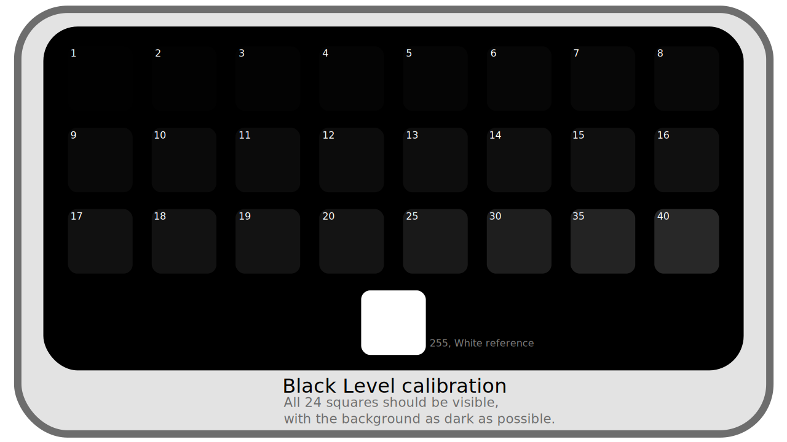
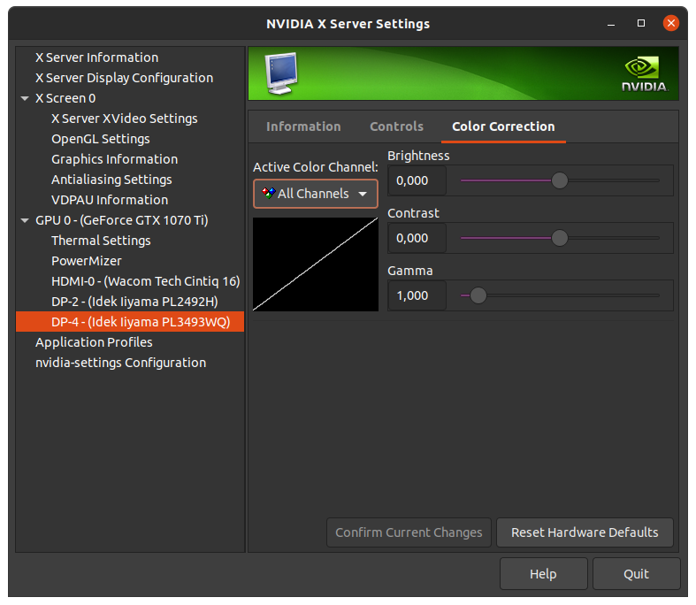

# II.C - Screen calibration

The very important first stage of color management in a production pipeline of digital images is to ensure the fidelity of the screens, that the colors displayed are the closest possible to what the images contain. It is the calibration process.

Calibration, by greatly improving the fidelity of the screens, makes it possible to have a correct display, even very good by using a probe, even on screens of lesser quality[^1].

[TOC]

## C.1 - Introduction

The purpose of screen calibration is multiple:

- To ensure that for any given color value, all screens in the production pipeline display the same color.
- To ensure that for any given color value, the color displayed is the one recommended by the color space used by the screen.
- To ensure that the people using the screens perceive the correct color (influence of the environment).

The obstacles to achieving this are also multiple:

- Displays in their factory configuration are rarely true to the advertised color space.
- Displays age, and their colors can therefore vary over time. Not to mention that even the temperature can influence the electronic components, and therefore the displayed colors.
- It is complicated to have an objective reference where we are sure that the colors are correct, which can be used as a point of comparison.
- The environment (ambient light, color of the walls...) influences the perception of the colors.

The most reliable way to do this is to rely on a *calibration probe*.  
A probe is in fact a light sensor that works in tandem with the computer to apply color corrections, and its role is to measure the colors displayed by the screen, to compare with reference values. Most of the probes are also able to measure the ambient light to take into account the variations due to the environment and the human perception.

The use of a probe thus makes it possible to overcome all these obstacles:

- They allow to measure the colors of the screen and their shift compared to the reference values of the colorimetric space of the screen.
- By recalibrating the screens regularly, they make it possible to maintain a sufficient fidelity throughout the life of the screen and the conditions.
- They avoid the need for a reference: they can objectively measure the colors, whose values can be compared directly with the values expected by the color space of the screen.
- Most of the probes can remain connected to the computer, and regularly measure the ambient light, in order to compensate for the variations in realtime.

**

However, in the absence of a probe, it is also possible to improve the display of colors with another sensor: the eye. The results will not be as precise as with a probe, but it's possible to improve the display of the worst screens. The main problem of eyeballing is the lack of an objective reference to compare colors: it is impossible to be sure that the colors displayed are the right ones. The influence of the environment is also a problem, but can be compensated with good planning.

## C.2 - Environment

First of all, a relatively easy parameter to control is the working environment and the ambient light in which the screen colors are seen.

A few simple rules can ensure that you always see the same colors, and as objectively as possible.

- Avoid as much as possible natural lighting, which varies at every moment; if the work on colors is essential, a room without windows is ideal. Without going that far, the possibility of dimming the light from the windows as much as possible, or shutters to cut it off completely when needed are simple but effective solutions.
- Control the lighting and the color of the walls (which make the general color of the ambient light). The colorimetric spaces generally define the conditions in which their colors are supposed to be seen; the ideal situation is thus to respect the recommendations of the space used by the ecan. In all cases, neutral light (white, of a defined *temperature[\*](ZZ-vocabulaire.md)* but not colored), and of good quality should be preferred; walls should be as neutral as possible, and ideally gray rather than white.
- Control the brightness of the screens, according to the ambient light: the screen must be sufficiently bright in relation to the environment (but not to the point of appearing overly bright: it must not be a source of light).

Here are the parameters of the environment such as it is recommended by the color space ***sRGB***, that of the majority of the screens, and applicable to the other spaces (P3, Rec.2020...):

- **Ambient light** : *64 lux* to *200 lux[\*](ZZ-vocabulaire)*.  
    This is low to very low light, lower than typical office light (which is between 300 and 500 lux).
- **Lighting temperature** : *5003 K*, *D50*.  
    It is a relatively orange light, close to that of the sun. It is voluntarily a little far from the white of the *sRGB* and therefore of the screens (which is *6500 K*, *D65*).
- **Wall color** : Medium gray (20% reflectance).  
    The walls should absorb 80% of the light rays they receive, making them medium gray.
- **Screen brightness** : *80 cd/m²*  
    The *sRGB* (just like the *P3* for the display) recommends a relatively low luminosity of the screens (if the environment is not very luminous). A slightly higher brightness may be necessary if the environment is not dark enough. It should be noted that the spaces dedicated to video like *Rec.709* or *Rec.2020* are adapted to *TV* screens with a screen brightness of *100 cd/m²*, and that it can thus be useful to increase the brightness of the screens towards this value for broadcast television (or cinema).

## C.3 - Calibration

Once the environment has been controlled, or in any case set in the working conditions, we can proceed to the calibration of the screens.

Before starting, it is necessary to make sure of the parameters of the calibration to be done.

### C.3.a - Choice of the screen color space and calibration

We choose default one, in general *sRGB* or sometimes *Display P3* or more rarely others.

You can also decide to calibrate to a different space than the one intended for the screen, **provided that the two spaces are compatible**. This can be useful when all manufactured images are intended for a specific use (TV, cinema...) in order to work in the same or close to the space used for the broadcasting of the finished images. For example, screens can be calibrated in *Rec.709* to make HD videos for TV and watch them in broadcast conditions, without having to convert the videos at playback time to the screen space[^2].

It is necessary for that that the *primaries[\*]( ZZ-vocabulaire.md)* of the two spaces are the same, or that the *gamut[\*](ZZ-vocabulaire.md)* of the space of the screen is larger and contains the *gamut* of the space in which one calibrates. In any case, you should remember to change the display settings in all applications and the operating system so that the images are displayed in the space in which you have calibrated the screen.

The choice of space will define the *primaries[\*]( ZZ-vocabulaire.md)* and *gama[\*]( ZZ-vocabulaire.md)* used; the *white point[\*]( ZZ-vocabulaire.md)* can often be set separately.

### C.3.b - White point and brightness

The white point is often adjustable when using a probe; unless there are specific needs such as work for printing (in which case the white point can be that of the paper), one chooses that of the colorimetric space of the screen, i.e. *D65*, *6500 K* in the majority of the cases.

The luminosity can also often be measured and adjusted. When working for images in *sRGB* intended to be seen on a computer screen, the reference is *80 cd/m²*. For television work (or cinema), the luminosity can be that of *Rec.709*, that is *100 cd/m²*. It may be useful to choose a slightly higher value if the working environment is too bright.

### C.3.c - Calibration and application of the color profile

#### C.3.c.1 - Calibration

If you use a probe, the process is usually quite simple: you connect the probe to the computer and place it flat on the screen (or facing the projector screen)[^3]. A software provided with the probe (or the very powerful free software *DisplayCal[^4]*) then performs a series of measurements of the colors displayed by the screen. The result of these measurements allows to calculate the shift between the displayed colors and the expected colors.

**
*Calibration parameters of* DisplayCAL

If you calibrate by eye, the idea is to display a series of *test cards*, reference images, and try to adjust screen settings by hand to approximate the description of a reference image. It is completely impossible to correctly adjust the *primaries[\*](ZZ-vocabulaire.md)* and the *white point[\*](ZZ-vocabulaire.md)* by eye, but one can try to get close by displaying different images. On the other hand, the *brightness[\*](ZZ-vocabulaire.md)*, the *contrast[\*](ZZ-vocabulaire.md)*, the *gama[\*](ZZ-vocabulaire.md)* can be relatively well approached thanks to comparisons of grey values between them (and a lot of patience).

To calibrate by eye several methods are possible, but everything always starts with the display of test patterns and reference images. Some operating systems offer them, but you can also find them on the net [like the ones we propose here](media/test-images.zip), carefully made to accompany this document.

These test cards can also be used to check the calibration result with a probe.

**

**

**

It is best to display these test patterns in full screen mode and with the environment controlled, as explained in chapter *C.2 - Environment*.

Then, by displaying the images, we retouch the screen settings. There are three possibilities:

- Tinker with the screen settings; but they are often quite limited and not very precise.
- Adjust the settings of the graphics card via its drivers, if they allow it.  
    The advantage is that the correction will be correctly applied in all situations; but it is possible that the parameters will be re-initialized when the system or the drivers are updated.
- If the operating system offers it, make the adjustments via its color utility and save then apply a color profile to the screen.  
    It is then necessary to make sure at the time of updates that the system does not re-select another profile. The interest of this method is to be able to keep the settings in a file that can be saved and transported, the profile, generally in `.icc` format.

It is not advisable to combine these different methods, as the result quickly becomes rather random, and especially difficult to retouch or correct afterwards.

!!! warning
    At the time of writing, during our tests on *Mac OS*, the screen calibration tool in the system settings has a mediocre method (and results) (except perhaps on Mac screens) and does not offer test patterns worthy of the name, it should be avoided. It is better to calibrate directly with good test patterns such as the ones we propose, using the screen settings or other utilities.

!!! tip
    *Windows* offers a good tool for calibrating screens *by eye* with rather good results. You can find it via the *Control Panel*, in *Color Management* then the *Advanced* tab. Then click on *Screen calibration* and let yourself be guided! It is in these options of *Color Management* that you can apply and choose the spaces and profiles (calibration result) of the screens.

**  
Example of parameters via the settings of a *Nvidia* graphics card (under *Linux*). Note especially here the *color range* parameter, to be set to *Full* if the screen is a computer screen, and *Limited* if it is a television.

**  
Example of parameters via the settings of a *Nvidia* graphics card (under *Linux*). Here, different sliders allow to adjust the display of the colors (for each screen). Each slider can act on the three *channels[\*](ZZ-vocabulaire.md)* at the same time, or separately on the red, green or blue.

**

**

#### C.3.c.2 - Colorimetric profile

The result of the calibration of the probe, or sometimes of a calibration with the eye, is recorded in a *colorimetric profile*, a *LUT[*](ZZ-vocabulaire.md)*. It is the operating system which will apply this profile or this *LUT* to all the colors at the time of the posting on the corresponding screen and thus to convert these colors so that they are displayed exactly as they must.

**

**

**  
Choice of color profiles under *Ubuntu Linux* in the *Color* section of the settings. A button allows you to add profiles (predefined or imported via a file, for example generated by a probe) to the list under each screen to easily change profile later.

Once the calibration is finished and the profile applied, you can check the result by displaying different test patterns (see above, *C.3.c.1 - Calibration* by eye), and also check the quality of the screen after calibration. Note that if you calibrate with a probe but the display of the test patterns is not perfect, it is probably more related to the quality of the screen than to a calibration defect.

----
Sources & References

[^1]:
    As long as the colors of the screen are more or less uniform and identical in the center as well as on the edges and in the corners...

[^2]:
    It should be noted that it is not at all necessary for the screens to use the broadcast color space: thanks to color management, the displayed images are converted to the screen space so that the displayed colors are exactly those of the broadcast no matter what; calibrating the screens in the broadcast space just allows to avoid this conversion, and to avoid the common configuration errors by systematically choosing the broadcast space, whether for display, file output, etc.  
    A concrete example: when working in video and for television, the images will be in *Rec.709*, but the working screens are by default in *sRGB*. When making the images, it is therefore necessary to specify (but this is often automatic), that the images are displayed in *sRGB*, whereas when exporting they will be chosen *Rec.709*.  
    If we calibrate the screens in *Rec.709*, we can simply choose *Rec.709* everywhere without making a mistake (but it is less standard in computing, and the default or automatic configurations may be wrong...).

[^3]:
    It is advisable to start by restoring the screen settings to as neutral as possible, disabling power saving, the various modes (game, office, video ...), to let the sensor and the system control the colors.

[^4]:
    DisplayCAL is free and available on Linux, MacOS, Windows and supports a wide range of probe makes and models: https://displaycal.net/  
    As always, we strongly encourage you to make a donation if you decide to use it!

