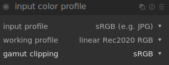
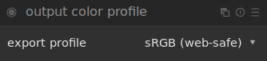

# II.L - Color management: Darktable

*Darktable* is a free and open source photo editing software, extremely complete and professional; the color management is very complete.

## L.1 - Input and workspace

The color workspace is set per file, at the same time as the input, via the module "*input color profile*".

The configuration is very simple:

- ***input profile*** is used to define the profile of the image on which we work; in the case of an image *jpeg* for example, we will choose *sRGB*.
- ***working profile*** is the workspace; we prefer a space with a wide gamut [\*](ZZ-vocabulaire.md), and linear. *Darktable* proposes the most useful and common ones, like the *Rec. 2020*, *Adobe RGB* or the *prophoto* dedicated to photo editing.
- ***gamut clipping*** is an interesting option for displaying on the image the areas whose colors are outside the gamut of the given space; the output space is usually chosen here.

To activate the *gamut clipping* alerts you have to activate the option via the button under the image:

## L.2 - Output

The output is easily adjusted via the "output color profile" module.

## L.3 - Soft-Proofing

Soft-proofing can be activated and regulated with the buttons under the image.

A right click gives access to the settings.

- ***softproof profile*** defines the simulated/activated space for the soft-proofing. It is there that one finds the specific profiles *ICC* for the impression which one would have added (see below).
- ***display profile*** allows you to modify the screen space; in general, you can leave "*system display profile*" (this is the only one that will take into account the possible calibration of the screen). Otherwise you should always choose the normal screen space (*sRGB* in general).
- ***preview display profile*** is the space of the possible second image preview window, in case it is on a second different screen.
- ***histogram profile*** defines the space used by the histogram and the eyedropper of *Darktable*.

You can add your own output and proofing profiles by adding the *ICC* files in the `color/out` subfolder of the *Darktable* installation (or the `$HOME/.config/darktable/` folder under linux).