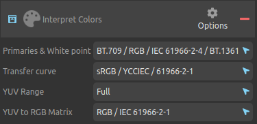
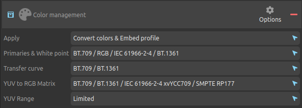

# II.M - Color management: Duduf Media Encoder (DuME)

[*DuME*](https://rainboxlab.org/tools/dume/) is a free and open source media encoder/converter based on [*ffmpeg*](http://ffmpeg.org) and [OpenColorIO](http://opencolorio.org).

## M.1 - Workspace

In general, to encode media, you don't necessarily need to define a workspace, but since *DuME* also allows you to edit videos, it can be useful to choose a specific workspace for it; it's also useful to encode *openEXR* files directly from a render in the same space as the render.

The space is simply selected in the output panel.

## M.2 - Input

The interpretation of the input colors is done by adding the block *Interpret Colors* in the input panel.

!!! hint
    In the absence of the *Interpret Colors* block, *DuME* uses its own rules to "guess" the space to use, respecting the most common standards, which makes this block optional if the input files are standard.

The characteristics of the color space of the input file can be set individually.

- ***Primaries & White point*** : primaries[\*](ZZ-vocabulaire) and white point (*illuminant[\*](ZZ-vocabulaire)*)to use, defined by the name of the corresponding space or standard.
- ***Transfer curve*** : transfer curve[\*](ZZ-vocabulaire) to use, defined by the name of the corresponding space or standard.
- ***YUV Range*** : allows you to choose between *Full* and *Limited* depending on the file.
- ***YUV to RGB Matrix*** : defines the mathematical method used for conversions between *YUV* and *RGB*.

In case of doubt, it is always possible to leave one of the parameters on "*Auto*".

!!! tip
    DuME offers a list of presets for all the most common spaces, see below.

## M.3 - Output

As for the input, the output settings are made via a *Color management* block in the output panel.

The parameters are the same as for the input.

!!! hint
    As for the input, in the absence of the *Color management* block, *DuME* uses its own rules to "guess" the space to use, respecting the most common standards, which makes this block optional if the input files are standard.

!!! tip
    DuME offers a list of presets for all the most common spaces, see below.

## M.4 - Presets

To select more quickly and without error the different input and output parameters, *DuME* offers several presets, accessible by clicking on the block options button.

It contains the most common spaces, including *ACES* in the latest versions.

## M.5 - LUT

It is also possible to apply a *LUT[\*]( ZZ-vocabulaire.md)* when encoding media, via the *Apply LUT* block in the output panel.

*DuME* offers several *LUTs*, including one to convert from or to *ACES* or *Blender Filmic*, and other *LUT* files can be loaded.

*DuME* also offers in its tools a *LUT* conversion tool, which allows to convert between many formats.

## M.6 - OCIO

There is no direct support for *OCIO[\*]( ZZ-vocabulaire.md)* when encoding media, but *DuME* provides a tool for generating *LUT* from a *OCIO* config, which can then be used during encoding (see above).

The different parameters can be found by reading the config file *OCIO*, *cf*. section *[II.F - Designing a production pipeline with OCIO](ocio.md)*