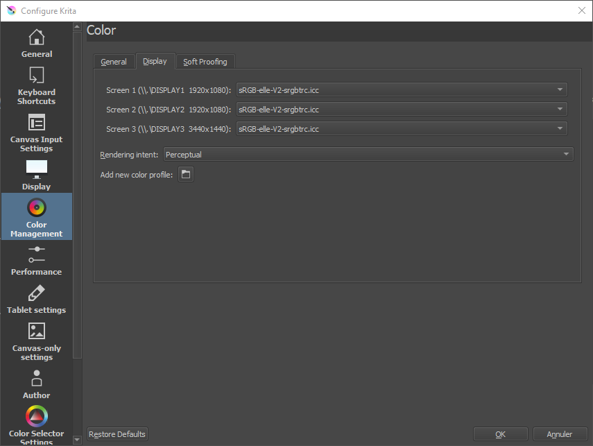

# II.N - Color management : Krita

*Krita* is very complete in the management of colors, and uses in particular *OCIO[\*](ZZ-vocabulaire.md)*.

Its only drawback is that you can't specify the color space of the images you import individually. This can be a problem especially when importing *openEXR[\*](ZZ-vocabulaire.md)* files which do not come from an application sharing the same *OCIO[\*](ZZ-vocabulaire.md)* configuration or if you mix files using different color spaces.

LThe *Krita* documentation includes [interesting and detailed explanations about colors](https://docs.krita.org/en/general_concepts/colors.html) and color management.

## N.1 - Workspace

The workspace is defined when creating a *Krita* document.

You can choose the space from the list in the *Color* tab.

- ***Model*** allows you to choose the format in which the colors will be recorded in the document. We generally stay on *RGB/Alpha* if we work in video, or possibly *CMYK/Alpha* in case of a document intended for printing.
- ***Depth*** defines the depth of the colors. We will generally choose *16-bit float/channel* when working for video or animation.
- ***Profile*** allows to select the working space, often *scRGB (Linear)* or *ACEScg* for video.

The ***Color Space Browser*** button opens a more complete dialog box describing the different color spaces available and facilitating the choice.

You can also browse the files to choose a space in *ICC* format.

It is possible to change the default profile used in new documents via the *Krita* preferences.

You can also set some other options.

To change the workspace of an already opened document, go to the menu *Image* then *Properties*.

It contains the same settings as when the document was created.

## N.2 - Display

### N.2.a - Screen

You can specify the display color space for each screen connected to the computer, in the *Krita* preferences. In general, we leave *sRGB* except in the case where the screen uses a different space.

### N.2.b - Soft-proofing

In the third tab of the preferences, it is possible to configure the *simulation* of the display according to the final output space, which is particularly interesting in *Krita* when working for printing.

The color selectable in ***Gamut Warning*** is the one used to display alerts showing areas of the image outside the output *gamut[\*](ZZ-vocabulaire.md)*, and which will therefore be changed during output.

Once the proofing is configured, it can be activated and deactivated for the display of the documents via the menu *View* (*Display*) or with the keyboard shortcut `[CTRL] + [Y]`. *Krita* can also display an alert for areas of the image whose colors are outside the output gamut, also via the *View* (*Display*) menu or with the keyboard shortcut `[CTRL] + [SHIFT] + [Y]`.

You can also define these parameters of proofing only for the opened document, via the menu *Image* then *Properties*.

## N.3 - Color picker

*Krita* allows you to adjust the display space of the color pickers, which is very practical. You can find the setting in a tab of the preferences.

In general, we check the box allowing to choose a specific space for the color picker (in particular a non-linear space, like the simple *sRGB* used by the screens).

When working in *16* or *32 bpc floating* and a linear space, selector types other than *HSV* (hue, saturation, value) - i.e. *HSL*, *HSI* and *HSY* - may not work properly (because they must have a maximum white which no longer exists in linear).

## N.4 - Output

When saving files, *Krita* displays a dialog box with the appropriate options. When saving in native `.kra` or *openEXR[*]( ZZ-vocabulaire.md)* format, the workspace is used; otherwise *Krita* will convert to the standard space of the saved file.

  
*Example for a PNG output and its conversion to* sRGB, *or optionally to* Rec.2020.

## N.5 - OCIO with Krita

*Krita* uses *OCIO* which is simply configured via the *Docker* (panel) called *LUT Management*.

  
*An example with the OCIO Filmic configuration of Blender*

