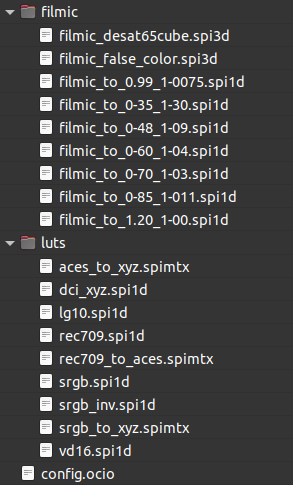

# II.F - Designing a production pipeline with OCIO

The interest of *OCIO[*\](ZZ-vocabulaire.md)* lies in the fact that, by using it, you can configure the entire production pipeline at once, for all the software in the pipeline (as long as they are compatible with *OCIO*).

In general, when you configure a production pipeline using *OCIO*, you start with an existing config that you modify according to the needs of the project and the artistic and manufacturing choices.

A set of configurations is available in the [*OpenColorIO*] downloads (http://opencolorio.org), including *ACES*, *spi-anim* and *spi-vfx*, developed by *Sony Pictures Imageworks*. Another configuration is available with *Blender*.

## F.1 - Setting up

The implementation of *OCIO* on a production pipeline is relatively simple. First of all, you have to choose a configuration to use, and eventually modify it and adapt it to your needs (see next section "*OCIO* config anatomy").

The principle is then to give to each application the path to the configuration file `config.ocio`. This can be done easily for all of them by modifying the `OCIO` environment variable, giving it the path to the configuration file.

It is also possible to give a specific path to each application; in this case the method varies according to the application.

## F.2 - OCIO configuratin anatomy

An OCIO configuration actually consists of a set of *LUT[\*](ZZ-vocabulaire.md)* accompanied by a simple text file containing the actual configuration, always named `config.ocio`.

Here is for example the *Filmic* config used by *Blender*:



The config file is divided into several sections, usually in the following order:

- ***Metadata***, including various information.
- ***Roles***, defining in which cases which color spaces should be used.
- ***Displays***, defining the spaces to be used for the display according to the screens.
- ***Colorspaces***, containing the list of color spaces used.
- ***Looks*** (optional), containing the list of *LUT* and transformations that can be added to the image.

Other sections can be added, see [the official documentation for details on opencolorio.org](https://opencolorio.readthedocs.io/en/latest/guides/authoring/authoring.html).

Comments that do not affect the configuration can also be added to the file. A line containing a comment must simply begin with the character `#`.

!!! hint
    The syntax actually follows the standard [*YAML*](https://fr.wikipedia.org/wiki/YAML).

We explain here only the different sections that a current user can modify, but all sections can be manipulated by more advanced users. You should refer to the official documentation of [*OpenColorIO*](https://opencolorio.readthedocs.io/en/latest/guides/authoring/authoring.html).

### F.2.a - Metadata

Example :

```yaml
ocio_profile_version: 1
search_path: "luts:filmic"
strictparsing: true
luma: [0.2126, 0.7152, 0.0722]
description: RRT version ut33
```

Here is a description of some common parameters:

- ***ocio_profile_version*** : either `1` or `2`, depending on the version of *OCIO* to be used with this config.
- ***description*** (optional) : a brief description
- ***name*** (optional) : an unique name
- ***search_path*** (optional) : defines where the *LUT* needed for the config are. In this example, they are in two subfolders (separated by `:`): *`luts`* and *`filmic`*.
- ***luma*** (optional and discontinued) : old value used in particular by *OCIO* for the conversions in black and white of the colors. This value is actually no longer used anywhere, so it can be omitted. By default, it corresponds to the luminance of the *Rec. 709* primaries.

### F.2.b - Roles

The *roles* section is the one that will be modified most often; it is the one that defines how the different color spaces available are used, what the default spaces should be during the different manufacturing stages, etc.

Example (commented) of *Blender*. :

```yaml
roles:
  reference: Linear
  # Internal scene linear space
  scene_linear: Linear
  rendering: Linear
  # Default color space for byte image
  default_byte: sRGB
  # Default color space for float images
  default_float: Linear
  # Default color space sequencer is working in
  default_sequencer: sRGB
  # Color spaces for color picking and texture painting (not internally supported yet)
  color_picking: sRGB
  texture_paint: Raw
  # Non-color data
  data: Non-Color
  # CIE XYZ color space
  XYZ: XYZ
```

On each line, the role is defined, then the color space to be used. The name of the space must be that of one of the spaces available in the list in the following section.

*ACES* examples:

```yaml
roles:
  color_picking: Output - sRGB
  color_timing: ACES - ACEScc
  compositing_linear: ACES - ACEScg
  compositing_log: Input - ADX - ADX10
  data: Utility - Raw
  default: ACES - ACES2065-1
  matte_paint: Utility - sRGB - Texture
  reference: Utility - Raw
  rendering: ACES - ACEScg
  scene_linear: ACES - ACEScg
  texture_paint: ACES - ACEScc
```

Here are some explanations on the different roles (alphabetical sorting):

- ***color_picking*** : space for color selectors.
- ***color_timing*** : space for colorimetric corrections.
- ***compositing_linear*** : space for compositing.
- ***compositing_log*** : alternative space for some compositing operations.
- ***data*** : space for files (*EXR*) containing something other than color (normal maps, specs, etc.).
- ***matte_paint*** : space for images used in matte painting.
- ***reference*** : space used as a base for all the others ; the other spaces are defined according to this one.
- ***rendering*** : space to use for rendering.
- ***scene_linear*** : main working space : the one for 3D rendering in particular, the one for the generation of the image.
- ***texture_paint*** : similar to *matte_paint* but for textures used on 3D objects.

!!! note
    Not all applications will respect all roles: some are not supported, or the application does not allow to change them (for example, *Blender* does not allow to change its color picker space)

    Some applications may also include other additional roles that are not listed here. This is the case for *Blender* with roles starting with `default_` for example.

### F.2.c - Displays

The *displays* section defines the list of different possible displays, for example work screens and projection room projectors.

Each display has a list of possible views, allowing to modify the display, for example for a technical validation, to better discern dark colors, etc.

Example of *Blender*:

```yaml
displays:
  sRGB:
    - !<View> {name: Standard, colorspace: sRGB}
    - !<View> {name: Filmic, colorspace: Filmic sRGB}
    - !<View> {name: Filmic Log, colorspace: Filmic Log}
    - !<View> {name: Raw, colorspace: Raw}
    - !<View> {name: False Color, colorspace: False Color}
  XYZ:
    - !<View> {name: Standard, colorspace: XYZ}
    - !<View> {name: DCI, colorspace: dci_xyz}
    - !<View> {name: Raw, colorspace: Raw}
  None:
    - !<View> {name: Standard, colorspace: Raw}
```

The standard view displays *sRGB* values directly; *Filmic Log* can be used to check dark areas. *Raw* displays the data without conversion, for example to perform a technical check of a data layer (normal map, occlusion, etc.). *False Color* is also used for technical checks of the image.

Example of *ACES*:

```yaml
displays:
  ACES:
    - !<View> {name: sRGB, colorspace: Output - sRGB}
    - !<View> {name: DCDM, colorspace: Output - DCDM}
    - !<View> {name: DCDM P3 gamut clip, colorspace: Output - DCDM (P3 gamut clip)}
    - !<View> {name: P3-D60, colorspace: Output - P3-D60}
    - !<View> {name: P3-D60 ST2084 1000 nits, colorspace: Output - P3-D60 ST2084 (1000 nits)}
    - !<View> {name: P3-D60 ST2084 2000 nits, colorspace: Output - P3-D60 ST2084 (2000 nits)}
    - !<View> {name: P3-D60 ST2084 4000 nits, colorspace: Output - P3-D60 ST2084 (4000 nits)}
    - !<View> {name: P3-DCI, colorspace: Output - P3-DCI}
    - !<View> {name: Rec.2020, colorspace: Output - Rec.2020}
    - !<View> {name: Rec.2020 ST2084 1000 nits, colorspace: Output - Rec.2020 ST2084 (1000 nits)}
    - !<View> {name: Rec.709, colorspace: Output - Rec.709}
    - !<View> {name: Rec.709 D60 sim., colorspace: Output - Rec.709 (D60 sim.)}
    - !<View> {name: sRGB D60 sim., colorspace: Output - sRGB (D60 sim.)}
    - !<View> {name: Raw, colorspace: Utility - Raw}
    - !<View> {name: Log, colorspace: Input - ADX - ADX10}
```

*ACES* does not sort by different displays, and everything is gathered under one display.

----
Sources & References

- [Documentation on *OCIO* configurations](https://opencolorio.readthedocs.io/en/latest/guides/authoring/authoring.html)
