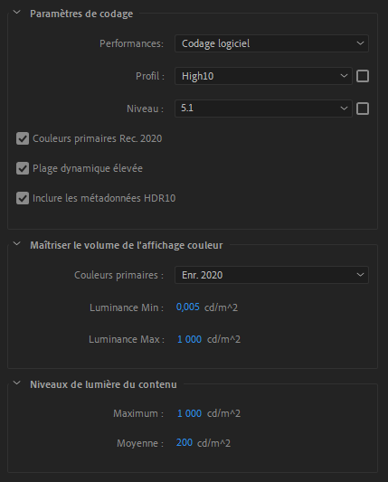
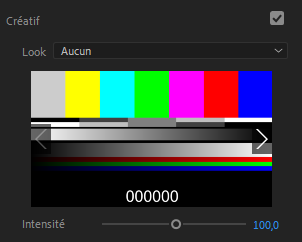
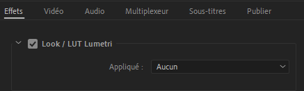

# II.G - Color Management : Adobe Premiere and Media Encoder

The color management options are quite limited (almost non-existent) in *Adobe Premiere*, and it does not support *OCIO[\*](ZZ-vocabulaire.md)*.

- **There is no setting to set up the input color interpretation**, which implies that all media (other than *After Effects* compositions) must use standard color spaces, and that an *openEXR* file will always be read as *RGB Linear* for example.
- **There is no configurable workspace** which is not mandatory when editing, as long as you don't use too many effects.
- **The choices are very limited** on the output possibilities, everything is automatic. The output is necessarily done via [*Adobe Media Encoder*](ame.md).

## H.1 - Output space

For the vast majority of formats, no setting is available.

Only for encoding in *h.264* or *h.265 / hevc* is it possible to use *Rec.2020*, if and only if the *high10* codec profile is selected.

- ***Primaries Colors Rec.2020***: Encoding is done in *Rec.709* if unchecked.
- ***High dynamic range*** allows 12-bit rendering instead of 10-bit (see [*I.K - Pixel Formats*](K-pix-format.md)), which is also called *HDR*.
- ***Include HDR10 Metadata** unlocks the following options...
- ***Primaries Colors*** allows to change the primaries, and strangely enough, to choose the primaries of *Display P3* or *Rec.709* **while** the Rec.2020 box above must be checked, and are only available in *HDR* mode.

The other options are metadata specific to the *HDR* video format for display purposes.

## H.2 - Applying *LUT*

It is however possible to apply a *LUT* on the clips, which remains a way to theoretically do everything, *provided* you have the adequate *LUT*, which is not always obvious...

You can find the option to add a *LUT* in the *Lumetri* effect or the panel of the same name.

You can also apply a *LUT* via *Media Encoder*.

The option to add a *LUT* can be found in the *Effects* tab of the output parameters.

## H.3 - Workspace and display

It is important to know that the *First* sequences are **always** in *Rec.709* during the editing; all the imported media are converted in *Rec.709* and the effects, the editing is done in this color space.

**By default**, __*Premiere* does not convert the colors back to the *sRGB* of the screen__, they remain in *Rec.709*, which makes the colors look bad on standard *sRGB* screens (and even worse on *P3* screens).

This also means that **by default** the colors of **the same** footage on *After Effects* and *Premiere* are rendered **differently**.

You can activate this missing conversion **in the preferences**, via the box ***Enable display color management***, a useful option as soon as you don't mount on a *Rec.709* screen but *sRGB* or *P3* (which is the majority of cases). This option only influences the display to automatically convert from *Rec.709* of *Premiere* to the screen space; in any case, it doesn't change anything to the final file output.

This option is also available in *Media Encoder* although it is less important: it only affects the display of previews.

