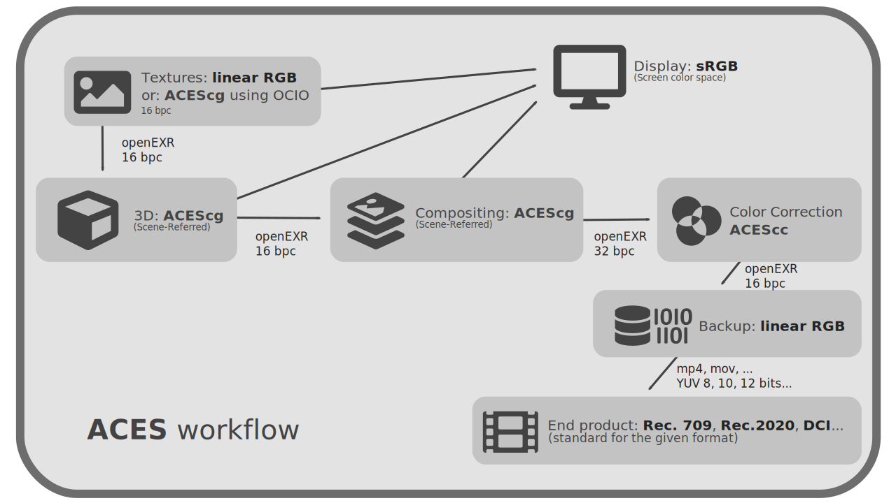

;license:CC-BY-NC-SA;copyright:2021;updated:2021/07/11)

# II.E - Preparation of the color management of a production pipeline

Now that we know the different types of color spaces and at what points in the production process they come into play, let's see how to prepare a complete production pipeline to effectively manage color from design to delivery.

The first step is to list all the formats used at the input of the production pipeline (videos or images supplied and imported, manufactured images) as well as all the formats to be delivered at the end of the production process (videos and final images).  
Depending on these formats, and therefore the associated color spaces, we can choose the different spaces to be used during production, keeping in mind that "who can do more can do less": the easiest thing is to set up a high-performance chain that can deliver in all formats.

It will also be necessary to take care that all the stages which modify the image use a colorimetric space *larger* than that of delivery: as well with a *gamut[\*](ZZ-vocabulaire.md)* wider as with a larger depth.

We will also try to limit the number of spaces used (and thus limit the possible errors and shifts due to conversions). The preparation of the pipeline consists therefore most often in choosing the most adequate workspace according to the input and especially output formats, and supported by the various applications.

Here are some examples of possible choices, consistent with a cinema quality (and therefore all types of production).

## E.1 - 3D animation with Blender, Filmic

Blender provides an efficient default workspace for 3D rendering: *Filmic*. This space being configured using *OCIO*, it is quite easy to create a production pipeline around it.

For simplicity, the textures can be made in a standard *RGB Linear* space.

As in most pipelines, we can use ***openEXR*** as an intermediate image format, both for textures and for intermediate renders or the final *master*.

**

| Step | Type | Color Space / Format | Notes |
| --- | --- | --- | --- |
| All | Color Selectors | *sRGB* (screen) | 
It is always more convenient, and safer, to choose your colors in the non-linear screen space.
| All | Display | Screen Space (*sRGB*) | Colors are always displayed in the color screen space.
| Textures | Workspace | *RGB Linear* / *16 bpc* | If the application does not support *OCIO[\*](ZZ-vocabulaire.md)* |
| Textures | Workspace | *Filmic* / *16 bpc* |
| Textures | Output | Workspace / *openEXR 16 bpc* | |
| 3D | Workspace | *Filmic* |
| 3D | Output | *Filmic* / *openEXR 16 bpc* |
| Compositing | Workspace | *Filmic* / *32 bpc* | In case of performance problems and if there is no color correction step following compositing, we may work with *16 bpc*.
| If the application does not support *OCIO*, then a *LUT[*](ZZ-vocabulaire.md) Filmic* must be applied to the imported footage.
| Compositing | Softproofing | Final output space (*Rec.709* for example) | | In doubt, it is better not to set up softproofing and to stay on the color screen space for the display. |
| Compositing | Final Output | Standard depending on the format: *Rec.709*, *Rec.2020*... | |
| Compositing | Master / Archiving | *RGB Linear* / *openEXR 16 bpc* | It is probably safest to archive the images in as standard a space as possible, but without losing quality.|
| Compositing | Output for color correction | *RGB Linear* / *openEXR 32bpc* | *32bpc* is necessary to avoid loss of quality when converting to a possibly non-linear space for color correction.|

### E.1.a - Textures and other 2D images

Whatever the application (*Substance Painter*, *Substance Designer*, *Krita*, *Adobe Photoshop*, *The Foundry Mari*...), the color textures can be created in ***RGB Linear*** ; just be careful to have at least *16 bpc*.

When importing in *Blender*, the images will be interpreted in *RGB Linear*, the data textures (*normal maps*, *metalness*, etc) in *Raw*, without conversion.

It is also possible to work directly with textures in *Filmic* space if the application supports *OCIO[\*](ZZ-vocabulaire.md)* by simply loading the *OCIO* configuration from *Blender*, or by using an *ICC* profile corresponding to *Filmic*, such as the ones we propose [download here](media/filmic-luts.zip).

### E.1.b - 3D Render

3D rendering in Blender will be done in ***Filmic*** by default. You can choose different levels of contrast; it's an artistic choice to make when working on lookdev, you'll just have to re-apply the same one when compositing.

### E.1.c - Compositing

If the compositing is done in *Blender*, it automatically uses the same workspace, i.e. ***Filmic*** (with the choice of contrast), and there is nothing to configure.

In case of compositing in a third party application, the easiest way is to use *OCIO* and load the *OCIO* configuration from *Blender* to be able to apply again the *Filmic* workspace (and the choice of contrast) on the *openEXR* files rendered by *Blender* and imported into the compositing application.

!!! warning
    When rendering *openEXR*, the images are linear and do not include color space information: the *Filmic* space must be reapplied in the compositing software. When rendering in any other format, *Blender* converts to the default space of the format (*sRGB* to *PNG* for example).

### E.1.c.a - Filmic with After Effects

For the particular case of *After Effects*, where setting up *OCIO* is tedious, it may be simpler to use a *LUT[*](ZZ-vocabulaire.md)* for *Filmic* conversion... We provide [a variation of this *LUT* here](ZZ-download.md) (for each *Filmic* contrast variation available). You will then have to choose another workspace in the *After Effects* project, and use a space conversion effect from *RGB Linear* to the project space after applying the *LUT*.

**  
*Example of effects to use on an openEXR Filmic file *in* After Effects *with an ACEScg workspace*.

### E.1.d - Exports

From the compositing software, we can then simply export *openEXR* ***RGB Linear*** files as *master* or *backup*, and directly video files in the standard color space that corresponds to them for the final exports.

## E.2 - 3D animation with *ACES*.

Since most 3D software uses *OCIO[\*](ZZ-vocabulaire.md)*, all of them will be able to use ***ACEScg***[\*](ZZ-vocabulaire.md) as their rendering space.

As in most pipelines, we can use ***openEXR*** as an intermediate image format, both for textures and for intermediate renders or the final *master*.

It should be noted that the *ACES[*](ZZ-vocabulaire.md)* configuration usually used, provided by *OCIO*, includes a very long list of color spaces, notably those of various camera manufacturers. If you don't need all these formats, on an animation production that doesn't include shooting, you can quite easily remove all these spaces from the setup. [We provide here](ZZ-download.md) such an adapted version of *ACES*, which is more convenient in animation productions.

**

| Step | Type | Color Space / Format | Notes|
| --- | --- | --- | --- |
| All | Color Selectors | *sRGB* (from the screen) | It is always more convenient, and safer, to choose your colors in the non-linear screen space. |
| All | Display | Screen Space (*sRGB*) | The colors are always displayed in the color screen space. |
| Textures | Workspace | *RGB Linear* / *16 bpc* | If the application does not manage *OCIO[\*](ZZ-vocabulaire.md)* |
| Textures | Workspace | *ACEScg* / *16 bpc* | |
| Textures | Output | Workspace / *openEXR 16 bpc* | |
| 3D | Workspace | *ACEScg* | |
| 3D | Output | *ACEScg* / *openEXR 16 bpc* | |
| Compositing | Workspace | *ACEScg* / *32 bpc* | In case of performance problems and if there is no color correction step following the compositing, we can eventually work with *16 bpc*. |
| Compositing | Softproofing | Final output space (*Rec.709* for example) | In doubt, it is better not to configure softproofing and to remain on the color space of the screen for display. |
| Compositing | Final output | Standard depending on the format : *Rec.709*, *Rec.2020*... | |
| Compositing | Master / Archiving | *RGB Linear* / *openEXR 16 bpc* | It is probably safer to archive the images in as standard a space as possible, but without losing quality. |
| Compositing | Output for color correction | *ACEScg* / *openEXR 32bpc* | The *32 bpc* are necessary to avoid loss of quality when converting to a probably non-linear space for color correction (which would be done with *ACEScc* in the case of a chain using *ACES* all along). |

### E.2.a - Textures and other 2D images

Whatever the application (*Substance Painter*, *Substance Designer*, *Krita*, *Adobe Photoshop*, *The Foundry Mari*...), the color textures can be created in ***RGB Linear***; just be careful to have at least *16 bpc*.

It is also possible, but not for all applications, to work directly in *ACEScg*; in this case, it will be necessary to be vigilant when importing into the 3D software to specify the right space, *RGB linear* or *ACEScg* (or *raw/data* for data maps such as *normal maps*, *specular*, etc.)

The interest of working directly with textures in *ACEScg* is to limit conversions and avoid the risks of color shift that result.

### E.2.b - 3D Rendering

The 3D rendering is done with ***ACEScg***

### E.2.c - Compositing

For compositing, the easiest way is to use *OCIO* and load the *ACES* configuration so that you can reapply the ***ACEScg*** space to the rendered *openEXR* files and as a workspace.

For the particular case of *Adobe After Effects*, there is no need to use *OCIO*, *ACEScg* is provided natively.

### E.2.d - Exports

From the compositing software, you can then simply export *openEXR* ***RGB Linear*** files as *master* or *backup*, and directly video files in the corresponding standard color space.

## E.3 - 2D Animation

In 2D animation, it is less important to use a *gamut[\*](ZZ-vocabulaire.md)* wide workspace. Although it is recommended to follow the same methods as in 3D, some animation softwares will not allow it and we can therefore fall back on a *RGB Linear* pipeline for example.

It will be necessary to use as much as possible *openEXR* files all along the pipeline to be sure to keep a sufficient quality. Here again, if for detailed scenery it is important to stay on this format and a linear space with at least *16 bpc*, in the case of animation if it is less detailed or uses simple flat colors, we can fall back on more common spaces *sRGB* and *PNG* formats (with *16 bpc* if possible) or vectors.

| Step | Type | Color Space / Format | Notes |
| --- | --- | --- | --- |
| All | Color Selectors | *sRGB* (from the screen) | It is always more convenient, and safer, to choose your colors in the non-linear screen space. |
| All | Display | Screen Space (*sRGB*) | The colors are always displayed in the color screen space. |
| Backgrounds | Workspace | *RGB Linear* / *16 bpc* | |
| Backgrounds | Output | *RGB Linear* / *openEXR 16 bpc* | |
| Animation | Workspace | *RGB Linéaire* / *16 bpc* | |
| Animation | Workspace | *sRGB* / *16 bpc* | If the application does not allow you to work in linear.|
| Animation | Workspace | *sRGB* / *8 bpc* | In case of vector output.|
| Animation | Output | *RGB Linear* / *openEXR 16 bpc* | |
| Animation | Output | *sRGB* / *PNG 16 bpc* | If the application does not allow exporting in *EXR*. |
| Animation | Output | *sRGB* / *8 bpc* | In case of vector output. |
| Compositing | Workspace | *ACEScg* / *32 bpc* | Or any other space at *gamut[*](ZZ-vocabulaire.md)* wide so that you can export in all types of formats, including film. |
| Compositing | Softproofing | Final output space (*Rec.709* for example) | In doubt, it is better not to configure softproofing and to remain on the color space of the screen for display. |
| Compositing | Final output | Standard depending on the format : *Rec.709*, *Rec.2020*... | |
| Compositing | Master / Archiving | *RGB Linear* / *openEXR 16 bpc* | It is probably safer to archive the images in as standard a space as possible, but without losing quality. |
| Compositing | Output for color correction | *RGB Linear* / *openEXR 32bpc* | *32 bpc* are necessary to avoid losing quality when converting to a probably non-linear space for color correction. |

## E.4 - Videos, live action and VFX

A pipeline that includes video can be very similar to a 3D production pipeline, especially if it involves 3D renderings.

Simply, you will have to be careful and import the photos and videos by specifying the correct color space, that of the camera that captured the images, as soon as they are imported into the software that uses them.

*OCIO* and *ACES* contain a large selection of color spaces from various camera models, so it is often easiest to use a chain with *ACES* for production, as described above.
