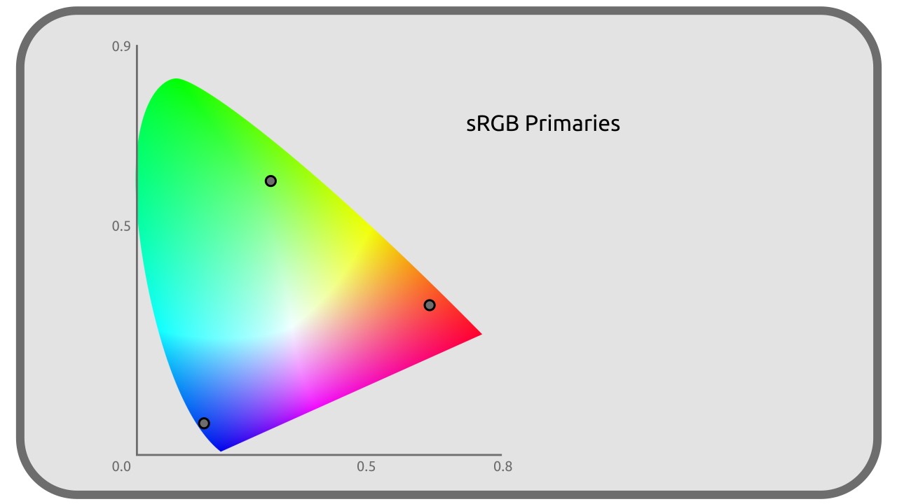

# E - Qu'est ce qu'un espace colorimétrique ?

Un espace colorimétrique définit **un sous-ensemble de couleurs** (un volume dans un diagramme de couleurs 3D, ou une surface sur une projection 2D comme le *CIE xy*) tirées du spectre visible (voire aussi en dehors du spectre visible)[^1].

[TOC]

**

## E.1 - Ce qui définit un espace colorimétrique

L'ensemble des couleurs pouvant être représentées par un espace colorimétrique dépend d'un paramètre principal : **Les couleurs primaires** de l'espace colorimétriques.

La manière de représenter ces couleurs dépend de deux autres paramètres qui complètent la définition d'un espace colorimétrique : **Le point blanc** et **la courbe de transfert**.

### E.1.a - Les primaires

Le plus souvent au nombre de 3, les couleurs primaires sont les valeurs primordiales de l'espace colorimétrique ; elles peuvent être représentées par des coordonnées précises dans l'espace *CIE XYZ* (qui est une représentation de toutes les couleurs visibles sur trois axes). Elles sont dans la majorité des cas une nuance de *Rouge*, de *Vert* et de *Bleu*, et se rapprochent dans l'idéal le plus possible d'une couleur réelle monochromatique (la bordure extérieur du diagramme *CIE xy*).

**

Chaque espace définit donc ses couleurs primaires par au moins trois coordonnées dans l'espace *CIE XYZ*.

Par exemple, voici les coordonnées du Rouge, Vert et Bleu de l'espace *sRGB* :

| | R | G | B |
| --- | --- | --- | --- |
| **X** | 0,64 | 0,30 | 0,15 |
| **Y** | 0,33 | 0,60 | 0,06 |
| **Z** | 0,03 | 0,1 | 0,79 |

Cela signifie que pour deux espaces donnés, la valeur "Rouge" la plus intense n'est pas reproduite concrètement par la même nuance : certains espaces auront un rouge primaire plus ou moins intense ou saturé (ou moins proche des ondes monochromatiques), plus ou moins orangé, par exemple.

L'espace colorimétrique définit donc la manière dont la valeur la plus intense d'une couleur primaire doit être reproduite par le dispositif physique qui va l'afficher (l'écran, le projecteur, ou l'imprimante, etc).

Autrement dit, chaque dispositif de reproduction doit être capable de contrôler précisément quels rayons lumineux, à quelles longueurs d'ondes, quelles couleurs physiques il est capable de produire ; suivant la plage de ces longueurs d'ondes, le dispositif est *compatible* avec différents espaces colorimétriques si il est capable de produire les longueurs d'ondes nécessaires à la reproduction des primaires de l'espace.

Les coordonnées des primaires définissent les bornes d'un sous-espace englobant toutes les couleurs pouvant être représentées dans l'espace colorimétrique. Ce sous espace est plus ou moins grand (il permet de représenter plus ou moins de couleurs différentes) ; la taille de cet espace est ce qu'on appelle le ***gammut***.

**

### E.1.b - Le point blanc

On l'a vu, dans la perception humaine, ce qui est considéré comme *blanc* varie énormément en fonction des conditions, de l'environnement dans lequel on perçoit les couleurs.

Il est donc nécessaire de définir dans l'espace colorimétrique la couleur qui sera considérée comme *blanche*, correspondant concrètement à celle qui doit être obtenue par le mélange en proportion égales des différentes couleurs primaires (blanc à l'intensité maximale, gris à des intensités plus faibles).

Ce point blanc est lui aussi donné par ses coordonnées dans l'espace *CIE XYZ*.

**

Par exemple, voici les coordonnées du point blanc de l'espace *sRGB* : 

| | Blanc |
| --- | --- |
| **x** | 0,3127 |
| **y** | 0,3290 |

La [*CIE*](03-representation.md) a défini un certain nombre de points blancs (on dit aussi *illuminant*) remarquables, utiles pour des usages particuliers. Ils sont représentés par des lettres (de *A* à *F*), parfois accompagné d'un nombre dans le cas de séries de points blancs.

Voici quelques exemples :

- L'illuminant *A* représente la couleur émise par un filament de tungstène des anciennes ampoules domestiques ; autrement dit la couleur d'un *corps noir* de 2856 Kelvin (cf [Température des couleurs]()).
- L'illuminant *B* représente la lumière directe du soleil.
- La série d'illuminants *D* représentent la lumière du jour dans différentes condition (le *D65* représente par exemple la lumière sous un ciel nuageux).

L'illuminant *D65* est celui le plus couramment utilisé comme point blanc dans les différents espaces colorimétriques.

!!! note
    Le point blanc est parfois lui même, par simplification, considéré comme une primaire (dans le sens où il est aussi simplement une couleur précise, une coordonnées dans le *CIE XYZ*). Dans ce cas les *primaires* de l'espace sont au minimum au nombre de 4 et l'espace n'est plus défini que par deux paramètres.

L'espace colorimétrique associe normalement aussi au point blanc son intensité maximum, sa luminance, le plus souvent mesuré en *cd/m²*.

### E.1.c - La courbe de transfert

Les couleurs dans un espace colorimétriques sont données par l'intensité de chaque primaire, représentée par une valeur variant de `0.0` à `1.0`.

La valeur `0.0` représente une intensité nulle (l'absence de lumière, un noir parfait) et la valeur `1.0` représente la couleur donnée par la coordonnée de la primaire dans le *CIE XYZ*.

La question se pose de savoir comment les valeurs intermédiaires sont transcrites en couleurs réelles (ou en coordonnées dans le *CIE XYZ*). Cette transcription est faite par la **courbe de transfert**. C'est une "simple" fonction mathématique qui, pour une valeur donnée dans l'espace colorimétrique, donne la coordonnée *Z* correspondante dans le *CIE XYZ*.

**

L'espace est dit *linéaire* quand cette courbe est une simple fonction affine, c'est à dire représentée par une ligne droite, et dont la correspondance entre les valeurs est juste proportionnelle.

D'autres espaces utilisent donc une courbe de transfert plus complexe visant à mieux refléter la vision humaine et/ou la façon dont les premiers écrans cathodiques reproduisaient les intensités (avec un *gamma 2,4*); les plus "simples" de ces courbes sont ce qu'on appelle les courbes *gamma*. Cela étant dit, la plupart des espaces n'utilisent pas de simples *gamma* mais des courbes plus complexes.

Voir la section intitulée [Courbes de transfert, espace linéaire et gamma](XX-transfert.md) pour plus de détails.

## E.2 - Autres paramètres

Les espaces colorimétriques peuvent aussi imposer ou préconiser d'autres paramètres, surtout sur la manière d'encoder/stocker les couleurs, en fonction de leurs usages prévus.

### E.2.a - Profondeur

Les espaces peuvent préconiser un nombre de bits précis à utiliser pour encoder chaque couleur. Par exemple le *sRGB* préconise un minimum de 8 bits, et le *Rec. 2020* impose 10 ou 12 bits.

Voir la section [Profondeur (bpc)](XX-bpc.md) pour plus de détails.

## E.3 - Pourquoi différents espaces colorimétriques ?

Les espaces colorimétriques sont (très) nombreux. Il en existe en fait autant que d'usages différents des couleurs, sans compter que les constructeurs de matériels, et concepteurs de logiciels, ajoutent parfois leurs propres espaces à la liste déjà longue. Les usages sont relativement peu standardisés.

Ainsi, certains espaces sont liés à des matériels de captation précis : une caméra peut enregistrer les données qu'elle capte dans un espace qui lui est propre, et correspond aux capacités de son capteur, ou à l'usage qui sera fait des images (en proposant par exemple une large gamme de couleurs qui facilite la post-production).

D'autres espaces sont liés aux matériels de reproduction (écrans, projecteurs, imprimantes...) et représentent les couleurs que le matériel est capable de reproduire.

Enfin, plus récemment, des espaces ont été créés spécifiquement pour le travail de l'image ; ils sont alors utilisés temporairement et sont différents des espaces utilisés pour capter, enregistrer ou reproduire les images.

Il faut donc bien garder à l'esprit que plusieurs espaces colorimétriques entrent en jeu lors du travail sur une image :

- L'espace colorimétrique des médias importés et utilisés.
- L'espace colorimétrique de l'affichage utilisé pour l'affichage.
- L'espace colorimétrique de travail, utilisé pour faire les calculs sur l'image, par l'ordinateur.
- L'espace colorimétrique utilisé pour enregistrer et stocker les données en sortie (et plus tard sur l'affichage de destination du média).

On classe ces espaces en deux catégories :

- ***Display-referred***: Espaces utilisés pour l'affichage.
- ***Scene-referred***: Espaces utilisés pour le calcul.

**

Tous ces espaces ne sont pas nécessairement les mêmes (et sont rarement les mêmes en réalité), chacun ayant un usage et correspondant à des besoins spécifiques ; un certain nombre de conversions entrent alors en jeu pour passer d'un espace à l'autre. C'est là que la possibilité de convertir les informations depuis et vers un espace de référence (le *CIE XYZ*) permet de travailler de manière sûre avec plusieurs espaces, chaque espace définissant ses ***primaires***, ***point blanc*** et ***courbe de transfert*** par rapport au même espace de référence.

!!! warning
    C'est une erreur courante de croire qu'il faut travailler dans l'espace utilisé pour la sortie (*output-referred*) alors que les espaces *output-referred* ont justement été prévus pour l'affichage, pas les calculs. Les espaces *scene-referred* sont prévus pour le travail.

----
Sources et références

- [Illuminant sur *Wikipedia*](https://fr.wikipedia.org/wiki/Illuminant)

[^1]:
    Il **ne définit pas** un *nombre* de couleurs, de nuances différentes (qui dépend de l'échantillonage, de la manière de stocker numériquement les valeurs), mais bien une *plage* de couleurs limitée dans l'ensemble des couleurs réelles ; autrement dit, il définit la taille de l'ensemble de couleurs, mais pas le nombre de subdvisions de l'ensemble, qui peuvent être plus ou moins fines dans sa mise en place concrète.