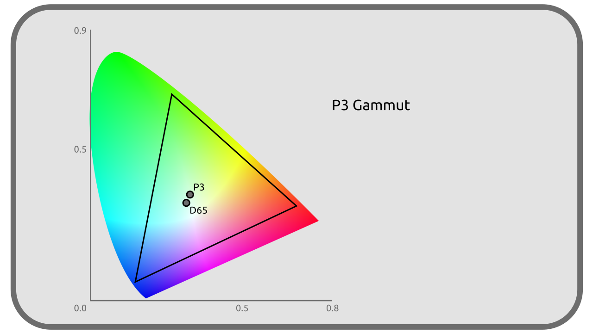
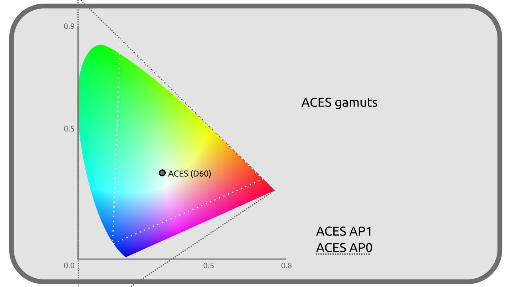

# F - Liste sélective d'espaces colorimétriques

Il ne serait pas possible de lister ici tous les espaces colorimétriques qui existent, mais voici une sélection utile dans la production audiovisuelle en 2021.

[TOC]

## sRGB / CIE 61966-2-1 / IEC 61966-2-1

Espace d'affichage, ***display-referred***.

Le sRGB (pour standard RGB) est un des espaces les plus courant en informatique ; en effet, c'est celui de la plupart des écrans d'ordinateurs, et est aussi utilisé par extension pour la plupart des formats d'image de manière standard (*JPEG*, *PNG*, *TGA*...).

Il date de 1996.

### Primaires

Ces primaires sont les mêmes que celles du *Rec. 709*.

| | R | G | B |
| --- | --- | --- | --- |
| **X** | 0,64 | 0,30 | 0,15 |
| **Y** | 0,33 | 0,60 | 0,06 |
| **Z** | 0,03 | 0,1 | 0,79 |

### Blanc

| | Blanc |
| --- | --- |
| **x** | 0,3127 |
| **y** | 0,3290 |
| **CIE** | *D65* |
| **lum.** | 80 cd/m² |

### Courbe de transfert

Le sRGB utilise une courbe de transfert très proche en moyenne d'un *Gamma 2.2*, avec en réalité un transfert linéaire pour les luminances linéaires inférieures à *0,0031308* puis un *Gamma 2,4* décalé.

## RGB linéaire

Espace de travail, ***scene-referred***.

Le RGB linéaire est **une variation du *sRGB*, en tout point identique sauf pour la courbe de transfert qui est** ***linéaire***. Il est utilisé principalement comme espace de travail (*scene referred*) quand on a besoin d'une meilleure simulation de la lumière (moteurs de rendu, modes de fusion en compositing...) et pour simplifier les calculs. On le retrouve notamment dans les fichiers *EXR*.

!!! note
    Souvent les logiciels parlent à tort de *sRGB linéaire*, ou pire, *IEC 61966-2-1 linéaire*, mais ce n'est **pas** du *sRGB* puisque la courbe de transfert est différente.

## Rec. 601 / ITU-R BT.601 / CCIR 601

Espace d'affichage, ***display-referred***.

Le Rec. 601 est la norme complète pour la vidéo entrelacée de la Télévision Standard Définition *SDTV*. Il n'est plus utilisé mais servait dans les standards *PAL* et *NTSC*.

Sa version *PAL* est très proche du *sRGB*.

### Primaires

| | R | G | B |
| --- | --- | --- | --- |
| **X** (NTSC) | 0,63 | 0,31 | 0,155 |
| **Y** (NTSC) | 0,34 | 0,595 | 0,007 |
| **Z** (NTSC) | 0,03 | 0,095 | 0,775 |
| **X** (PAL) | 0,64 | 0,29 | 0,15 |
| **Y** (PAL) | 0,33 | 0,60 | 0,06 |
| **Z** (PAL) | 0,03 | 0,11 | 0,79 |

!!! note
    En *PAL*, les primaires du *Rec. 601* sont très proches de celle du *sRGB* ; seul le *Gx* change (0,29 au lieu de 0,3)

### Blanc

| | Blanc |
| --- | --- |
| **x** | 0,3127 |
| **y** | 0,3290 |
| **CIE** | *D65* |
| **lum.** | 100 cd/m² |

### Courbe de transfert

*Gamma 2.4*.

## Rec.709 / UIT-R BT 709

Espace d'affichage, ***display-referred***.

Rec. 709 est la norme de la Télévision Haute Définition, *HDTV* et date de 1990. On le retrouve généralement dans les formats vidéos courant (*mp4*...)

Il est très proche du *sRGB*, seule la courbe de transfert change (et son point blanc doit être un peu plus intense).

### Primaires

Ces primaires sont les mêmes que celles du *sRGB*.

| | R | G | B |
| --- | --- | --- | --- |
| **X** | 0,64 | 0,30 | 0,15 |
| **Y** | 0,33 | 0,60 | 0,06 |
| **Z** | 0,03 | 0,1 | 0,79 |

### Blanc

| | Blanc |
| --- | --- |
| **x** | 0,3127 |
| **y** | 0,3290 |
| **CIE** | *D65* |
| **lum.** | 100 cd/m² |

### Courbe de transfert

Proche d'un *Gamma 2,4* ou *Gamma 2,35* suivant les recommandations.

## Rec.2020 / UIT-R BT.2020

Espace d'affichage, ***display-referred***.

Rec. 2020 est la norme de la Télévision Ultra Haute Définition, *UHDTV* et date de 2012.

### Primaires

| | R | G | B |
| --- | --- | --- | --- |
| **X** | 0,708 | 0,17 | 0,131 |
| **Y** | 0,292 | 0,797 | 0,046 |
| **Z** | 0,0 | 0,033 | 0,823 |

### Blanc

| | Blanc |
| --- | --- |
| **x** | 0,3127 |
| **y** | 0,3290 |
| **CIE** | *D65* |
| **lum.** | variable |

### Courbe de transfert

La même que Rec.709 proche d'un *Gamma 2,4*, mais plus précise.

## DCI-P3

Espace d'affichage, ***display-referred***.

*DCI-P3* a été créé comme transition vers le *Rec. 2020* et pour la projection de films. Il est utilisé par certains téléviseurs et écrans d'ordinateur, et même plus récemment certains téléphones/tablettes.

### Primaires

| | R | G | B |
| --- | --- | --- | --- |
| **X** | 0,68 | 0,265 | 0,15 |
| **Y** | 0,32 | 0,69 | 0,06 |
| **Z** | 0,00 | 0,045 | 0,79 |

### Blanc

| | Blanc |
| --- | --- |
| **x** | 0,3140 |
| **y** | 0,3510 |
| **CIE** | N/A |
| **lum.** | 48 cd/m² |

### Courbe de transfert

*Gamma 2,6*

## Display P3

Espace d'affichage, ***display-referred***.

Le *Display P3* est une variation du *DCI-P3* adaptée pour être plus proche (et mieux compatible avec) du *sRGB* (et ainsi fabriquer des écrans capables d'afficher les deux plus facilement). Il garde les primaires (et donc le gammut plus large) du *DCI-P3* mais utilise le point blanc et la courbe de transfert du *sRGB*.

### Primaires

| | R | G | B |
| --- | --- | --- | --- |
| **X** | 0,68 | 0,265 | 0,15 |
| **Y** | 0,32 | 0,69 | 0,06 |
| **Z** | 0,00 | 0,045 | 0,79 |

### Blanc

| | Blanc |
| --- | --- |
| **x** | 0,3127 |
| **y** | 0,3290 |
| **CIE** | *D65* |
| **lum.** | 80 cd/m² |

### Courbe de transfert

Celle du sRGB proche en moyenne d'un *Gamma 2.2*.

## ACES

*ACES* signifie *Academy Color Encoding System*, et représente un système comprenant 5 espaces colorimétriques conçus par l'Académie des Oscars spécifiquement pour la production audiovisuelle, publié en 2014 pour sa première version.

Ces 5 espaces partagent le même point blanc, proche du *D60*; ils utilisent deux ensembles de primaires nommés *AP0* ou *AP1*. Les primaires *AP0* sont *en dehors* des couleurs visibles (et donc du *CIE XYZ*) : elles sont les primaires théoriques les plus proches englobant l'intégralité des couleurs visibles. Les primaires *AP1* sont plus proches des primaires habituelles *RGB* et des écrans et projecteurs, les rendant plus pratiques dans la production des images.

### Primaires (AP0)

| | R | G | B |
| --- | --- | --- | --- |
| **X** | 0,7347 | 0,0 | 0,001 |
| **Y** | 0,2653 | 1,0 | -0,77 |

### Primaires (AP1)

| | R | G | B |
| --- | --- | --- | --- |
| **X** | 0,713 | 0,165 | 0,128 |
| **Y** | 0,293 | 1,830 | 0,044 |

### Blanc

| | Blanc |
| --- | --- |
| **x** | 0,32168 |
| **y** | 0,33767 |
| **CIE** | proche de *D60* |
| **lum.** | infinie |

### ACES2065-1

Espace de **stockage**.

*ACES2065-1* est l'espace principal du système *ACES*. Il est conçu pour stocker n'importe quelle information de couleur de manière non destructive et utilisable à long terme avec de futurs nouveaux espaces. Il englobe donc l'intégralité des couleurs visibles et est *plus grand* que le *CIE XYZ*. Son usage est surtout théorique.

Il est prévu pour être utilisé dans les images *openEXR* ou vidéos *MXF*.

Il est linéaire.

### ACEScg

Espace de travail, ***scene-referred***.

*ACEScg* est semblable au *ACES2065-1* mais utilise les primaires *AP1*. Il est prévu principalement pour les moteurs de rendu 3D et le compositing.

Son format de stockage image standard est l'*openEXR*.

### ACEScc

Espace de travail, ***scene-referred***.

*ACEScc* est semblable au *ACEScg* (avec les primaires *AP1*) mais utilise une courbe de transfert non linéaire, plus pratique pour la correction colorimétrique et l'étalonnage.

## Adobe RGB

Espace d'affichage, ***display-referred*** et de travail.

*Adobe RGB* a été conçu en 1998 pour les graphistes travaillant sur écran mais dont le travail est destiné à l'impression. Il est proche du *sRGB*, mais la primaire verte a été décalée pour englober plus de couleurs pouvant être reproduites en impression *CMYK*. Sa courbe de transfert est aussi légèrement différente.

### Primaires

| | R | G | B |
| --- | --- | --- | --- |
| **X** | 0,64 | 0,21 | 0,15 |
| **Y** | 0,33 | 0,71 | 0,06 |

### Blanc

| | Blanc |
| --- | --- |
| **x** | 0,3127 |
| **y** | 0,3290 |
| **CIE** | *D65* |
| **lum.** | 160 cd/m² |

### Courbe de transfert

*Gamma 563/256* soit *2,199 218 75*.

----
Sources et références

- [*sRGB* sur *Wikipadia*](https://fr.wikipedia.org/wiki/SRGB)
- [Spécifications *sRGB* sur *color.org*](http://www.color.org/chardata/rgb/srgb.xalter)
- [Spécifications *BT.601* sur *color.org*](http://www.color.org/chardata/rgb/BT601.xalter)
- [*Rec. 709* sur *Wikipedia*](https://fr.wikipedia.org/wiki/Rec._709)
- [Spécifications *BT.709* sur *color.org*](http://www.color.org/chardata/rgb/BT709.xalter)
- [*Rec. 2020* sur *Wikipedia*](https://fr.wikipedia.org/wiki/Rec._2020)
- [Spécifications *BT.2020* sur *color.org*](http://www.color.org/chardata/rgb/BT2020.xalter)
- [*DCI-P3* on *Wikipedia*](https://en.wikipedia.org/wiki/DCI-P3)
- [Spécifications *DCI-P3* sur *color.org*](http://www.color.org/chardata/rgb/DCIP3.xalter)
- [*ACES* on *Wikipedia*](https://en.wikipedia.org/wiki/Academy_Color_Encoding_System)
- [acescolorspace.com/](https://acescolorspace.com/)

