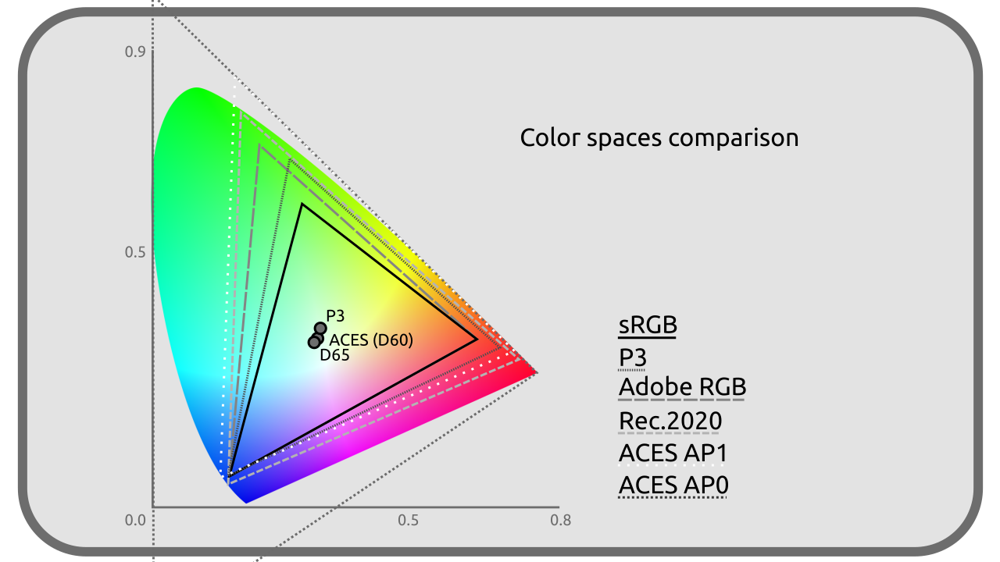

# G - Liste des paramètres d'espaces colorimétriques

Voici la liste des différentes *primaires*, *points blancs* et *courbes de transfert* partagés par les différents espaces colorimétriques, ainsi que leurs comparaisons.

[TOC]

## G.1 - Primaires

### RGB / sRGB / Rec. 709

| | R | G | B |
| --- | --- | --- | --- |
| **X** | 0,64 | 0,30 | 0,15 |
| **Y** | 0,33 | 0,60 | 0,06 |
| **Z** | 0,03 | 0,1 | 0,79 |

### Rec. 601

| | R | G | B |
| --- | --- | --- | --- |
| **X** (NTSC) | 0,63 | 0,31 | 0,155 |
| **Y** (NTSC) | 0,34 | 0,595 | 0,007 |
| **Z** (NTSC) | 0,03 | 0,095 | 0,775 |
| **X** (PAL) | 0,64 | 0,29 | 0,15 |
| **Y** (PAL) | 0,33 | 0,60 | 0,06 |
| **Z** (PAL) | 0,03 | 0,11 | 0,79 |

### Rec. 2020

| | R | G | B |
| --- | --- | --- | --- |
| **X** | 0,708 | 0,17 | 0,131 |
| **Y** | 0,292 | 0,797 | 0,046 |
| **Z** | 0,0 | 0,033 | 0,823 |

### P3

| | R | G | B |
| --- | --- | --- | --- |
| **X** | 0,68 | 0,265 | 0,15 |
| **Y** | 0,32 | 0,69 | 0,06 |
| **Z** | 0,00 | 0,045 | 0,79 |

### AP0 / ACES2065-1

| | R | G | B |
| --- | --- | --- | --- |
| **X** | 0,7347 | 0,0 | 0,001 |
| **Y** | 0,2653 | 1,0 | -0,77 |

### AP1 / ACEScg / ACEScc

| | R | G | B |
| --- | --- | --- | --- |
| **X** | 0,713 | 0,165 | 0,128 |
| **Y** | 0,293 | 1,830 | 0,044 |

### Adobe RGB

| | R | G | B |
| --- | --- | --- | --- |
| **X** | 0,64 | 0,21 | 0,15 |
| **Y** | 0,33 | 0,71 | 0,06 |

## G.2 - Blancs

### D65 / RGB / sRGB / Rec. 601 / Rec. 709 / Display P3 / Adobe RGB

| | Blanc |
| --- | --- |
| **x** | 0,3127 |
| **y** | 0,3290 |
| **CIE** | *D65* |

### DCI-P3

| | Blanc |
| --- | --- |
| **x** | 0,3140 |
| **y** | 0,3510 |

### ACES / ACES2065-1 / ACEScg / ACEScc

| | Blanc |
| --- | --- |
| **x** | 0,32168 |
| **y** | 0,33767 |
| **CIE** | proche de *D60* |

## G.3 - Courbes de transfer

### Linéaire / RGB / ACES2065-1 / ACEScg

Transfert Linéaire

### sRGB / Display P3

Proche en moyenne d'un *Gamma 2.2*, avec en réalité un transfert linéaire pour les luminances linéaires inférieures à *0,0031308* puis un *Gamma 2,4* décalé.

### 2.4 / Rec. 601 / Rec. 709 / Rec. 2020

*Gamma 2,4*

### 2.2 / Adobe RGB

*Gamma 563/256* soit *2,199 218 75*.

### ACEScc

.