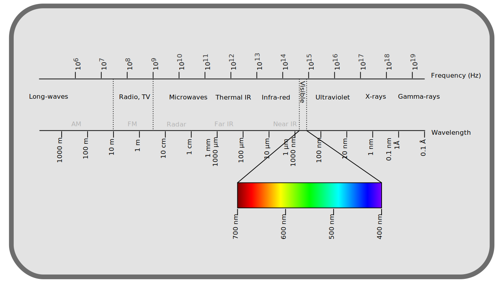

# C - Le blanc, le pourpre, et autres mélanges

Comme on l'a vu précédemment, la part de l'interprétation par le cerveau dans la perception des couleurs est extrèmement importante. L'exemple le plus frappant concerne la couleur "blanche" (et par extensions toute la gamme des gris, le blanc n'étant qu'un gris avec une forte luminosité).

## C.1 - Blanc

Une même feuille blanche sera vue blanche quelque soit le moment de la journée ou le type d'éclairage artificiel, bien qu'en réalité, sa couleur soit tout à fait différente dans chacun de ces cas : la feuille prendra en fait la couleur de la lumière qui l'éclaire, mais le cerveau opèrera un "décalage" dans la perception qui la fera apparaître blanche dans tous les cas.

Ainsi, des rayons de lumière aux attributs physiques parfaitement différents seront vus de la même manière par l'observateur.

**

Et il en est de même pour différents blancs d'apparence parfaitement identiques mais composés de rayons complètement différents ; il y a une infinité de mélanges de rayons de lumière différents qui peuvent être perçus comme le même blanc[^1], y compris dans le même environnement ; et il en est en réalité de même pour toutes les couleurs qui ne sont pas des lumières monochromatiques\*.

Dans la nature, **toutes** les lumières, ou plus précisément tous les rayons lumineux, sont monochromatiques ; c'est la perceptions de leurs mélanges que le cerveau interprète en une infinité d'autres couleurs. Il n'y a pas de "lumière blanche" mais bien des lumières mélangées.

Les couleurs monochromatiques "naturelles" vont du bleu au rouge en passant par le cyan, le vert, le jaune ; elles sont les couleurs les plus *saturées*\* possible. Toutes les nuances "désaturées", blanchatres, grisatres, sont des mélanges de ces couleurs monochromatiques, et il y a pour chaque couleur une infinité de mélanges différents possibles qui peuvent la générer, avec un minimum de deux rayons "opposés" : deux rayons monochormatiques qui forment du gris/blanc une fois mélangés sont dits *complémentaires*\*.

**

## C.2 - Pourpre

Il est à noter que la gamme des pourpres/violets[^2] ne fait **pas** partie des couleurs "naturelles" et monochromatiques\* mais sont le résultat du mélange de bleu et de rouge, qui sont les deux extrèmes du spectre. Mais on "voit" tout de même les pourpres comme des couleurs saturées.

En effet, ce pourpre à son tour mélangé à du vert donne du blanc, et peut donc être considéré comme la *complémentaire* du vert, bien qu'il soit en réalité déjà le mélage de rouge et de bleu. On retrouve là d'ailleurs les trois primaires courantes des systèmes numériques de reproduction des couleurs.

**

## C.3 - Température

https://fr.wikipedia.org/wiki/Corps_noir

https://fr.wikipedia.org/wiki/Lieu_planckien

----

[^2]:
    C'est une erreur courante de décrire le blanc commme le mélange "de toutes les couleurs de l'arc en ciel" ; si le mélange de tous les rayons lumineux monochromatiques possible est effectivement vu comme du blanc (en proportions adéquates), c'est loin d'être la seule manière de composer une lumière blanche. Il se trouve simplement que la lumière reçue du soleil sur Terre est une source très mélangée de toute le spectre lumineux et donc qui se décompose en arc-en-ciel complet.
[^1]:
    Le terme "ultra-violet" pour décrire la partie du spectre électomagnétique au delà du bleu est trompeur ; l'extrémité du spectre est perçue comme bleue (foncée) plus que violet. Le véritable violet étant bien la couleur qu'on perçoit résultant du mélange de rayons bleus et rouges.

