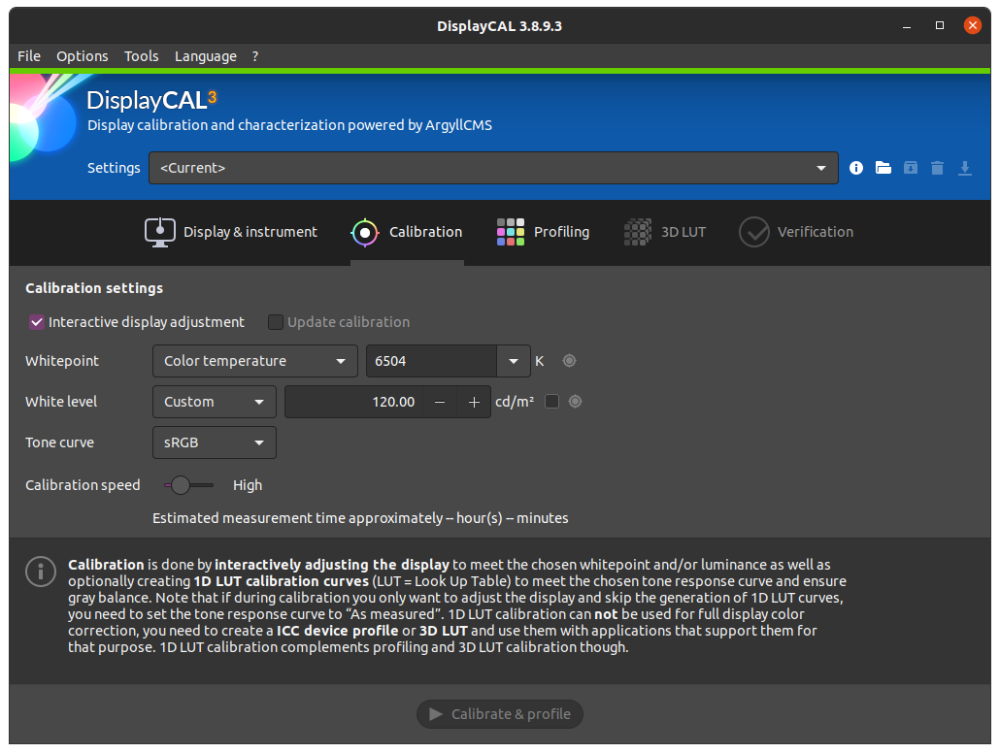

# II.C - Calibration des écrans

Première étape, primordiale, dans la mise en place de la gestion des couleurs dans une chaîne de fabrication d'images numériques : s'assurer de la fidélité des écrans, que les couleurs affichées soient les plus proches possibles de ce que contiennent les images. C'est le calibrage.

Le calibrage, en améliorant grandement la fidélité des écrans, permet d'avoir un affichage correct, voire très bon en utilisant une sonde, même sur des écrans de qualité moindre[^1].

[TOC]

## C.1 - Introduction

Le but du calibrage des écrans est multiple :

- S'assurer que pour toute valeur de couleur donnée, tous les écrans de la chaîne de fabrication affichent la même couleur.
- S'assurer que pour toute valeur de couleur donnée, la couleur affichée est bien celle préconisée par l'espace colorimétrique utilisé par l'écran.
- S'assurer que les personnes utilisant les écrans perçoivent la couleur correcte (influence de l'environnement).

Les obstacles pour y parvenir sont aussi multiples :

- Les écrans dans leur configuration d'usine ne sont que rarement fidèles à l'espace de couleurs annoncé.
- Les écrans vieillissent, et leurs couleurs peuvent donc varier dans le temps. Sans compter que même la température peut influencer les composants électroniques, et donc les couleurs affichées.
- Il est compliqué d'avoir une référence objective où l'on est certain que les couleurs soient justes, qui puisse servir de point de comparaison.
- L'environnement (la lumière ambiante, couleur des murs...) influence la perception des couleurs.

La manière la plus fiable pour parvenir est donc de faire confiance à une *sonde de calibration*.  
Une sonde est en fait un capteur de lumière qui fonctionne en tandem avec l'ordinateur pour appliquer des corrections colorimétriques, et son rôle est de mesurer les couleurs affichées par l'écran, pour comparer avec des valeurs de référence. La plupart des sondes sont aussi capables de mesurer la lumière ambiante pour prendre en compte les variations dues à l'environnement et la perception humaine.

L'usage d'une sonde permet ainsi de surmonter tous ces obstacles :

- Elles permettent de mesurer les couleurs de l'écran et leur décalage par rapport aux valeurs de référence de l'espace colorimétrique de l'écran.
- En recalibrant les écrans régulièrement, elles permettent de maintenir une fidélité suffisante tout au long de la vie de l'écran et des conditions.
- Elles évitent d'avoir besoin d'une référence : elles peuvent mesurer objectivement les couleurs, dont les valeurs peuvent être comparées directement aux valeurs attendues par l'espace colorimétrique de l'écran.
- La plupart des sondes peuvent rester branchées à l'ordinateur, et mesurent régulièrement la lumière ambiante, afin d'en compenser les variations en direct.

Toutefois, en l'absence de sonde, il est aussi possible d'améliorer l'affichage des couleurs avec un autre capteur : l'œil. Les résultats ne seront pas aussi précis qu'avec une sonde, mais on peut toutefois améliorer l'affichage des écrans les plus mauvais. Le principal problème de la calibration à l'œil étant le manque de référence objective pour comparer les couleurs : il est impossible d'être certain que les couleurs affichées soient les bonnes. L'influence de l'environnement est aussi un problème, mais qui peut être compensé avec une bonne organisation.

## C.2 - Environnement

Avant toute chose, un paramètre relativement facile à maîtriser est l'environnement de travail et la lumière ambiante dans lesquelles sont vues les couleurs de l'écran.

Quelques règles simples permettent de s'assurer que l'on percevra toujours les mêmes couleurs, et de manière aussi objective que possible.

- Éviter au maximum l'éclairage naturel, qui varie à chaque instant ; si le travail sur les couleurs est primordial, une pièce sans fenêtre est idéale. Sans aller si loin, la possibilité de tamiser au maximum la lumière des fenêtres, ou des volets pour la couper complètemenbt au besoin sont des solutions simples mais efficaces.
- Maîtriser l'éclairage et la couleur des murs (qui font la couleur générale de la lumière ambiante). Les espaces colorimétriques définissent généralement les conditions dans lesquelles leurs couleurs sont censées être vues ; la situation idéale est donc de respecter les préconisations de l'espace utilisé par l'écan. Dans tous les cas, il faut privilégier une lumière neutre (blanche, d'une *température[\*](ZZ-vocabulaire.md)* définie mais pas colorée), et de bonne qualité ; les murs devraient être aussi neutres que possible, et dans l'idéal gris plutôt que blancs.
- Contrôler la luminosité des écrans, en fonction de la luminosité ambiante : l'écran doit être suffisamment lumineux par rapport à l'environnement (mais pas au point de paraître exagérément lumineux : il ne doit pas être source de lumière).

Voici les paramètres de l'environnement tel qu'il est préconnisé par l'espace colorimétrique ***sRGB***, celui de la majorité des écrans, et applicable aux autres espaces (P3, Rec.2020...) :

- **Luminosité ambiante** : *64 lux* à *200 lux[\*](ZZ-vocabulaire)*.  
    C'est une luminosité faible à très faible, plus faible que la luminosité typique d'un bureau (qui se situe entre 300 et 500 lux).
- **Température de l'éclairage** : *5003 K*, *D50*.  
    C'est une lumière relativement orangée, proche de celle du soleil. Elle est volontairement un peu éloignée du blanc du *sRGB* et donc des écrans (qui est de *6500 K*, *D65*).
- **Couleur des murs** : Gris moyen (réflectance de 20%).
    Les murs devraient absorber 80% des rayons lumineux qu'ils reçoivent, ce qui en fait des murs d'un gris moyen.
- **Luminosité de l'écran** : *80 cd/m²*  
    Le *sRGB* (tout comme le *P3* pour l'affichage) préconise une luminosité relativement faible des écrans (si l'environnement est peu lumineux). Une luminosité un peu plus élevée peu être nécessaire si l'environnement n'est pas assez sombre. Il faut noter que les espacecs dédiés à la vidéo comme le *Rec.709* ou *Rec.2020* sont adaptés aux écrans *TV* avec une luminosité d'écran de *100 cd/m²*, et qu'il peut donc être utile d'augmenter la luminosité des écrans vers cette valeur si l'on produit pour la télévision (ou le cinéma).

## C.3 - Calibration

Une fois l'environnement maîtrisé, ou en tout cas réglé dans les condition de travail, on peut procéder à la calibration des écrans.

Avant de commencer, il faut s'assurer des paramètres de la calibration à faire.

### C.3.a - Choix de l'espace colorimétrique de l'écran et de la calibration

On choisit celui de l'écran par défaut, en général *sRGB* ou parfois *Display P3* ou plus rarement d'autres.

On peut aussi décider de calibrer vers un espace différent de celui prévu pour l'écran, **pour autant que les deux espaces soient compatibles**. Cela peut être utile quand toutes les images fabriquées sont destinées à un usage specifique (TV, cinéma...) afin de travailler dans un espace identique ou proche de celui utilisé pour la diffusion des images terminées. On peut par exemple calibrer les écrans en *Rec.709* pour fabriquer des vidéos HD pour la télévision et les regarder dans les conditions de la diffusion, et sans avoir à convertir les vidéos au moment de la lecture vers l'espace de l'écran[^2].

Il faut pour cela que les *primaires[\*](ZZ-vocabulaire.md)* des deux espaces soient les mêmes, ou bien que le *gamut[\*](ZZ-vocabulaire.md)* de l'espace de l'écran soit plus grand et contienne le *gamut* de l'espace dans lequel on calibre. Il faudra dans tous les cas bien penser à changer les paramètres d'affichage dans toutes les applications et le système d'exploitation pour que les images soient bien affichées dans l'espace dans lequel on a calibré l'écran.

Le choix de l'espace va définir les *primaires[\*](ZZ-vocabulaire.md)* et le *gama[\*](ZZ-vocabulaire.md)* utilisés ; le *point blanc[\*](ZZ-vocabulaire.md)* peut souvent être réglé à part.

### C.3.b - Point blanc et luminosité

Le point blanc est souvent réglable lorsqu'on utilise une sonde ; à moins de besoins spécifiques comme le travail pour l'impression (auquel cas le point blanc peut être celui du papier), on choisit celui de l'espace colorimétrique de l'écran, soit *D65*, *6500 K* dans la majorité des cas.

La luminosité peut aussi souvent être mesurée et réglée. Si l'on travaille pour des images en *sRGB* destinées à être vues sur écran d'ordinateur, la référence est de *80 cd/m²*. Si l'on travaille plutôt en vidéo pour la télévision (ou le cinéma), la luminosité peut être celle du *Rec.709*, soit *100 cd/m²*. Il peut être utile de choisir une valeur un peu plus élevée si l'environnement de travail est trop lumineux.

### C.3.c - Calibration et application du profil colorimétrique

#### C.3.c.1 - Calibration

Si l'on utilise une sonde, le processus est en général assez simple : on branche la sonde à l'ordinateur et on la place à plat sur l'écran (ou face à l'écran du projecteur)[^3]. Un logiciel fourni avec la sonde (ou bien le très performant logiciel libre *DisplayCal[^4]*) effectue alors une série de mesure des couleurs affichées par l'écran. Le résultat de ces mesures permet de calculer le décalage entre les couleurs affichées et les couleurs attendues.

**
*Paramètres de calibration de* DisplayCAL

Si l'on calibre à l'œil, le principe est d'afficher une série de *mires*, d'images de référence, et d'essayer d'ajuster des réglages de l'écran à la main pour s'approcher de la description d'une image de référence. Il est complètement impossible de régler correctement les *primaires[\*](ZZ-vocabulaire.md)* et le *point blanc[\*](ZZ-vocabulaire.md)* à l'œil, mais on peut essayer de s'en approcher en affichant différentes images. Par contre, la *luminosité[\*](ZZ-vocabulaire.md)*, le *contraste[\*](ZZ-vocabulaire.md)*, le *gama[\*](ZZ-vocabulaire.md)* peuvent être relativement bien approchés grâce à des comparaisons de valeurs de gris entre elles (et beaucoup de patience).

Pour calibrer à l'œil plusieurs méthodes sont possibles, mais tout commence toujours par l'affichage de mires et d'images de références. Certains systèmes d'exploitation en proposent, on peut aussi en trouver sur le net [comme ici](http://www.lagom.nl/lcd-test/).

**

Ensuite, en affichant les images, on retouche les réglages de l'écran. Il y a trois possibilités :

- Retoucher les réglages de l'écran ; mais ils sont souvent assez limités et peu précis.
- Retoucher les paramètres de la carte graphique via ses pilotes, si ils le permettent.  
    L'intérêt est que la correction sera correctement appliquée dans toutes les situations ; mais il se peut que les paramètres soient ré-initialisés lors de mises à jour du système ou des pilotes.
- Si le système d'exploitation le propose, effectuer les réglages via son utilitaire de couleur et enregistrer puis appliquer un profil colorimétrique à l'écran.  
    Il faut ensuite s'assurer lors de mises à jour que le système ne re-sélectionne pas un autre profil. L'intérêt de cette méthode est de pouvoir garder les réglages dans un fichier sauvegardable et transportable, le profil, en général au format `.icc`.

Il n'est pas conseillé de cumuler ces différentes méthodes, le résultat devenant vite assez aléatoire, et surtout difficile à retoucher ou corriger par la suite.

**  
Exemple de paramètres via les réglages d'une carte graphique *Nvidia* (sous *Linux*). Notez surtout ici le paramètres *color range*, à mettre sur *Full* si l'écran est un écran d'ordinateur, et *Limited* si c'est un téléviseur.

**  
Exemple de paramètres via les réglages d'une carte graphique *Nvidia* (sous *Linux*). Ici, différents curseurs permettent d'ajuster l'affichage des couleurs (pour chacun des écrans). Chaque curseur peut agir sur les trois *canaux[\*](ZZ-vocabulaire.md)* à la fois, ou bien séparément sur le rouge, vert ou bleu.

**

**

#### C.3.c.2 - Profil colorimétrique

Le résultat du calibrage de la sonde, ou parfois d'un calibrage à l'œil, est enregistré dans un *profil colorimétrique*, une *LUT*. C'est le système d'exploitation qui va appliquer ce profil ou cette *LUT* à toutes les couleurs lors de l'affichage sur l'écran correspondant et ainsi convertir ces couleurs afin qu'elles s'affichent exactement comme elles le doivent.

**

**

**  
Choix des profils colorimétriques sous *Ubuntu Linux* dans la section *Color* des paramètres. Un bouton permet d'ajouter des profils (prédéfinis ou importés via un fichier, par exemple généré par une sonde) à la liste sous chaque écran pour changer facilement de profil par la suite.

----
Sources et références

[^1]:
    Pour autant que les couleurs de l'écran soit à peu près uniformes et identiques aussi bien au centre que sur les bords et dans les coins...

[^2]:
    Il faut bien noter qu'il n'est pas nécessaire du tout que les écrans utilisent l'espace colorimétrique de la diffusion : grâce à la gestion des couleurs, les images affichées sont converties pour l'espace de l'écran de sorte que les couleurs affichées sont exactement celles de la diffusion quoi qu'il arrive ; calibrer les écrans dans l'espace de diffusion permet juste d'éviter cette conversion, et d'éviter les erreurs de configurations courantes en choisissant systématiquement l'espace de la diffusion, que ce soit pour l'affichage, la sortie des fichers, etc.  
    Un exemple concret : en travaillant en vidéo et pour la télévision, les images seront en *Rec.709*, mais les écrans de travail sont par défaut en *sRGB*. Lors de la fabrication des images, il faut donc préciser (mais c'est souvent automatique), que l'on affiche les images en *sRGB*, alors que lors des exports on choisira *Rec.709*.  
    Si l'on calibre les écrans en *Rec.709*, on pourra simplement choisir *Rec.709* partout sans se tromper (mais c'est moins standard en informatique, et les configurations par défaut ou automatiques risquent d'être fausses...).

[^3]:
    Il est conseillé de commencer par restaurer les réglages de l'écran dans des paramètres les plus neutres possible, désactiver les économies d'énergie, les différents modes éventuels (jeu, bureau, vidéo...), afin de laisser la sonde et le système contrôler les couleurs.

[^4]:
    DisplayCAL est gratuit et disponible sur Linux, MacOS, Windows et prend en charge une large gamme de marques et modèles de sondes : https://displaycal.net/  
    Comme toujours, on vous encourage fortement à faire un don si vous décidez de l'utiliser !

