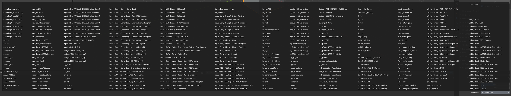
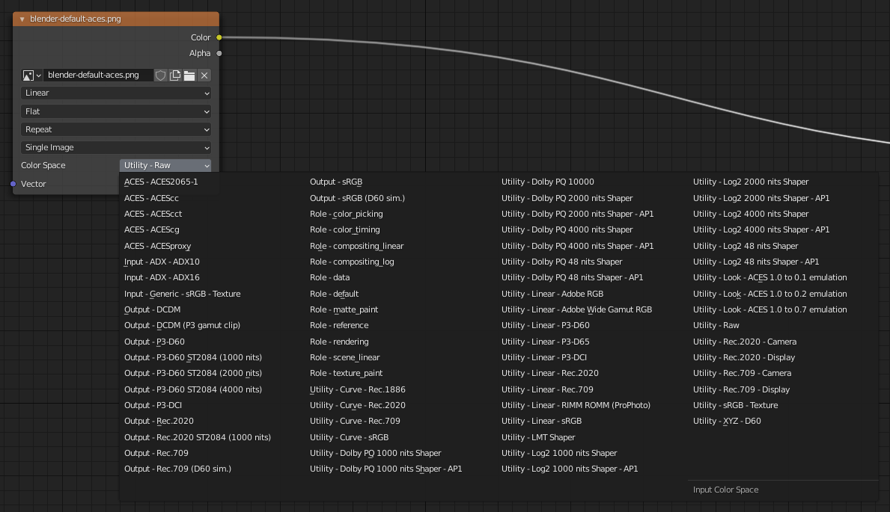

# II.I - Gestion des couleurs : Blender

*[Blender](http://blender.org)* utilise nativement *OpenColorIO[\*](ZZ-vocabulaire.md)* (*cf*. *[I.N - OpenColorIO et ACES](N-ocio.md)*) pour la gestion des couleurs, et ses paramètres sont très simples.

Une excellente configuration *OCIO* par défaut est fournie avec *Blender*, qui inclue les espaces nécessaires pour importer des fichiers images et vidéo, exporter dans plusieurs formats, et un espace de travail *Filmic* fonctionnant très bien pour les rendus 3D.

On peut toutefois aussi facilement utiliser une configuration avec *ACES* si l'on souhaite en profiter ou intégrer Blender à une chaîne de fabrication en *ACES*, l'espace de travail *ACES* étant légèrement différent de *Filmic*.

[TOC]

## I.1 - Configuration par défaut : *Filmic*

*a. Rendu sans gestion des couleurs, avec l'espace de travail sRGB __standard__.*

*b. Rendu avec gestion des couleurs, dans l'espace de travail __Filmic__.*

Avec la configuration par défaut et l'espace *Filmic* pour le rendu (*scene referred*), voici les quelques paramètres de couleur dans Blender.

### I.1.a - Rendu (scene referred) et affichage

Ces paramètres se situent dans les paramètres de rendu, section *Color Management*.

!!! note
    - En sortie ***OpenEXR***, seules les données brutes (linéaires) sont enregistrées.
    - ***Pour les autres formats***, les paramètres sont appliqués lors de la conversion vers l'espace colorimétrique du format de sortie.

Il est important de bien noter que dans une chaîne de production avec gestion des couleurs, et utilisant le format *OpenEXR[\*](ZZ-vocabulaire.md)* comme format intermédiaire (et donc d'enregistrement en sortie de *Blender*), toutes ces options n'influencent que l'**affichage** du rendu dans *Blender* mais pas les données enregistrées dans le fichier *OpenEXR* ! Il faut donc ré-appliquer les mêmes réglages dans les applications suivantes de la chaîne (de compositing comme *Nuke*, *After Effects*, etc. par exemple).

Si les autres applications n'utilisent pas *OpenColorIO[\*](ZZ-vocabulaire.md)* (et qu'on ne peut donc pas donner la configuration *OCIO* de *Blender*), on peut toutefois retrouver ces réglages via des *LUT[\*](ZZ-vocabulaire.md)* exportées depuis la configuration OCIO de Blender. *Cf*. *I.2 - Chaîne de fabrication* OCIO

Par contre, ce n'est pas le cas quand on enregistre les images dans d'autres formats (*PNG*, vidéo, etc.), auquel cas *Blender* applique tous les réglages dans l'image qui, contrairement à l'*OpenEXR*, est enregistrée dans un espace colorimétrique précis (*sRGB* pour les images, *Rec.709* pour les vidéos, etc.).

- ***Display Device*** : choisissez l'espace d'affichage. En général, laissez sur *sRGB*.
- ***View Transform*** : c'est le paramètre de l'espace de travail (scene referred) qui transforme les données brutes linéaires du moteur de rendu vers l'affichage.
    - *Filmic* (*fig. a*) : C'est l'espace par défaut, très performant pour atténuer les hautes lumières qui brûlent facilement et garder des détails dans les zones sombres. Il simule en fait l'impression des images sur pellicule et permet un rendu assez fin et détaillé.
    - *Standard* (*fig. b*) : Affiche les données dans l'espace d'affichage ; cette option permet de voir comment une application afficherait l'image sans application de l'espace *Filmic*. Il est peu utile, les hautes lumières devenant trop facilement brûlées, sauf éventuellement en utilisant les outils de courbes plus bas.
    - *Filmic Log* : une version logarithmique du *Filmic*, destinée surtout à effectuer d'importantes retouches de couleurs en compositing.
    - *Raw* : affiche les données brutes sans transformation, telles qu'elles sont enregistrées dans les fichiers *OpenEXR* si c'est le format choisi en sortie.
    - *False Color* : un affichage contrasté en couleurs variées destiné à pouvoir analyser en détail le contenu de l'image.
- ***Look*** : applique en plus de l'espace de travail (*View Transform*) un réglage supplémentaire selon un choix purement artistique et créatif.  
    Chacune des options est un choix de contraste de l'image. *Medium* et *None* sont exactement les mêmes options.
- ***Exposure*** et ***Gamma*** : changent l'exposition et appliquent une éventuelle correction *gamma[\*](ZZ-vocabulaire.md)* à l'image.  
    Mieux vaut ne pas changer ces paramètres si la chaîne de fabrication implique d'autres applications après la sortie de *Blender* et qu'on utilise le format *OpenEXR*. Ils peuvent toutefois être utiles pour retoucher simplement le contraste de l'image en sortie, si on exporte dans un format d'image ou vidéo final, autre que *EXR*. Ces réglages influençant l'espace de travail, ils s'appliquent *après* les noeuds de compositing.
- ***Sequencer*** : réglage de l'espace de travail du séquenceur (le module de montage vidéo).  
    N'influence pas les images 3D ni le compositing.

*Blender* propose aussi un outil d'ajustement de l'image via des courbes, qui permet des retouches fines de l'image.

  
*Cet exemple reproduit à peu près ce que fait l'espace* Filmic.

Si cet outil peut être pratique pour retoucher les images qui sortent de *Blender*, il est à proscrire si l'on travaille sur une chaîne avec gestion des couleurs et utilisant le format *OpenEXR* : il serait trop compliqué de reproduire exactement le même effet de courbes dans les applications qui suivent *Blender* dans la chaîne de fabrication.

### I.1.b - Sortie

*Blender* n'affiche pas d'option de couleurs (à part quelques modes et la profondeur) pour la sortie des images ; il utilise l'espace standard du format de sortie (*sRGB* pour les formats image, données brutes linéaires en *OpenEXR*)

En *OpenEXR* les deux *profondeurs[\*](ZZ-vocabulaire.md)* sont :

- *Float (Half)* : *16 bpc* float.
- *Float (Full)* : *32 bpc* float.

Suivant le compositing à faire dans les applications suivantes ou les formats finaux, on pourra préférer *Float (Full)* en gardant à l'esprit que les fichiers seront parfois bien plus gros et lourds en calculs.

*Cf*. chapitre *[I.K - Format des pixels](K-pix-format.md)* pour plus d'informations.

Ce qu'il faut retenir :

- En ***OpenEXR*** (et *OpenEXR MultiLayer*) : ce sont les données brutes et linéaires qui sont enregistrées.  
    Il faudra ré-appliquer les mêmes réglages que ceux choisis dans les paramètres de rendu et *color management* lors de l'utilisation des fichiers dans d'autres applications pour retrouver la même image. C'est le format qui permet le meilleur contrôle et la meilleure qualité.
- Dans les autres formats **image et vidéo** : ce sont les données converties via l'espace de travail vers l'espace standard du fichier qui sont enregistrées (*sRGB* ou *Rec.709* en général). Les images affichées telles quelles seront donc automatiquement les mêmes que dans *Blender* (mais on perd en qualité avec la perte de la linéarité notamment, et de *profondeur des couleurs*).

### I.1.c - Entrée (textures)

À l'ajout d'images dans *Blender*, le sélecteur *Color Space* permet de préciser l'espace colorimétrique utilisé par le fichier en question.

- ***Filmic Log*** : à utiliser (uniquement) au cas où le fichier est un fichier *OpenEXR* précédemment exporté ou rendu par *Blender* avec l'espace de travail *Filmic Log*.
- ***Linear*** : pour les fichiers *OpenEXR* standards (ou d'autres formats éventuels en *RGB linéaire*).
- ***Linear ACES*** : pour les fichiers *OpenEXR* rendus avec l'espace de travail *ACEScg*.
- ***Non-Color*** et ***Raw*** : le fichier ne contient pas une image mais des données (comme une *normal map*, une *displacement map*, une *metalness*, etc.)
- ***sRGB*** : pour tous les fichiers image et vidéo standards.
- ***XYZ*** : en cas de chaîne de production dans l'espace XYZ.

!!! note
    La présence de l'espace *Linear ACES* permet d'importer des images ayant utilisé *ACES*, mais *Blender* ne s'intègre pas pour autant complètement dans une chaîne de fabrication utilisant *ACES* par défaut ; en effet il ne propose pas d'espace de travail *ACES*.  
    *Cf*. *I.3 - Utiliser* ACES

## I.2 - Chaîne de fabrication OCIO

Cf. *[II.D - Concevoir une chaîne de fabrication avec *OpenColorIO*](2D-ocio.md)*.

La configuration *OCIO[\*](ZZ-vocabulaire.md)* fournie par défaut avec *Blender*, *Filmic*, est disponible dans le dossier de configuration de *Blender*, `datafiles/colormanagement/config.ocio`.

Il est donc possible d'utiliser cette configuration sur toute la chaîne de production en pointant cette configuration dans les autres applications, ou en définissant la variable d'environnement `OCIO` sur ce fichier.

Pour inclure des applications n'utilisant pas *OpenColorIO* à la chaîne (comme *Adobe After Effects* ou *Adobe Photoshop*), on peut toujours générer les *LUT[\*](ZZ-vocabulaire.md)* nécessaires, en particulier la *LUT* qui convertit les images linéaires (comme en *openEXR[\*](ZZ-vocabulaire.md)*) vers *sRGB* ou d'autres espaces courants. Nous proposons plusieurs de ces [*LUT* en téléchargement ici](media/filmic-luts.zip), dans différents formats. Il suffit alors d'appliquer la *LUT* voulue pour retrouver l'espace *Filmic* de Blender dans une autre application.

### I.2.a - Changer la configuration OCIO

Pour utiliser une configuration différente de la *Filmic* par défaut, *Blender* ne permet pas de sélection une configuration via l'interface, mais deux solutions sont possible.

- Via la variable d'environnement  
    On peut simplement changer la variable d'environnement du système `OCIO` pour pointer vers le chemin de la configuration à utiliser.  
    Cf. *[II.D - Concevoir une chaîne de fabrication avec *OpenColorIO*](2D-ocio.md)*.

- En remplaçant le fichier dans le dossier *Blender*  
    On peut aussi supprimer la configuration existante dans le dossier de *Blender* pour y copier la nouvelle configuration (le fichier `ocio.config` et les sous-dossiers associés). Pensez simplement à garder une copie de la configuration d'origine !

Il est aussi bien sûr possible d'éditer soi-même le fichier de `ocio.config` de *Blender*, pour les utilisateurs avancés.

## I.3 - Utiliser *ACES*

Il peut être intéressant d'utiliser l'espace de travail *ACEScg* plutôt que le *Filmic* par défaut de *Blender* pour un rendu un peu différent, ou pour intégrer *Blender* à une chaîne de production utilisant *ACES*.

Voici une comparaison des résultats du même rendu dans différents espaces :

*a. Rendu sans gestion des couleurs, avec l'espace de travail sRGB __standard__.*

*b. Rendu avec gestion des couleurs, dans l'espace de travail __Filmic__ (réglage "Medium-Contrast").*

*c. Rendu avec gestion des couleurs, dans l'espace de travail __ACEScg__.*

Comme on peut le voir sur ces images, *ACES* garde mieux la saturation des couleurs très lumineuses, et un peu plus de contraste, alors que *Filmic* a tendance à ternir un peu les images.

Pour utiliser *ACES[\*](ZZ-vocabulaire.md)* avec *Blender* et profiter de son espace de travail performant, il suffit d'utiliser la configuration *OCIO[\*](ZZ-vocabulaire.md)* correspondante.

Cependant, la configuration fournie par *OCIO* pour *ACES* comporte une longue liste d'espaces colorimétriques correspondant à divers modèles de caméras, très utile en cinéma pour le travail sur les images filmées, mais qui complique la tâche en animation et notamment dans *Blender*.

*La liste des espaces colorimétriques affichée dans* Blender *avec la configuration* ACES *d'origine !*

[Nous proposons en téléchargement ici](https://rainboxlab.org/downloads/aces-anim/aces-anim_1.0.3.zip) une version modifiée de *ACES* spécifiquement pour l'animation, notamment en limitant le nombre d'espaces colorimétriques inclus à ceux qui sont potentiellement réellement nécessaire en animation. Ce travail effectué depuis les sources de *Sony Pictures ImageWorks* est [disponible ici sur Github](https://github.com/Rainbox-dev/Aces-Anim-OpenColorIO-Config).

*La liste des espaces colorimétriques affichée dans* Blender *avec la configuration* ACES *ajustée par nos soins.*

Voici les nouveaux réglages disponibles une fois cette configuration installée.

### I.3.a - Rendu (scene referred)

Voici les réglages des paramètres de rendu, *color management*, une fois *ACES[\*](ZZ-vocabulaire)* disponible.

- *Display Device* ne contient plus qu'une seule option, *ACES*. Ce n'est pas très standard dans la manière de fonctionner, mais *ACES* est fait comme ça...
- C'est *View Transform* qui contient les espaces d'affichage, auxquels sont appliqués l'espace de travail *ACEScg*.
- Il n'y a pas de *Look* créatif fournit avec *ACES*. Les *Looks* de *Filmic* ne sont de toute manière pas très utiles (ils peuvent facilement être reproduits en compositing).

Choisissez simplement l'espace d'affichage correspondant à votre écran (généralement *sRGB*).

- *Raw* affiche les données brutes sans transformation, telles qu’elles sont enregistrées dans les fichiers OpenEXR si c’est le format choisi en sortie.
- *Log* est l'équivalent *ACES* de *Filmic Log*, utile en cas de retouches fortes en compositing.
- Plusieurs espaces proposent une variation avec le *point blanc[\*](ZZ-vocabulaire)* *D60* au lieu de *D65*. En effet, *D60* (environ *6000 K*) est le *point blanc* de *ACES* et choisir une de ces options permet de voir l'image sans la conversion du *point blanc*.

### I.3.b - Entrée (textures)

Pour l'import des images, une grande liste d'espace colorimétriques potentiels est disponible. Voici les plus utiles et les plus courants.

- Les espaces ***ACES*** sont les espaces habituels de *ACES*:
    - ***ACES2065-1*** : espace colorimétrique pour le stockage préconisé par la norme *ACES* dans les fichiers *OpenEXR*, mais encore assez peu utilisé.
    - ***ACEScc*** et ***ACES - ACEScct*** : espace colorimétrique *ACES* dédié à la correction des couleurs, dans des fichiers *OpenEXR* en général. Il est peu probable que l'on aie à importer ce genre de ficher dans *Blender*, sauf éventuellement un fichier *OpenEXR* venant d'un logiciel d'étalonnage ou de compositing.
    - ***ACEScg*** : espace de travail de *ACES* pour les rendus et le compositing. Dans une chaîne utilisant *ACES*, les textures peuvent être fabriquées dans cet espace et importées dans *Blender* via des fichiers *OpenEXR*.
- ***Input - Generic - sRGB - Texture*** et ***Utility - sRGB - Texture*** sont identiques. Pour les fichiers images standards en *sRGB* (*PNG*, *TGA*, etc).
- Les espaces ***Output*** ne devraient pas être utiles en entrée...
- Les espaces ***Role*** sont des alias pour d'autres espaces en fonction de leur usage, et peu utiles ici.
- Les espaces ***Utility*** contiennent plusieurs éléments importants pour importer des images dans *Blender* :
    - ***Curve*** convertissent uniquement la courbe de transfert des fichiers importés, mais pas les primaires.
    - ***Linear*** convertissent uniquement les primaires mais pas la courbe de transfert. Certains sont courants et utiles :
        - ***Linear - sRGB*** est l'espace par défaut des fichiers *OpenEXR*.
        - ***Linear - Rec.709*** est parfaitement identique à *Linear - sRGB*.
    - ***Raw*** est l'espace à utiliser pour les fichiers ne contenant pas des images mais d'autres données (comme les *normal map*, *displacement map*, *metalness*, etc.)
    - ***Rec.709 - Display*** est l'espace des vidéos HD standard (*MP4* par exemple)
    - ***Rec.2020 - Display*** est un espace de vidéo UHD (4K)

En résumé :

- Fichiers ***OpenEXR*** contenant de l'image : ***ACES - ACEScg*** si le fichier vient d'une application travaillant en *ACES*, ***Utility - Linear - sRGB*** dans les autres cas.
- Fichiers ***OpenEXR*** contenant des données autres que de la couleur : ***Utility - Raw***.
- Fichiers ***image*** (*PNG*, *JPG*, *TGA*, etc.) : ***Utility - sRGB - Texture***.
- Fichiers ***vidéo*** (*MP4*) : ***Utility - Rec.709 - Texture*** dans la majorité des cas, ***Utility - Rec.2020 - Display*** en cas de vidéo UHD.

----
Sources et références

