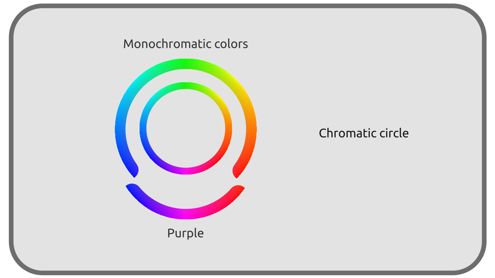
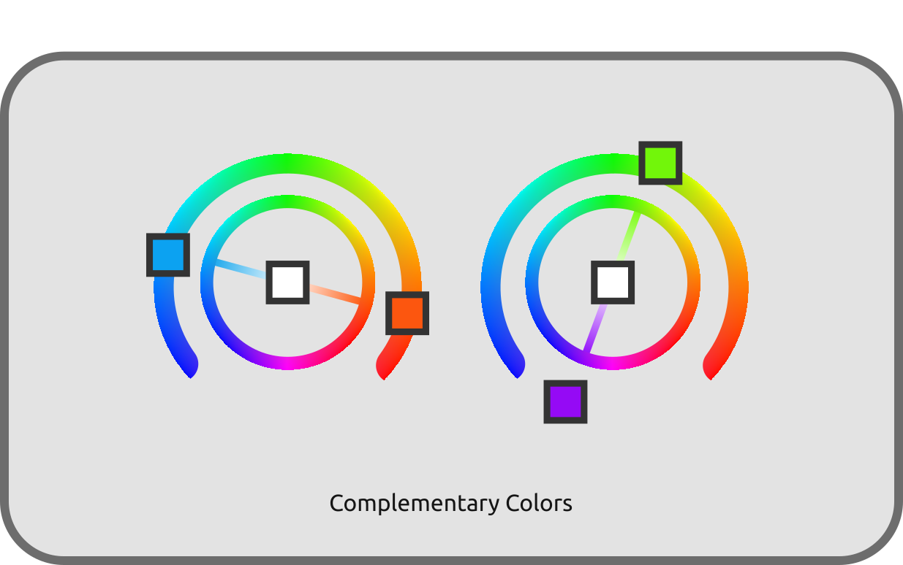

# B - Petit inventaire et classification des couleurs

Les couleurs perçues sont donc des mélanges de rayons de lumière *monochromatiques*\*. Voyons comment classer toutes ces couleurs comment elles se décomposent.

!!! note
    Nous parlons encore ici de *lumières* et de rayons lumineux, et donc d'un système *additif* ; il n'est pas question de la composition des surfaces et de la manière dont elles absorbent et renvoie les couleurs, et qui serait l'objet d'une synthèse *soustractive* de la lumière.  
    cf chapitre [*D - Reproduction des couleurs*](D-reproduction.md) pour plus de détails sur le sujet.

## B.1 - Noir

La couleur la plus simple est donc le *noir*\* : l'absence totale de lumière est perçue comme noire. Quand l'intensité de la lumière baisse, les couleurs s'approchent progressivement du noir. Mais quand l'intensité monte, les couleurs ne vont pas vers le blanc ! Plus l'intensité est élevée, plus la couleur apparait "lumineuse" et "saturée", mais ne pâlit, ne blanchit pas[^1].

## B.2 - Lumières monochromatiques

Les couleurs les plus simples, et les plus rares (ce sont celles émises par les *Lasers* par exemple), sont celles composée d'une seule lumière *monochromatique*. Ce sont en fait les *couleurs de l'arc en ciel*, celles qui sont incluses dans le spectre monochromatique.

**

Elles vont du rouge au bleu en passant par orange, jaune, vert, cyan... mais n'incluent aucune nuance de violet, de *pourpre*\*.

**

Elles peuvent varier d'intensité, dans une échelle allant du noir (intensité 0) à la couleur la plus "lumineuse".

## B.3 - Pourpres

Il est à noter que la gamme des pourpres/violets[^2] ne font **pas** partie des couleurs "naturelles" et *monochromatiques*\* mais sont le résultat du mélange de rayons bleus et de rayons rouges, qui sont les deux extrèmes du spectre.

**

Les pourpres ajoutés aux couleurs monochromatiques forment l'ensemble des couleurs les plus *saturées[\*](ZZ-vocabulaire.md)* possible, qui sont donc toutes les couleurs *monochromatiques* **et** les mélanges contenant uniquement du bleu et du rouge.

**

## B.4 - Blancs et gris

Dans la nature, **toutes** les lumières, ou plus précisément tous les rayons lumineux, sont *monochromatiques[\*](ZZ-vocabulaire.md)* ; c'est la perceptions de leurs mélanges que le cerveau interprète en une infinité d'autres couleurs. On a vu que les pourpres font partie de ces mélanges ; toutes les autres couleurs non *saturées[\*](ZZ-vocabulaire.md)*, les gris et les blancs, sont donc aussi des lumières mélangées.

Toutes les nuances "désaturées", blanchâtres, grisâtres, sont des mélanges de ces couleurs *monochromatiques*, et il y a pour chaque couleur (et pas uniquement les gris, toutes les couleurs non-monochromatiques) une infinité de mélanges différents qui peuvent la générer.

**

Deux couleurs perçues de manière identique mais composées de rayons *monochromatiques* dans des proportions différentes sont dites ***métamères[\*](ZZ-vocabulaire.md)***.

### B.4.a - Couleurs complémentaires

Il faut un minimum de deux rayons "opposés" pour former du blanc : deux rayons *monochromatiques* qui forment du gris/blanc une fois mélangés sont dits *complémentaires[\*](ZZ-vocabulaire.md)*.

On peut aussi inclure les pourpres comme complémentaires des verts. En effet, un pourpre à son tour mélangé à du vert donne du blanc[^3], et peut donc être considéré comme la *complémentaire* du vert[^4], bien qu'il soit en réalité déjà le mélange de rouge et de bleu. On retrouve là d'ailleurs les trois primaires courantes des systèmes numériques de reproduction des couleurs.

**

### B.4.b - Perception

Une même feuille blanche sera vue blanche quelque soit le moment de la journée ou le type d'éclairage, bien qu'en réalité, sa couleur soit tout à fait différente dans chacun de ces cas : la feuille prendra en fait la couleur de la lumière qui l'éclaire, mais le cerveau opèrera un "décalage" dans la perception qui la fera apparaître blanche dans tous les cas.

**  
*Sous le soleil ,à l'ombre ou dans les nuages, quelque soit le moment de la journée, dans la réalité nous percevons la neige comme* blanche *même si en réalité la lumière qu'elle réfléchit est à chaque fois différente[^5].*

Ainsi, des rayons de lumière aux attributs physiques parfaitement différents peuvent être vus de la même manière par l'observateur. **La perception des couleurs est éminemment subjective.**

----

[^1]:
     Dans la réalité. Mais artistiquement, les limites techniques des systèmes de reproduction des couleurs imposent de "tricher" en blanchissant les hautes lumières pour compenser la limite de luminosité des couleurs disponibles. Sans cet artifice, des couleurs "monochromatiques" dans une image pourraient paraître moins lumineuses que des gris ou blancs de la même image ; on est donc obligé de tirer les lumières vers le blanc pour compenser.
[^2]:
    Le terme "ultra-violet" pour décrire la partie du spectre électomagnétique au delà du bleu est trompeur ; l'extrémité du spectre est perçue comme bleue (foncée) plus que violet. Le véritable violet étant bien la couleur qu'on perçoit résultant du mélange de rayons bleus et rouges.
[^3]:
    On parle bien sûr ici de *lumière*, autrement dit un système "additif" où les intensités s'additionnent. Ce n'est évidemment pas vrai en peinture et impression qui sont des systèmes "soustractif" où les couleurs "asborbent" de l'intensité lumineuse, soustraient des rayons de lumière. cf. chapitre [*D - Reproduction des couleurs*](D-reproduction.md).
[^4]:
    Si on voulait être physique juste, les verts n'auraient simplement pas de complémentaires du tout, et seules les intervalles de rayons proches des deux extrêmes du spectres (oranges-rouges et cyan-bleus) seraeint complémentaires les uns des autres.
[^5]:
    Ce qu'un appareil photo ou une caméra a le plus grand mal à reproduire. cf. chapitre *[E - Retour sur les blancs : température](E-temperature.md)*.

