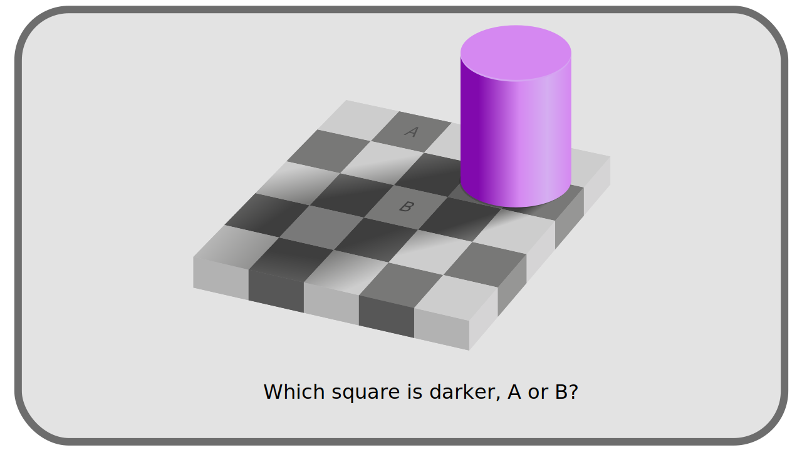
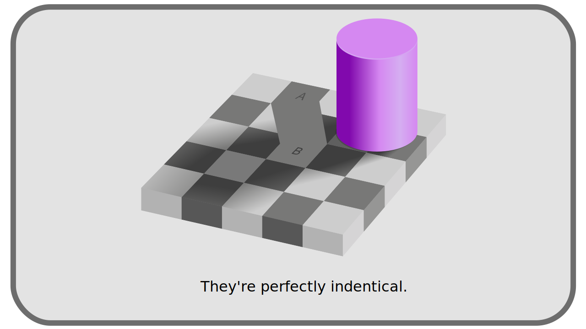

# I.C - Perception de la lumière et des couleurs par l'être humain

Au problème d'avoir une référence objective pour définir les couleurs s'ajoute le fait que la définition de la couleur est intrinsèquement liée à la perception qu'on en a, et cette perception diffère évidemment d'une population à l'autre, d'un individu à l'autre, et aussi de l'environnement dans lequel on perçoit la couleur.

!!! hint
    Dans l'antiquité, [Démocrite](https://fr.wikipedia.org/wiki/D%C3%A9mocrite) suggérait même que les couleurs ne sont qu'imagination.

[TOC]

Comprendre cette interprétation subjective des couleurs est important pour comprendre comment la gestion des couleurs dans le traitement des images numériques a été conçu et comment elle évolue.

## C.1 -  L'œil

Dès la réception des rayons lumineux par l'œil et la rétine, la lumière est décomposée et interprétée. Deux types de photorécepteurs composent la rétine, les cônes et bâtonnets.

Les bâtonnets sont les cellules utiles et actives dans la pénombre ; ils sont saturés dès que la lumière devient trop forte, vers 500 photons par seconde.

Les cônes sont les cellules efficaces dans la réception des lumières plus intenses ; ils ne s'activent d'ailleurs qu'à partir d'une intensité de 10 photons par seconde. Divisés en trois types différents, ils sont capables de capter les rayons sur une gamme de fréquence plus large ; cette division en trois types permet aussi d'interpréter la *teinte* de la lumière : le système nerveux peut comparer les intensités sur les trois différents types de cônes et en déduire une teinte.

## C.2 - Le système nerveux

Les informations reçues par les cellules de la rétines sont traduites en influx nerveux et interprétées par le cerveau.

Ce processus explique notamment le fait que des mélanges **objectivement différents** de sources monochromatiques peuvent être perçus exactement de la même manière et **subjectivement identiques** ; ainsi, deux couleurs *blanches* perçues de la même manière et indifférenciables par l'individu peuvent en réalité être formées de différents mélanges de lumières monochromatiques[^1].

À l'inverse, des couleurs **objectivement identiques** peuvent être perçues de manière **subjectivement complètement différentes** en fonction de leur environnement. C'est en particulier le cas pour le *blanc* ; ce qu'on perçoit comme la couleur blanche varie grandement en fonction des types de sources lumineuses et de la teinte générale de l'environnement. C'est l'équivalent de la *balance des blancs* en photographie, mais c'est vrai pour toutes les couleurs.

Le système nerveux est donc responsable d'une interprétation des couleurs qui n'est pas liée directement au signal objectif reçu par l'œil, mais qui pourrait être vu comme une "*retouche*" subjective en post-production : il adapte l'image en fonction de l'environnement, exactement comme le fait le photographe en retouchant les contrastes et la balance des blancs (les teintes), pour "*neutraliser*" l'image, et augmenter la quantité de détails percevables dans l'image reconstruite.

Toutes ces différentes étapes altèrent donc la perception d'un signal physique et objectif : un même rayon lumineux ne sera pas "*vu*" de la même manière dans deux endroits différents, et suivant la quantité et la nature des autres rayons qui l'accompagnent.

## C.3 - Conséquences

Les conséquences de cette perception subjective sont importante pour comprendre les choix historiques qui ont été fait sur les techniques permettant la reproduction artificielle et le traitement des images (analogiques puis numériques).

### C.3.a - Sur la luminosité et le contraste

La présence des bâtonnets sur la rétine et leurs performance dans les lumières plus faibles, au détriment de la perception des teintes dans ces lumières, fait que **l'oeil est globalement plus performant pour discerner les détails dans la pénombre** que dans les lumières fortes, et qu'il est en général **plus performant pour distinguer les contrastes d'intensité** lumineuses **que les variations de teinte** (la décomposition en longueurs d'ondes précises sur le spectre).

### C.3.b - Sur les teintes

La division en trois types de cônes performants chacun sur des longueurs d'ondes précises fait que **trois couleurs _primaires_**[^2] suffisent pour reproduire toutes les couleurs telles que l'être humain peut les percevoir, pour autant que ces primaires correspondent environ au domaine de performance de ces trois types de cônes[^3].

Les trois couleurs "*primaires*" les plus proches des gammes de perception des cellules cônes sont la combinaison **Rouge, Vert, et Bleu**, même si en réalité les cônes perçoivent plutôt le jaune, vert et bleu.

!!! note
    La trichromie n'est pas le seul modèle pouvant représenter la vision de la couleur. On peut aussi imaginer un modèle où la vision distingue les oppositions blanc-noir, bleu-jaune et rouge-vert par exemple[^4].

Cette façon de percevoir les couleurs influence donc les choix de systèmes pour les reproduire artificiellement, comme on l'explique par la suite, notamment avec le ***gamma***, le système ***RVB*** ou ***YUV***.

----
Sources et références

- [Couleur sur *Wikipedia*](https://fr.wikipedia.org/wiki/Couleur)
- [Psychophysique sur *Wikipedia*](https://fr.wikipedia.org/wiki/Psychophysique)
- [Bâtonnet sur *Wikipedia*](https://fr.wikipedia.org/wiki/B%C3%A2tonnet)
- [Cône sur *Wikipedia*](https://fr.wikipedia.org/wiki/C%C3%B4ne_(photor%C3%A9cepteur))
- [Colour representation, *Kent State University*](http://www.cs.kent.edu/~farrell/cg00/lectures/color/colour.html)

[^1]:
    Il y a plusieurs "qualités" de lumières blanches et apparemment identiques, suivant qu'elles sont composées d'une gamme plus ou moins variées de rayons de longueurs d'ondes (donc de teintes) différentes.
[^2]:
    Il y a une confusion de vocabulaire, notamment dans la production audiovisuelle, entre couleur *primaire* (qui ne peut pas être obtenue par mélange d'autres couleurs), et couleurs *complémentaires* (dont le mélange donne du noir, gris ou blanc). Nous utilisons ici le mot *primaire* au sens des espaces de couleurs numériques : dont le mélange donne le blanc.
[^3]:
    [Isaac Newton](https://fr.wikipedia.org/wiki/Isaac_Newton) avait découvert qu'il est tout à fait possible de reproduire une lumière blanche avec seulement deux couleurs monochromatiques mais une troisième primaire est nécessaire pour s'éloigner du dégradé simple entre les deux premières.
[^4]:
    [Ewald Hering](https://fr.wikipedia.org/wiki/Ewald_Hering) s'est opposé vigoureusement à la trichromie. Fondé sur l'étude psychologique de la perception, son modèle, dont [Erwin Schrödinger](https://fr.wikipedia.org/wiki/Erwin_Schr%C3%B6dinger) a montré l'équivalence mathématique avec la trichromie, a été depuis confirmé par des études en neurosciences. 