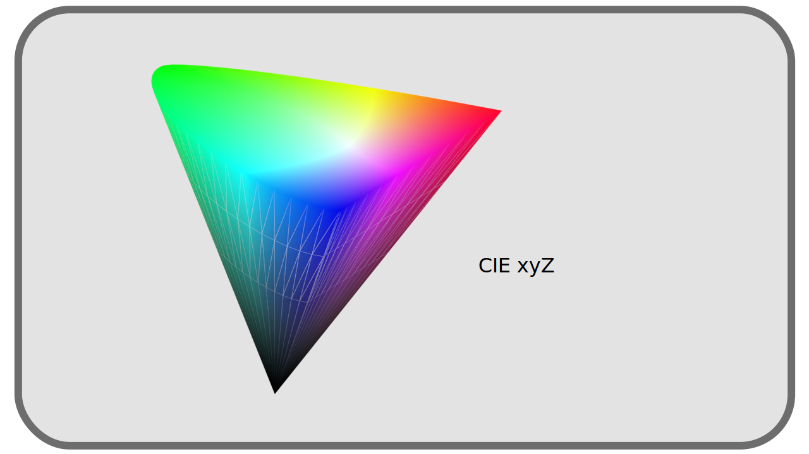
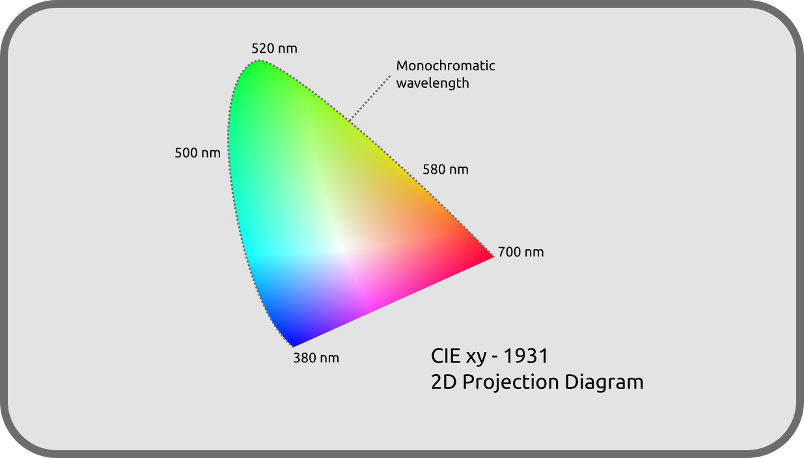
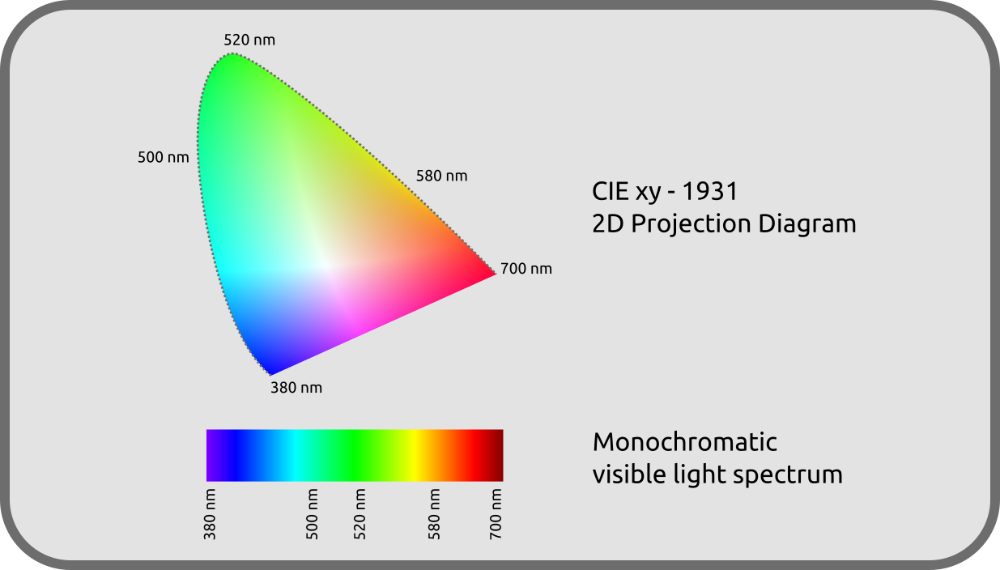

# F - Représentation objective des couleurs

Étant entendu que la perception des couleurs est éminemment subjective, tout travail en commun nécessite la mise en place d'un référenciel objectif partagé par tous (et donc une certaine standardisation des techniques, ce qui n'est pas toujours évident...).

[TOC]

Ce travail de rationnalisation n'est pas né avec l'image numérique ; depuis 1913 la [Commission Internationale de l'Éclairage](https://fr.wikipedia.org/wiki/Commission_internationale_de_l%27%C3%A9clairage) (*CIE*) travaille sur le problème.

Les espaces colorimétriques modernes[^1] qu'on utilise en traitement de l'image sont des propositions de solutions à cette rationnalisation, de standardisation de représentation des couleurs, et se basent sur le travail et les premières tentatives de la CIE.

Il est intéressant de savoir que la CIE a mené ses travaux de manière empirique, définissant un *observateur moyen* à partir de nombreuses expériences de comparaison de couleurs par des observateurs humains, afin de caractériser les couleurs et les lumières telles que les perçoit l'humain moyen.

C'est en 1931 que la CIE a proposé une première représentation et rationnalisation des couleurs : le diagramme *CIE-1931*, encore très utilisé aujourd'hui comme référentiel objectif, notamment pour comparer les différents espaces colorimétriques en usage.

## F.1 - Décomposer les couleurs

On l'a sous-entendu jusqu'ici, une couleur telle qu'on la perçoit est physiquement définie par trois paramètres indépendants : son *intensité*, sa *longueur d'onde dominante* et sa *pureté d'excitation*.

- L'**intensité** est assez intuitive à comprendre, et liée à ce qu'on appelle aussi la *luminosité* ; c'est le nombre de photons reçus chaque seconde par les cellules de la rétine.
- La **longueur d'onde dominante** va influencer principalement la *teinte* de la couleur ; c'est la composante monochromatique la plus intense dans le mélange de toutes les longueurs d'ondes formant cette couleur particulière.
- La **pureté d'extraction** représente la proportion entre la longueur d'onde dominante et la quantité de *blanc* qu'il faut y ajouter pour obtenir la couleur en question. C'est proche de ce qu'on nomme la *saturation*.

Cette décomposition étant parfaitement objective (liée à la réalité physique de la lumière), elle est une bonne base pour fabriquer une représentation objective des couleurs ; c'est ce qu'a fait la CIE dès 1931.

## F.2 - Diagrammes de couleurs, CIE XYZ de 1931 et CIE xyZ

Avec ces trois paramètres, on peut donc représenter les couleurs en trois dimensions.

Afin d'établir cette représentation, la CIE a choisi trois couleurs primaires théoriques différentes des Rouge, Vert et Bleu plus courant, dénommées X, Y et Z, capables d'englober l'intégralité des couleurs visibles. Cette représentation est donc l'**espace colorimétrique _CIE XYZ_ de 1931**, et sert encore aujourd'hui de référence pour représenter et comparer tous les autres espaces colorimétriques.

Les paramètres à la base de cet espace colorimétriques ont été soigneusement choisis afin de représenter au mieux l'intégralité des couleurs perçues par la vision humaine.

!!! note
    La représentation en trois dimensions ci-dessus n'est pas exacte, mais illustre bien l'apparence générale de l'espace colorimétrique.

Afin d'en faciliter l'utilisation et la visualisation, on le représente surtout dans une projection en deux dimensions, ne figurant pas du tout l'intensité (la luminosité) de la couleur.

Cette projection fait en réalité passer dans un autre espace colorimétrique dérivé du *CIE XYZ* où la teinte est représentée sur un plan par des coordonnées nommées *x* et *y* (en minuscules) ce qui en fait l'espace ***CIE xyZ***.

Sur ce diagramme, on retrouve le spectre de la lumière visible, sur le tour supérieur, arrondi, allant du rouge au bleu.

Ce contour contient donc toutes les lumières monochromatiques possibles, tandis que l'intérieur du diagramme représente les couleurs "mélangées" telles qu'on les perçoit.

La ligne droite inférieure représente les mélanges des deux extrèmes du spectre visible, que l'on voit comme les couleurs *pourpres*, qui ne font pas partie des lumières monochromatiques et referment le "cercle chromatique" qu'on connait.

Ce diagramme contenant toutes les couleurs visibles **sert toujours de référence** dans lequel **on peut y inscrire les autres espaces colorimétriques**, forcément "plus petits" car ne représentant qu'une sous-partie de toutes ces couleurs, comme nous allons le voir par la suite.

## F.3 - Autres espaces de la CIE

Depuis l'établissement de ces premiers espaces colorimétriques et jusqu'à aujourd'hui, la CIE a continué ces travaux, améliorant l'espace *xyZ* et créant d'autres espaces plus spécifiques et pour des usages particulier.

En 1976 notamment, deux autres espaces ont été publiés : le ***CIE L\*u\*v\**** (pour la lumière) et le ***CIE L\*a\*b\**** (pour les couleurs de surface, plus connu sous la forme *CIE LAB*). Ces deux espaces améliorent et compensent un "défaut" du *xyZ*[^2] : les coordonnées n'y sont plus *linéaires* afin de mieux s'accorder à la vision humaine. En effet, dans l'espace *xyZ*, deux couleurs situées "à la même distance" peuvent dans certaines zones paraîtrent plus semblables que dans d'autres zones. Les *L\*a\*b\** et *L\*u\*v\** corrigent ce "défaut" au prix d'une plus grande complexité des calculs.

Mais c'est toujours le *XYZ* ou *xyZ* de 1931 qui sert de référence pour travailler avec et comparer tous les autres espaces colorimétriques.

----
Sources et références

- [Couleur sur *Wikipedia*](https://fr.wikipedia.org/wiki/Couleur)
- [Commission Internationale de l'Éclairage sur *Wikipedia*](https://fr.wikipedia.org/wiki/Commission_internationale_de_l%27%C3%A9clairage#Espace_XYZ_et_d%C3%A9riv%C3%A9s)
- [CIE XYZ sur *Wikipedia*](https://fr.wikipedia.org/wiki/CIE_XYZ)
- [L\*a\*b\* CIE sur *Wikipedia*](https://fr.wikipedia.org/wiki/L*a*b*_CIE_1976)
- [L\*u\*v\* CIE sur *Wikipedia*](https://fr.wikipedia.org/wiki/L*u*v*_CIE_1976)
- [Colour representation, *Kent State University*](http://www.cs.kent.edu/~farrell/cg00/lectures/color/colour.html)

[^1]:
    Les espaces colorimétriques sont les manières standardisées d'enregistrer et de représenter les couleurs (analogiques aussi bien que numériques).  
    Il y a par exemple : *sRGB*, *BT.709*, *ACES*, *BT.2020*, *P3*, pour n'en citer que quelques uns parmi une très grande liste.
[^2]:
    Les *L\*a\*b\** et *L\*u\*v\** sont en réalité basés sur un autre espace publié en 1976, le *CIE U'V'W'* qui lui est linéaire (et lui même basé sur le *CIE UVW* de 1960). La chronologie de publication de ces espaces successifs est donc la suivante :  
    - 1931 : *XYV*, et sa représentation *xyZ*, linéaire.  
    - 1960 : *UVW*, et sa représentation *uvW*, linéaire.  
    - 1976 : *U'V'W'*, linéaire.  
    - 1976 : *L\*a\*b\** et *L\*u\*v\**, non linéaires.  