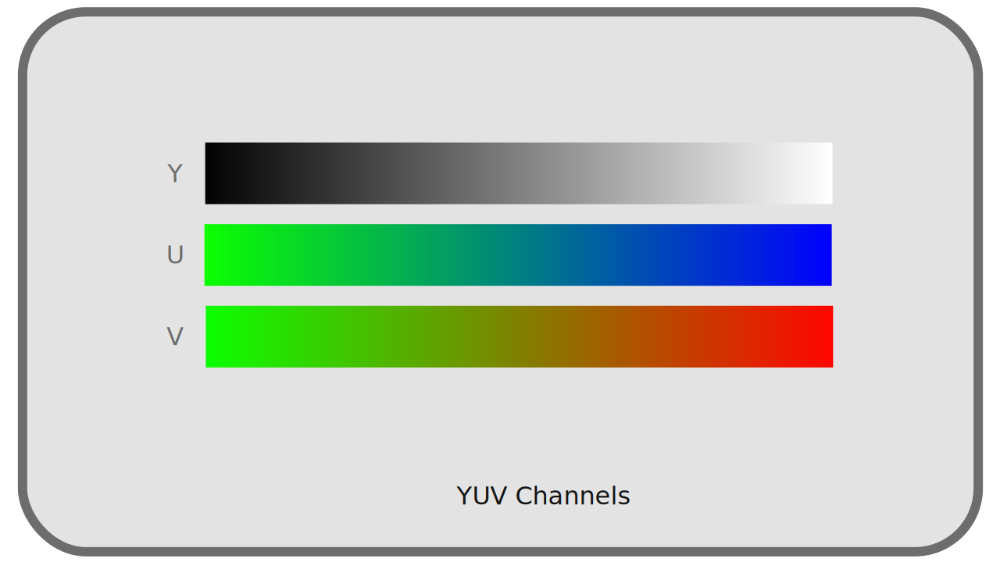

# K - RGB et YUV

N'importe quelle couleur visible peut être représentée par seulement deux couleurs *complémentaires[\*](ZZ-vocabulaire.md)* et *primaires[\*](ZZ-vocabulaire.md)* ; mais avec plus de *primaires*, en variant leurs proportions, on peut représenter une gamme (un *gammut[\*](ZZ-vocabulaire.md)*) plus vase de couleurs visibles.

Dès le nombre de trois couleurs *primaires*, on peut obtenir une surface utile (et suffisante) de couleurs visibles. Ainsi, la plupart des dispositifs de reproduction des couleurs (écrans, projecteurs...) utilisent trois couleurs primaires.

Ces couleurs sont très majoritairement des rouges, verts, et bleus ; ils peuvent varier en fonction des dispositif et de *l'espace colorimétrique[\*](ZZ-vocabulaire.md)* qu'ils utilisent mais se situent toujours dans cette gamme.

Quoi qu'il en soit, tous les systèmes de codage des couleurs utilisent un groupe de différentes valeurs correspondant à des primaires ou propriétés précises ; on parle de *canaux[\*](ZZ-vocabulaire.md)*, généralement au nombre de trois.

## K.1 - RGB

**

On utilise donc généralement en numérique une division des informations de couleurs utilisant les mêmes *primaires[\*](ZZ-vocabulaire.md)* Rouges, Vertes et Bleues que les dispositifis de reproduction. Rouge, Vert et Bleu sont les trois canaus *R*, *G*, *B* de ce système.

**

Il y a donc plusieurs raisons à l'usage de ces *primaires* et de ce système de réprésentation des couleurs :

- Le choix du rouge, vert et bleu est proche de ce que les cellules rétiennes perçoivent le mieux naturellement
- Le rouge et le bleu sont les extrèmes du spectre visible, et le vert est à mi-chemin entre les deux : c'est le choix qui permet facilement d'avoir les *gammut* les plus larges dans l'ensemble des couleurs visibles.
- C'est donc naturellement les couleurs les plus utilisées par les dispositifs d'affichage bien qu'en théorie il serait possible d'en choisir d'autres.

Mais historiquement, et pour des raisons de performance et de stockage, un autre système est très répandu : *YUV*.

## K.2 - YUV

**

Lors des premières utilisations d'un signal électrique (analogique et pas numérique dans un premier temps) pour représenter des vidéos, le signal était un signal "simple" à une dimension : les vidéos étaient représentées uniquement dans une gamme allant du noir au blanc en passant par les gris, en *noir et blanc*. Autrement dit, on ne stockait et reproduisait que l'information d'intensité lumineuse, de *luminance[\*](ZZ-vocabulaire.md)*.

Puis sont arrivées les télévisions couleurs, mais il a fallu garder la compatibilité du signal avec les plus anciens téléviseurs noir et blanc ; on a donc ajouté au signal de luminance[^1] les informations de couleurs, de *chrominance*, sans toucher au signal d'origine ; les anciennes télés noir et blanc ignorant simplement ces informations supplémentaires.

Le système utilisé n'est donc pas un système *RGB* mais de trois canaux *YUV*[^2], où *Y* représente la *luminance*, et *UV* représentent deux informations de *chrominance* (contenant respectivement le ratio bleu/vert et rouge/vert).

**

L'intérêt de ce système n'est pas qu'historique : comme on l'a vu précédemment, l'œil humain distingue mieux les contrastes de *luminance[\*](ZZ-vocabulaire.md)* que de *chrominance*. Séparer ces informations permet de les traiter différemment, et notamment de réserver une quantité d'information, une résolution, plus élevée dans la luminance que la chrominance, et donc de réduire la quantité d'information à stocker et transmettre sans perte notable de qualité visible.

## K.3 - Comparaison

On a donc deux systèmes principaux de codage des couleurs, **indépendants des espaces colorimétriques** utilisés[^3].

Voici les principales différences :

- Historique : l'usage du *RGB* s'est répandu avec le numérique, *YUV* date de l'analogique
- En conséquence *YUV* est plus répandu dans les formats vidéos, *RGB* dans les formats d'images.
- *YUV* permet une compression des données plus efficace, moyennant une certaine perte dans la chrominance, alors que *RGB* doit stocker autant d'information dans ses trois canaux.
- La conversion de *YUV* à *RGB*, et inversement, se fait facilement et *quasiment* sans perte d'information.

----
Sources et références

[^1]:
    En réalité, on parle soit de *luminance[\*](ZZ-vocabulaire.md)* soit de *luminosité[\*](ZZ-vocabulaire.md)* ou *luma[\*](ZZ-vocabulaire.md)* :  
    • La *luminance* a une courbe de transfert linéaire.  
    • La *luma/luminosité* (*brightness* en anglais) a un gamma.  
    Lorsqu'on parle de *luminance* on note *YUV* tandis que lorsqu'on parle de *luminosité* on devrait noter *Y'UV*, mais la plupart du temps on ommet le prime.  
    *cf.* chapitre *[Courbes de transfert, espace linéaire et gamma](O-transfert.md)*.
[^2]:
    Le terme général *YUV* recouvre en réalité deux familles, chacune déclinées en *luminance* ou *luminosité* (*Y* ou *Y'*) :  
    • En analogique on parle de *YUV* et *Y'UV*, ou parfois *YPbPr* et *Y'PbPr*.  
    • En numérique le terme exact est *YCbCr* ou *Y'CbCr*, et parfois *YCC*.  
    Mais c'est généralement le terme *YUV* qui est utilisé dans tous ces différents cas...
[^3]:
    En fait, on peut utiliser indifféremment *YUV* et *RGB*, mais certains standards et espaces colorimétriques préconnisent plutôt l'un ou l'autre, ou les deux. Par exemple *sRGB* est spécifiquement prévu pour être utilisé sur un encodage *RGB*, alors que *Rec.709* spécifie qu'il peut servir aussi bien en *RGB* que *YUV*.

