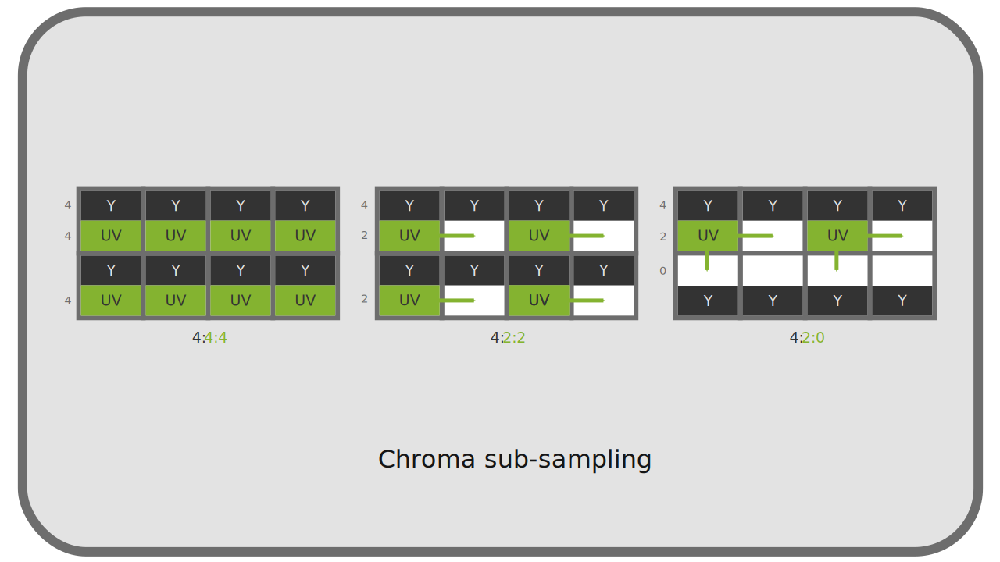
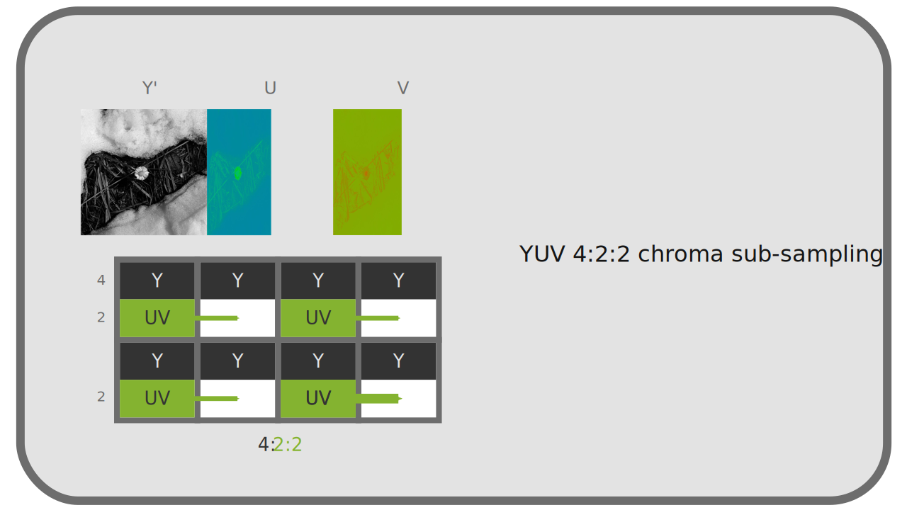
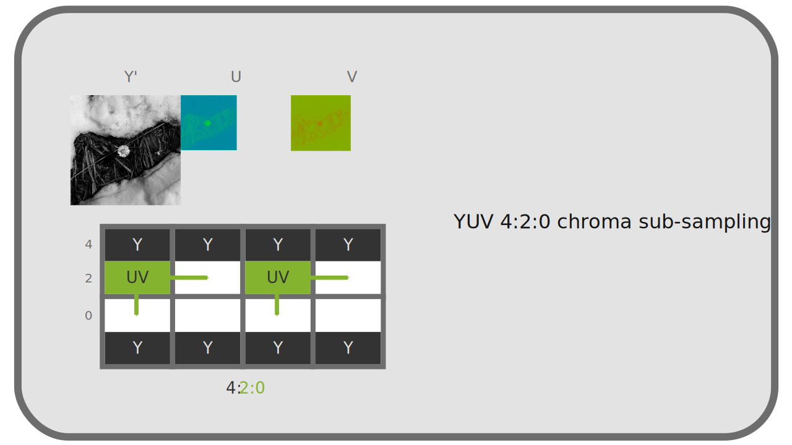

# L - YUV 4:4:4, 4:2:2, 4:2:0... Le sous-échantillonage de la chrominance

*YUV* présente l'avantage, par rapport au *RGB*, de pouvoir fonctionner en pratique de manière plus proche de la perception humaine qui est plus performante en *luminosité[\*](ZZ-vocabulaire.md)*. En effet, en séparant la *luminance[\*](ZZ-vocabulaire.md)* de la *chrominance[\*](ZZ-vocabulaire.md)*, on va pouvoir diminuer la quantité de données enregistrée en *chrominance* pour favoriser la *luminance*, sans que nous ne percevions la perte et ainsi compresser efficacement les données vidéo.

Pour opérer cette réduction de qualité en *chrominance*, on en réduit simplement la résolution, le nombre de pixels ; c'est ce qu'on appelle le sous-échantillonage de chrominance (*chroma sub-sampling* en anglais).

Le sous-échantillonnage de chrominance est donc *une méthode de compression* avec pertes complètement indépendante de la *norme[\*](ZZ-vocabulaire.md)* (*codec[\*](ZZ-vocabulaire.md)*) d'encodage de la vidéo.

Les sigles *4:4:4*, *4:2:2*, *4:2:0*[^1]... décrivent la manière dont le sous-échantillonnage est fait et indiquent la quantité de données perdues. Cette description est faite à partir d'une grille de 4 pixels sur 2.

La première valeur du trio représente la résolution (l'échantillonage) de la *luminance[\*](ZZ-vocabulaire.md)*.  
La deuxième valeur représente le sous-échantillonage de la *chrominance[\*](ZZ-vocabulaire.md)* sur la première ligne (toutes les lignes impaires), tandis que la troisième représente ce sous-échantillonage sur la deuxième ligne (toutes les lignes paires).

Une quatrième valeur est parfois ajoutée au sigle et représente dans ce cas un sous-échantillonage dans la couche *alpha\** de la vidéo[^2].

On peut facilement calculer la quantité de données économisées en additionnant les trois valeurs et en divisant par 12 (ou 16 si il y a une valeur séparée pour l'alpha).  
Par exemple :

- en *4:4:4*, il n'y a aucune perte (facteur de `1,0`)
- en *4:2:2*, on gagne un tiers (facteur de `0,66`)
- en *4:2:0*, on gagne la moitié (facteur de `0,5`)

!!! tip
    En cas de vidéo noire et blanche, la chrominance est complètement inutile, on peut donc choisir le mode qui en a le moins.

## L.1 - 4:4:4

Le sous-échantillonage *4:4:4* en *YUV* est **le seul équivalent au *RGB*** en terme de qualité (et quantité de données). Il n'y a en fait aucun sous-échantillonage dans ce mode et tous les pixels contiennent les informations de *chrominance[\*](ZZ-vocabulaire.md)* et de *luminance[\*](ZZ-vocabulaire.md)*.

Il n'est pas utilisé en diffusion mais **seulement en production** (ou pour l'archivage). En effet, le débit serait trop élevé, mais ces données sont indispensables à la post-production, en particulier dans le cas d'utilisation de fond vert ou bleu (*chroma-key*) : le masquage se faisant sur l'information de chrominance, il est absolument indispensable d'en avoir toute la résolution.

!!! warning
    Malheureusement, seules les caméras et enregistreurs professionnels haut de gamme peuvent enregistrer en *4:4:4*, beaucoup de caméras enregistrent en *4:2:2*, voire même pour l'entrée de gamme en *4:2:0*.

## L.2 - 4:2:2

En *4:2:2*, la résolution de la *chrominance[\*](ZZ-vocabulaire.md)* est la moitié de celle de la luminance (on diminue donc d'un tiers la quantité de données). La perte est imperceptible, ce qui en fait une manière de compresser la vidéo très efficace. Ce mode est utilisé en production (pour autant qu'il n'y ait pas d'incrustation, de fond vert/bleu), dans les formats haut de gamme et dans les diffusion de haute qualité (en télévision notamment).

La résolution horizontale de la chrominance est réduite de moitié, la résolution verticale est gardée.

## L.3 - 4:2:0

En *4:2:0*, la résolution de la *chrominance[\*](ZZ-vocabulaire.md)* est réduite de moitié une ligne sur deux, et complètement supprimée sur l'autre ligne. La quantité de données est donc globalement réduite de moitié, mais la différence reste très difficile à percevoir, ce qui en fait un très bon format de diffusion[^3].

Ce mode est majoritaire dans les fichiers informatique grand public et sur internet. Beaucoup de lecteurs logiciels, et la plupart des lecteurs *hardware* (lecteurs de blu-rays, smart TVs, etc) ne supportent d'ailleurs que le *4:2:0*.

Il est à proscrire en production en cas de correction colorimétrique ou incrustation ; les informations de *chrominance* sont très insuffisantes (un effet "d'escalier" peut facilement apparaitre, dû au manque de résolution en chrominance).

La résolution horizontale ainsi que verticale de la chrominance sont toutes deux réduites de moitié.

----
Sources et références

- [Sous-échantillonage de la chrominance sur *Wikipedia*](https://fr.wikipedia.org/wiki/Sous-%C3%A9chantillonnage_de_la_chrominance)

[^1]:
    Cette liste sont les sous-échantillonages les plus courants, mais il y en a de plus rares (*4:2:1*, *4:1:1*), ou plus complexes ou carrément exotiques (*3:1.5:1.5*, *3:1:1*)...
[^2]:
    À défaut, le sous-échantillonage du canal alpha est le même que celui de la *luminance[\*](ZZ-vocabulaire.md)*.
[^3]:
    Ce mode existe dans le format *openEXR* : c'est l'option notée "Luminance/Chroma".

