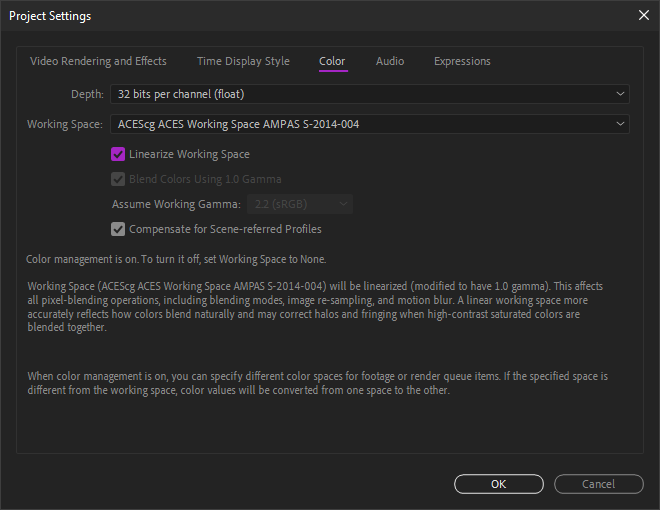
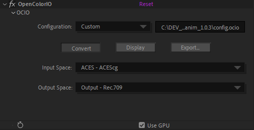

# II.G - Gestion des couleurs : Adobe After Effects

*After Effects* est un des derniers logiciels à ne pas intégrer *OpenColorIO[\*](ZZ-vocabulaire.md)* (*cf*. *[I.N - OpenColorIO et ACES](N-ocio.md)*) nativement pour la gestion des couleurs. Cependant, la gestion des couleurs dans *After Effects* est assez simple à régler, et il gère une vaste gamme d'espaces colorimétriques, comprenant notamment aussi *ACEScg[\*](ZZ-vocabulaire.md)*, ce qui peu permettre de se passer d'*OCIO*.

Il est toutefois possible d'utiliser *OCIO* quand même via un plug-in dédié, et profiter ainsi d'une configuration unique sur toute la chaîne de production dont ferait partie *After Effects*.

En natif, *After Effects* peut être compliqué à intégrer à une chaîne de fabrication :

- L'interprétation des métrages, et la gestion des couleurs en général, ne peut pas être changée via un script.
- L'interprétation par défaut pour chaque type de métrage peut être changée dans un fichier texte de configuration, mais qu'il faudra copier sur tous les postes de travail.
- *After Effects* ne propose pas l'espace de travail *ACEScc* pour la correction colorimétrique.
- L'espace de sortie est défini par défaut sur l'espace de travail.

Ces manques le rendent peu pratique lors de travail en équipe avec une chaîne de travail précise et automatisée. On peut toutefois contourner ces problèmes en utilisant le plug-in *OCIO*, qui, étant un effet, peut être scripté.

Pour un indépendant ou une petite équipe, la gestion proposée par *After Effects* peut toutefois suffire.

[TOC]

## G.1 - Paramètres du projet - Espace de travail

L'espace de travail se règle par projet, dans les paramètres de projet.

On y retrouve la profondeur des couleurs à utiliser avec l'espace de travail ; à moins de travailler sur du matériel peu performant, il n'y a pas de raison de choisir autre chose que *32 bpc*, à plus forte raison si on active la gestion des couleurs. Quoi qu'il arrive, *16 bpc* sont indispensables pour obtenir des couleurs correctes.

*After Effects* propose une longue liste d'espaces colorimétriques, et mélange aussi bien de véritables espaces de travail que des espaces de sortie / d'affichage et de caméras **à ne pas utiliser comme espace de travail**. Comme pour tous les logiciels, il est conseillé de choisir un espace au gammut large, comme *Adobe RGB* ou *ACEScg*. Malheureusement, *After Effects* ne propose pas *ACEScc* pour la correction colorimétrique nativement, et il faudra utiliser le plug-in *OCIO* ou des *LUT[\*](ZZ-vocabulaire.md)* pour l'utiliser.

Une case à cocher permet de linéariser les espaces de travail qui ne seraient pas linéaires (comme *Adobe RGB* par exemple) afin de mieux générer les couleurs.  
En cas de travail de correction colorimétrique, courant sur *After Effects*, on choisira plutôt un espace non linéaire et on laissera cette case décochée.

## G.2 - Interprétation des métrages - Espaces d'entrée

L'espace d'entrée se définit sur chaque métrage, dans l'*interprétation*, accessible via un clic droit sur le métrage.

Il faut bien vérifier pour chaque type de métrage importé que *After Effects* sélectionne bien le bon espace, ou bien le préciser manuellement via cette boite de dialogue. Par exemple, en important des fichiers *EXR* depuis un rendu 3D, *After Effects* les considère par défaut être du *RGB linéaire* ; en cas de travail en *ACEScg*, il faudra venir sélectionner cet espace à cet endroit **pour chaque** séquence *EXR* importée.

On peut modifier les interprétation par défaut pour chaque type de fichier en modifiant le fichier texte de configuration nommé *interpretation rules.txt*, lui-même situé dans le dossiers contenant les réglages d'*After Effects*[^1]. Une fois le fichier modifier, il faut redémarrer *After Effects* pour que les changements soient pris en compte.

!!! Warning
    Si l'espace colorimétrique des fichiers importés est différent de celui par défaut pour le type de fichier en question, il ne faut pas oublier de sélectionner le bon espace à chaque import, ou bien de modifier le fichier des réglages par défaut.

## G.3 - Options de vues - Espace d'affichage et simulations (Épreuvage)

La transformation depuis l'espace de travail vers l'espace d'affichage se règle dans le menu *View* (*Affichage*).

En cochant simplement la case *Use display color managament*, *After Effects* convertit automatiquement les couleurs vers l'espace d'affichage de l'écran tel que spécifié par le système d'exploitation.

Le sous menu *Simulate output* permet de tester des espaces colorimétriques de sortie sans avoir à effectuer de rendu : un espace de sortie est automatiquement appliqué à l'image, qui est ensuite à nouveau convertie vers l'espace de l'affichage. Cette option peut être utile pour tester le résultat d'une sortie précise et vérifier que les différentes conversions ne dégradent pas l'image, et être certain des couleurs qui seront générées lors de la sortie dans un espace précis, même si la plupart du temps on pourra laisser cette simulation désactivée.

On peut alors configurer manuellement une simulation.

La première option d'espace colorimétrique permet la conversion vers l'espace de sortie de l'image.

La deuxième option simule une conversion ou interprétation que ferait un lecteur vidéo, et permet d'avoir un aperçu de ce qui se passerait dans différents scénarios. On laisse généralement cochée la case *Preserve RGB* qui désactive toute conversion sur l'image telle qu'elle est sortie.

La troisième partie, qui ne peut pas être modifiée, rappelle l'espace colorimétrique de l'écran et la transformation finale appliquée à l'image pour l'affichage.

## G.4 - Options d'export - Espaces de sortie

Il ne faut pas oublier à l'exportation d'appliquer la conversion vers l'espace de sortie.

On trouve ces options dans les réglages du module de sortie de la file d'attente de rendu.

Par défaut, *After Effects* règle la sortie sur l'espace de travail, ce qui n'est pas logique du tout, l'espace de travail n'étant que rarement l'espace de sortie ! Il faut alors spécifier le bon espace pour chaque sortie... *Cf. [II-B Quelques standards pour les fichiers](standards.md)*.

!!! Warning
    *After Effects* applique par défaut l'espace de travail à tous les fichiers... Il faut penser à systématiquement le changer ou bien créer des préconfigurations correctement réglées.

## G.5 - OCIO

### G.5.a - Introduction

Utiliser *OCIO* sur *After Effects* permet de contourner pas mal des manques et problèmes soulevés par la gestion des couleurs native, mais l'usage du plug-in nécessite une certaine organisation précise.

L'idéal étant de créer un script pour automatiser ces tâches dans la chaîne de production.

La première chose à faire (après installation du plug-in) est de désactiver la gestion des couleurs de *After Effects* pour pouvoir tout contrôler via *OCIO*.

### G.5.b - Installer le plug-in OCIO

[Le plug-in maintenu à jour est disponible ici](https://fnordware.blogspot.com/2012/05/opencolorio-for-after-effects.html). Bien que le post en question date de 2012, il est mis à jour à chaque nnouvelle version de *OCIO*.

Après téléchargement de l'archive *.zip*, il suffit de copier le fichier *OpenColorIO.aex* dans le dossier des plug-ins de *After Effects*, puis de redémarrer l'application. *OpenColorIO* est un effet disponible dans la section *Utility* (*Utilitaires*) des effets.

### G.5.c - Désactiver la gestion des couleurs de After Effects

Une fois le plug-in installé, il faut reprendre la main sur la gestion des couleurs dans *After Effects* pour la contrôler via l'effet.

!!! Warning
    Contrairement à ce qu'on pourrait croire, il faut commencer par choisir un espace colorimétrique dans les paramètres du projet, afin d'avoir ensuite accès aux autres options de gestion des couleurs et être dans un espace linéaire...

Dans les paramètres du projet, choisir un espace par défaut. *sRGB* fait bien l'affaire, en cochant impérativement la case pour le linéariser et en *32 bpc*.

Lors de l'import de tous les métrages, il faut cocher *Preserve RGB* dans l'interprétation afin qu'*After Effects* n'effectue aucune conversion. Il est possible de modifier le fichier texte de configuration nommé *interpretation rules.txt*, lui-même situé dans le dossiers contenant les réglages d'*After Effects*[^1] afin d'interpréter tous les métrages par défaut en mode *Preserve RGB*.

**Pour chaque composition** il faut désactiver la transformation d'affichage en décochant *Use Display Color Management* dans le menu *View* (*Affichage*).

Enfin, pour toutes les sorties, il faut cocher la case *Preserve RGB* dans les paramètres de couleur du module de sortie, afin qu'*After Effects* n'effectue aucune conversion.

Toutes ces manipulations permettent de s'assurer que c'est bien *OCIO* qui se chargera de toutes les conversions de couleurs.

### G.5.d - Organisation

Étant donné qu'*OCIO* pour *After Effects* est un effet, son usage demande une certaine organisation du projet pour ne pas se tromper.

Lors de l'import d'un métrage, il sera bien plus pratique de systématiquement le placer dans une précomposition, et d'utiliser cette précomposition à la place du métrage lui même dans les autres compositions. C'est dans cette précomposition qu'on mettra en place l'interprétation du métrage et la conversion vers l'espace de travail.

### G.5.e - Entrée et espace de travail

Dans la précomposition de chaque métrage, il faut mettre l'effet *OpenColorIO* sur le calque du métrage.

Après avoir sélectionné la bonne configuration *OCIO*, on peut sélectionner dans le premier champ l'espace correspondant au métrage (dans cet exemple, *RGB linéaire*, pour une séquence *EXR* par exemple).

Dans le deuxième champ, on choisit l'espace de travail voulu pour le projet (*ACEScg* dans cet exemple). Ce deuxième champ sera commun à tous les métrages, tandis que le premier dépend du format du fichier importé.

### G.5.f - Sortie

La conversion pour la sortie se fait simplement via un calque d'effet avec l'effet *OpenColorIO* qui convertit les couleurs depuis l'espace de travail vers l'espace de sortie.

Choisir l'espace de travail dans le champ *input space* et l'espace de sortie correspondant au fichier voulu dans *output space*.

### G.5.g - Affichage

Pour effectuer la conversion d'affichage, on utilise un calque de réglage tout en haut des compositions dans lesquelles on travaille. On peut mettre ce calque en mode *calque repère* (*guide layer*) pour être sûr qu'il ne soit pas actif au rendu.

On ajoute l'effet *OpenColorIO* sur ce calque.

Deux solutions sont possibles :

- Soit on convertit depuis l'espace de travail vers l'affichage ; c'est le plus simple dans le cas où on aurait plusieurs sorties différentes à faire. Dans ce cas on désactive le calque de sortie lors du travail, et il faut penser à le réactiver pour effectuer les rendus.

Cocher le bouton *Display*, sélectionner l'espace de travail en premier (champ *input space*), puis l'espace d'affichage sur le(s) champs suivant.

- Ou bien on convertit depuis l'espace de sortie voulu (voir point précédent), si on en utilise qu'un. Dans ce cas on laisse actif le calque de réglage de sortie lors du travail.

Cocher le bouton *Display*, sélectionner l'espace de sortie en premier (champ *input space*), puis l'espace d'affichage sur le(s) champs suivant.

[^1]:
    On trouve facilement ce dossier via le bouton *Reveal Preferences* (*révéler les préférences*) dans le panneau des préférences générales de *After Effects*