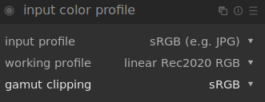

# II.L - Gestion des couleurs : Darktable

*Darktable* est un logiciel libre et gratuit de retouche photo extrèmement complet et professionnel ; la gestion des couleurs y est très complète.

## L.1 - Entrée et espace de travail

L'espace de travail des couleurs se règle par fichier, en même temps que l'entrée, via le module "*input color profile*".

La configuration est très simple :

- ***input profile*** sert à définir le profil de l'image sur laquelle on travaille ; dans le cas d'une image *jpeg* par exemple, on choisira *sRGB*.
- ***working profile*** est l'espace de travail ; on préfère un espace au gamut[\*](ZZ-vocabulaire.md) large, et linéaire. *Darktable* propose les plus utiles et courants, comme le *Rec. 2020*, *Adobe RGB* ou encore le *prophoto* dédié à la retouche photo.
- ***gamut clipping*** est une option intéressante permettant d'afficher sur l'image les zones dont les couleurs sont en dehors du gamut de l'espace donné ; on choisit en général ici l'espace de sortie.

Pour activer les alertes du *gamut clipping* il faut activer l'option via le bouton sous l'image :

## L.2 - Sortie

La sortie se règle très simplement via le module "*output color profile*".

## L.3 - Épreuvage (Soft-Proofing)

L'épreuvage peut être activé et réglé avec les boutons sous l'image.

Un clic droit permet d'accéder aux réglages.

- ***softproof profile*** définit l'espace simulé/activé pour l'épreuvage. C'est là qu'on retrouve les profils *ICC* spécifiques pour l'impression qu'on aurait ajouté (voir plus bas).
- ***display profile*** permet de modifier l'espace de l'écran ; en général, on peut laisser "*system display profile*" (c'est le seul qui prendra en compte l'éventuelle calibration de l'écran). Sinon on choisira toujours l'espace normal de l'écran (*sRGB* en général).
- ***preview display profile*** est l'espace de l'éventuelle seconde fenêtre de prévisualisation de l'image, au cas où elle serait sur un deuxième écran différent.
- ***histogram profile*** définit l'espace utilisé par l'histogramme et la pipette de *Darktable*.

On peut ajouter ses propres profils de sortie et d'épreuvage en ajoutant les fichiers au format *ICC* dans le sous dossier `color/out` de l'installation de *Darktable* (ou le dossier `$HOME/.config/darktable/` sous linux).