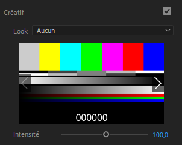
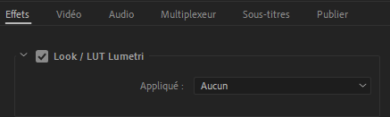

# II.G - Gestion des couleurs : Adobe Premiere et Media Encoder

Les options de gestion des couleurs sont assez limitées (pour ne pas dire inexistantes) dans *Adobe Premiere*, et il ne gère pas *OCIO[\*](ZZ-Vocabulaire.md)*.

- **Il n'y a pas de réglage de l'interprétation des couleurs en entrée**, ce qui implique que tous les médias (autres que les compositions *After Effects*) doivent impérativement utiliser des espaces colorimétriques standards, et qu'un fichier *openEXR* sera toujours lu en tant que *RGB Linéaire* par exemple.
- **Il n'y a pas d'espace de travail** configurable, ce qui n'est pas forcément nécessaire en montage, du moment qu'on ne fait pas trop d'effets.
- **Il n'y a que très peu de choix** sur les possibilités en sortie, tout est automatique. En fait, la sortie se fait forcément via [*Adobe Media Encoder*](ame.md).

## H.1 - Espace de sortie

Pour la grande majorité des formats, aucun réglage n'est disponible.

On retrouve, seulement pour l'encodage en *h.264* ou *h.265 / hevc* la possibilité d'utiliser le *Rec.2020*, si et seuleument si le profil *high10* du codec est sélectionné.

- ***Couleurs primaires Rec.2020***: L'encodage se fait en *Rec.709* si décoché.
- ***Plage dynamique élevée*** permet un rendu en 12 bits au lieu de 10 bits (voir section [*I.K - Format des pixels*](K-pix-format.md)), qu'on appelle aussi *HDR*.
- ***Include les métadonnées HDR10** débloque les options suivantes...
- ***Couleurs primaires*** permet de changer les primaires, et assez étrangement, de choisir les primaires du *Display P3* ou du *Rec.709* **alors que** la case Rec.2020 plus haut doit être cochée, et ne sont disponibles qu'en mode *HDR*.

Les autres options sont des métadonnées spécifiques au format vidéo *HDR* à des fins de reproduction sur les écrans.

## H.2 - Appliquer une *LUT*

Il est toutefois possible d'appliquer une *LUT* sur les clips, ce qui reste un moyen de théoriquement tout faire, *à condition* de disposer de la *LUT* adéquate, ce qui n'est pas toujours évident...

On trouve l'option pour ajouter une *LUT* dans l'effet *Lumetri* ou le panneau du même nom.

On peut aussi appliquer une *LUT* via *Media Encoder*

On trouve l'option pour ajouter une *LUT* dans l'onglet *Effets* des paramètres de sortie.

## H.3 - Espace de travail et affichage

Il faut savoir que les séquences *Premiere* sont **toujours** en *Rec.709* lors du montage; tous les médias importés sont convertis en *Rec.709* et les effets, le montage se fait dans cet espace colorimétrique.

**Par défaut**, __*Premiere* ne reconvertit pas les couleurs vers le *sRGB* de l'écran__, elles restent en *Rec.709*, ce qui fait que les couleurs sont mal affichées sur les écrans *sRGB* standards (et encore pires sur les écrans *P3*).

Cela signifie aussi que **par défaut** les couleurs des **mêmes** métrages sur *After Effects* et *Premiere* sont rendues **différemment**.

On peut activer cette conversion manquante **dans les préférences**, via la case ***Activer la gestion des couleurs d'affichage*** (*Enable display color management*), option utile dès qu'on ne monte pas sur un écran *Rec.709* mais *sRGB* ou *P3* (ce qui est la majorité des cas). Cette option n'influence que l'affichage pour convertir automatiquement depuis le *Rec.709* de *Premiere* vers l'espace de l'écran ; quoi qu'il arrive, elle ne change rien à la sortie du fichier final.

Cette option est aussi disponible dans *Media Encoder* bien que moins importante : elle ne concerne que l'affichage des prévisualisations.